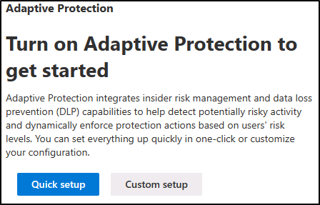

---
lab:
  title: 会话 4 - Microsoft Purview 自适应保护
  module: Learning Objective - Implement Adaptive Protection in Insider Risk Management
---

# 第 1 部分演示 4 - 启用自适应保护

> 备注：除了启用“快速设置”之外，此演示中无需执行任何操作。 快速设置需要 72 小时才能设置，但在设置选项后，该选项将从门户消失。 在此演示中，你将在门户中解释自适应保护的一些元素，并解释使用快速设置时会发生什么情况。

## 任务 1 – 了解自适应保护

在此任务中，你将熟悉了解 Microsoft Purview 内部风险管理中的自适应保护功能。 你将熟悉了解快速和自定义设置选项、可自定义的风险级别、过去活动检测的设置以及风险级别时间范围。 你还将查看显示特定于用户的风险级别和 DLP 策略的选项卡，并了解在门户中启用或禁用自适应保护功能的位置。

1. 在 Microsoft Edge 中，导航到 `https://purview.microsoft.com` 并以 `admin@WWLxZZZZZZ.onmicrosoft.com` （其中 ZZZZZZ 是实验室托管提供程序提供的唯一租户 ID）登录到 Microsoft Purview 门户 。

1. 从左侧边栏中选择“**解决方案**”，然后选择“**内部风险管理**”，导航到内部风险管理。

1. 首次在内部风险管理部分中选择“自适应保护（预览）”**** 按钮时，你将看到两个用于启用自适应保护的选项：

    

1. 开始使用此功能时，有两个选项可用：“快速设置”**** 或“自定义设置”****。 开始使用此功能的最快方法是进行快速设置。 无需任何预先存在的 DLP 或内部风险管理策略即可开始使用。 自定义设置有助于更好地控制策略，如果有现成的 DLP 和内部风险管理策略，则建议使用此选项。 快速设置过程大约需要 72 小时，而后才能开始使用，而自定义设置则需要大约 36 小时。

1. 在“**自适应保护**”窗口中的左侧导航窗格中，选择“**自适应保护的风险级别**”。

1. 熟悉了解自适应保护设置中的可自定义的风险级别：

    - **高风险级别**：标记具有高严重性警报或多个高风险活动的用户。
    - **中等风险级别**：重点关注具有中等严重性警报或至少两项高风险数据外泄的用户。
    - **低风险级别**：关注具有低严重性警报或单项高风险数据外泄的用户。

1. 请注意，每个风险级别都有自定义选项，可通过选择风险级别旁边的“编辑”**** 按钮来访问这些选项。

1. 了解“**过去活动检测**”、“**风险级别时间范围**”以及“**内部风险级别时间范围**”的选项：

    - 过去活动检测****：指定回溯期（5 到 30 天之间）以评估用户的日常操作是否满足风险级别条件。
    - 风险级别时间范围****：确定持续时间（5 到 30 天之间），在自动重置之前，分配给用户的风险级别不变。
    - **内部风险级别过期**：默认情况下，在关闭关联的警报或关闭案例时，用户的自适应保护风险级别会自动过期。 如果想要防止此自动过期并保持风险级别处于活动状态，可以禁用此选项。

1. 查看“自适应保护风险级别”**** 选项卡中的选项后，从左侧导航窗格中选择“用户分配的风险级别”**** 选项卡。

1. 激活时，“用户分配的风险级别”**** 选项卡将显示每个用户的名称或匿名版本、其当前风险级别、分配过后的时间以及自动重置之前的剩余天数。 无需删除现有警报或案例，即可手动使风险级别过期。 该选项卡还显示每个用户的当前警报和已确认案例的数量。

1. 熟悉了解“**用户分配的风险级别**”选项卡后，从左侧导航窗格中选择“**条件访问**”选项卡。

   Microsoft Purview 中的自适应保护与条件访问集成，可根据用户的风险级别动态应用安全策略。 在“**条件访问**”选项卡中，你将看到强制实施特定控制的策略，例如阻止高风险用户访问某些应用程序或要求低风险用户在继续之前确认使用条款。

1. 熟悉了解“**条件访问**”选项卡后，从左侧导航窗格中选择“**数据丢失防护**”选项卡。

   自适应保护与数据丢失防护 (DLP) 集成，可根据用户的风险级别自动应用 DLP 策略，例如阻止高风险用户共享敏感数据。 在“**数据丢失防护**”选项卡中，你将看到根据分配给用户的内部风险级别动态调整保护控制的策略。

1. 熟悉了解“DLP 策略”**** 选项卡后，从左侧导航窗格中选择“自适应保护设置”**** 选项卡。

1. 在“自适应保护设置”**** 选项卡中，可以打开或关闭该功能。 将其关闭可停止分配风险级别并重置现有级别，完成停用的过程最多需要 6 小时。 不会自动删除策略。

1. 导航回**仪表板**。

1. 选择“**快速设置**”以“**打开**”自适应保护。 此过程需要 72 个小时，在此期间，将处理分析，创建内部风险级别、DLP、条件访问和数据生命周期管理策略并应用于用户活动。 片刻后，应该会收到一条消息，指出 **我们正在设置...**

你已成功探索自适应保护，并使用快速设置启用自适应保护。
