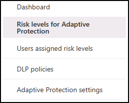

---
lab:
  title: 练习 2 - 配置内部风险管理
  module: Module 5 - Manage insider and privacy risk in Microsoft 365
---

# 练习 5 - 配置内部风险管理

你是 Contoso Ltd. 的合规性管理员 Joni Sherman。你的角色涉及确保法规合规性和保护组织内的敏感信息。 最近，Contoso Ltd. 认识到需要主动解决可能损害公司声誉、损害数据安全或导致法律问题的内部风险。

为了有效管理内部风险，你实现了 Microsoft Purview 内部风险管理，这是一个全面的解决方案，旨在识别、分析和响应潜在内部威胁。

## 任务 1：分配内部风险管理角色

在本练习中，你将向 Joni 分配内部风险管理角色，以授予在 Microsoft Purview 门户中执行内部风险任务的权限。

1. 你仍然应该会使用 lon-cl1\admin**** 帐户登录到客户端 1 VM (LON-CL1)。

1. 在 Microsoft Edge 中，导航到 **https://compliance.microsoft.com**，并使用“MOD 管理员”帐户 **admin@WWLxZZZZZZ.onmicrosoft.com** 登录到 Microsoft Purview 门户。 管理员的密码应由实验室托管提供程序提供。

1. 导航到“角色和范围”，然后从下拉菜单中选择“权限” 。

1. 在“权限”**** 页上，选择“Microsoft Purview 解决方案”**** 下的“角色”****。

1. 在“Microsoft Purview 解决方案的角色组”页上，选择“内部风险管理” 。

1. 在右侧的“内部风险管理”弹出页中，选择“编辑” 。

1. 在“编辑角色组的成员”页上，选择“+ 选择用户” 。

1. 在“选择用户”页中，选中 Joni Sherman 旁边的复选框，然后选择“选择”按钮 。

1. 在“编辑角色组的成员”页上，选择“下一步” 。

1. 在“查看角色组并完成”页上，选择“保存” 。

1. 在“已成功更新角色组”页上，选择“完成” 。

1. 退出登录“MOD 管理员”帐户并关闭所有浏览器窗口。

你已成功将内部风险管理角色分配给 Joni Sherman，授予她在 Microsoft Purview 门户中执行内部风险任务的权限。

## 任务 2：内部风险设置配置

在此任务中，你将在 Microsoft Purview 门户中自定义内部风险管理设置。 这将使 Joni Sherman 能够有效地管理组织内潜在的内部风险并确保敏感信息的安全。

1. 在 Microsoft Edge**** 中，导航到 **https://compliance.microsoft.com**，并使用 JoniS@WWLxZZZZZZ.onmicrosoft.com 登录到 Microsoft Purview 门户。 Joni 的密码应由实验室托管提供程序提供。

1. 从左侧导航栏中，选择“内部风险管理”。

1. 选择右上角的“设置”齿轮图标。 
1. 浏览设置：

    - **隐私**：用于选择在警报和案例中是显示用户名还是匿名版本。
    - **策略指示器**：涉及使用特定风险指示器配置策略模板。
    - 检测组（预览）****：自定义组织中特定用户集的风险指标
    - **策略期限**：根据事件和活动定义由策略匹配项触发的评审期。
    - **智能检测**：控制警报量，从风险评分中排除某些实体，并允许筛选 Microsoft Defender 警报。
    - **导出警报**：使用 Office 365 管理活动 API 将风险警报信息导出到 SIEM 和 SOAR 解决方案。
    - **优先用户组**：确定高风险用户，以便进行更深入的检查和更敏感的风险评分。
    - **优先物理资产(预览版)** ：识别和监视对将活动与用户事件关联的优先物理资产的访问。
    - **Power Automate 流(预览版)** ：使用 Microsoft Power Automate 流自动执行内部风险管理任务。
    - **Microsoft Teams (预览版)** ：使 Microsoft Teams 能够协作处理内部风险管理案例。
    - **分析**：评估潜在的内部风险，而无需配置策略来指导策略创建。
    - **管理员通知**：自动向内部风险管理角色组发送电子邮件通知。
    - **内联警报自定义**：允许直接从“警报”仪表板优化策略和调整阈值。

1. 在内部风险管理设置栏的“常规”下选择“隐私” 。

1. 选择“不显示用户名的匿名版本”。

1. 选择“保存”以保存此设置。

1. 在内部风险管理设置栏的“常规”下选择“策略指示器” 。

1. 在“策略指示器”设置窗格的“Office 指示器”下，选中“全选”复选框  。

1. 向下滚动并选择“保存”。

1. 在内部风险管理设置栏的“常规”下选择“优先用户组” 。

1. 选择“+ 创建优先用户组”以打开“新建优先用户组向导” 。

1. 在“命名并描述优先用户组”页中输入：

    - 名称：财务团队
    - 说明：管理财务运营、预算和报告的团队成员

1. 选择**下一步**。

1. 在“选择成员”页上，选择“+ 选择成员” 。

1. 在“选择成员”窗格中，选中“Lynne Robbins”、“Debra Berger”和“Megan Bowen”旁边的复选框，然后选择“添加”以添加这 3 个成员    。

1. 在“选择成员”页上，选择“下一步” 。

1. 在“选择谁可以查看涉及此优先组中的用户的数据”上，选择“+ 选择用户和角色组” 。

1. 在“选择用户和角色组”页上，选中“内部风险管理”旁边的复选框，以添加在 Microsoft Purview 中具有内部风险管理角色的所有成员，然后选择“添加”  。

1. 在“选择谁可以查看涉及此优先组中的用户的数据”上，选择“下一步” 。

1. 在“查看”页上，选择“提交” 。

1. 在“已创建优先用户组”页上，选择“完成” 。 这将返回到内部风险管理设置页面。

1. 选择“内部风险管理”以导航回内部风险管理主页面。

你已成功自定义内部风险管理设置。 现在，Joni Sherman 拥有必要的工具和功能，可以主动识别和缓解内部风险，保护 Microsoft Purview 门户中的宝贵数据。

## 任务 3：内部风险策略创建

在此任务中，你将在 Microsoft Purview 中配置名为“财务数据保护”的策略，以监视和保护组织内的敏感财务数据访问。

1. 你仍应以 Joni 的身份登录 Microsoft Purview。

1. 从左侧导航栏中，选择“内部风险管理”。

1. 从顶部导航栏中选择“策略”选项卡，然后选择“+ 创建策略” 。

1. 在“选择策略模板”页上，选择“数据泄露”，然后选择“下一步”  。

1. 在“策略命名”页上输入：

    - 名称：财务数据保护
    - 说明：敏感财务数据访问监视

1. 选择**下一步**。

1. 在“选择用户和组”页上，保持选中“包括所有用户和组”，然后选择“下一步”  。

1. 在“决定是否确定内容的优先级”**** 页面上，仅保持选中“敏感信息类型”****，然后选择“下一步”****。

1. 在“要确定优先级的敏感信息类型”页上，选择“+ 添加或编辑敏感信息类型” 。

1. 在“添加或编辑敏感信息类型”窗格中搜索“银行”，然后选中“美国银行帐户号码”和“国际银行帐户号码(IBAN)”旁边的复选框 。 接下来搜索“信用”，选中“信用卡号”旁边的复选框，然后选择“添加”以添加 3 种敏感信息类型 。

1. 返回到“要确定优先级的敏感信息类型”，选择“下一步” 。

1. 在“决定是否仅对具有优先内容的活动进行评分”页上，保持选中“获取所有活动的警报”，然后选择“下一步”  。

1. 在“此策略的触发器”页上，选择“用户执行外泄活动” 。

1. 在“选择哪些活动将触发此策略”下，选择：

   - **从 SharePoint 下载内容**
   - **向组织外部的收件人发送带附件的电子邮件**
   - **与组织外部人员共享 SharePoint 文件**
   - **从 Microsoft 365 位置下载后外泄**

    >[!note] 注意：如果无法选择策略触发器，可能会显示“打开指示器”的提示。 如果此选项可用，请选择“打开指示器”。 在“选择要打开的指示器”弹出窗口中，单击“Office 指示器”的“全选”旁边的复选框，然后选择“保存”   。

1. 选择“**下一步**”。

1. 在“触发此策略的阈值”页上，选择“使用默认阈值(建议)”，然后选择“下一步”  。

1. 在“指示器”页上，选择“物理访问指示器”下拉菜单，取消选中“对敏感资产的访问终止或失败后的物理访问”（如果已选中），然后选择“下一步”   。

1. 在“检测选项”页上，从“序列检测”、“累积外泄检测”和“风险评分提升程序”部分选择“全选”，然后选择“下一步”     。

1. 在“决定是使用默认阈值还是自定义指示器阈值”页上，选择“默认阈值”，然后选择“下一步”  。

1. 在“查看设置并完成”页上，选择“提交” 。

1. 在“策略已创建”页上，选择“完成” 。

    >[!note] 注意：如本页所述，策略匹配项最多可能需要 24 小时才会开始显示在“警报”选项卡中。

你已成功创建“财务数据保护”策略，这将有助于检测和防止未经授权访问敏感财务信息。 请记住，策略匹配项最多可能需要 24 小时才会显示在“警报”选项卡中。

## 任务 4：创建通知模板

在此任务中，你将在 Microsoft Purview 的内部风险管理中创建一个通知模板，使你能够在针对风险活动生成案例时自动向用户发送电子邮件消息，作为提醒或提供合规性培训信息。

1. 在内部风险管理中，你仍应以 Joni 的身份登录 Microsoft Purview。

1. 从顶部导航选项卡中选择“通知模板”，然后选择“+ 创建通知模板” 。

1. 在右侧的“创建新的通知模板”弹出页中填写必要的信息。

    - **模板名称**：数据泄露策略警报
    - **发件人**：Joni Sherman
    - **主题**：检测到潜在的数据泄漏
    - **消息正文**：

        ````html
        <!DOCTYPE html>
        <html>
        <body>
        <h2>Alert: Potential Data Leak Detected</h2>
        <p>We detected a potential data leak associated with your account. As part of our Insider Risk Management policy, we are required to investigate any suspicious activity related to data breaches.</p>
        <p>Please review your recent actions, report any unusual behavior, and refer to the Contoso User Code of Conduct training at <a href='https://contoso.com'>https://contoso.com</a> for more information.</p>
        <p>Thank you for your cooperation,</p>
        <p><em>Human Resources</em></p>
        </body>
        </html>
        ````

1. 选择“创建”。

你已成功创建“数据泄漏策略警报”通知模板，能够在检测到潜在数据泄漏时自动向用户发送通知，加强安全措施，并促进遵守 Contoso 用户行为准则。

## 任务 5：了解自适应保护

在此任务中，你将熟悉了解 Microsoft Purview 内部风险管理中的自适应保护功能。 你将熟悉了解快速和自定义设置选项、可自定义的风险级别、过去活动检测的设置以及风险级别时间范围。 你还将查看显示特定于用户的风险级别和 DLP 策略的选项卡，并了解在门户中启用或禁用自适应保护功能的位置。

1. 在内部风险管理中，你仍应以 Joni 的身份登录 Microsoft Purview。

1. 在顶部导航选项卡中，选择“自适应保护（预览）”****。

1. 首次在内部风险管理部分中选择“自适应保护（预览）”**** 按钮时，你将看到两个用于启用自适应保护的选项：

    

1. 开始使用此功能时，有两个选项可用：“快速设置”**** 或“自定义设置”****。 开始使用此功能的最快方法是进行快速设置。 无需任何预先存在的 DLP 或内部风险管理策略即可开始使用。 自定义设置有助于更好地控制策略，如果有现成的 DLP 和内部风险管理策略，则建议使用此选项。 快速设置过程大约需要 72 小时，而后才能开始使用，而自定义设置则需要大约 36 小时。

1. 在“自适应保护（预览）”**** 窗口中的左侧导航窗格中，选择“自适应保护的风险级别”****。

    

1. 熟悉了解自适应保护设置中的可自定义的风险级别：

    - **高风险级别**：标记具有高严重性警报或多个高风险活动的用户。
    - **中等风险级别**：重点关注具有中等严重性警报或至少两项高风险数据外泄的用户。
    - **低风险级别**：关注具有低严重性警报或单项高风险数据外泄的用户。

1. 请注意，每个风险级别都有自定义选项，可通过选择风险级别旁边的“编辑”**** 按钮来访问这些选项。

    

1. 熟悉了解“过去活动检测”**** 和“风险级别时间范围”**** 的选项：

    - 过去活动检测****：指定回溯期（5 到 30 天之间）以评估用户的日常操作是否满足风险级别条件。
    - 风险级别时间范围****：确定持续时间（5 到 30 天之间），在自动重置之前，分配给用户的风险级别不变。

1. 查看“自适应保护风险级别”**** 选项卡中的选项后，从左侧导航窗格中选择“用户分配的风险级别”**** 选项卡。

    

1. 激活时，“用户分配的风险级别”**** 选项卡将显示每个用户的名称或匿名版本、其当前风险级别、分配过后的时间以及自动重置之前的剩余天数。 无需删除现有警报或案例，即可手动使风险级别过期。 该选项卡还显示每个用户的当前警报和已确认案例的数量。

1. 熟悉了解“用户分配的风险级别”**** 选项卡后，从左侧导航窗格中选择“DLP 策略”**** 选项卡。

    

1. “DLP 策略”**** 页面将显示每个策略的名称、当前状态、位置、包含的风险级别、状态、创建日期和上次修改日期。

1. 熟悉了解“DLP 策略”**** 选项卡后，从左侧导航窗格中选择“自适应保护设置”**** 选项卡。

    

1. 在“自适应保护设置”**** 选项卡中，可以打开或关闭该功能。 将其关闭可停止分配风险级别并重置现有级别，完成停用的过程最多需要 6 小时。 不会自动删除策略。

你已成功完成对内部风险管理中的自适应保护功能的熟悉了解。
