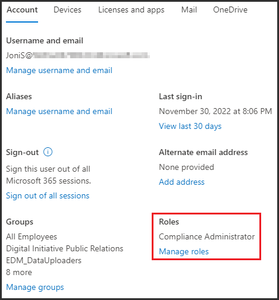

---
lab:
  title: 练习 1 - 管理合规性角色
  module: Module 1 - Implement Information Protection
---
# 练习 1 - 管理合规性角色

你是 Contoso Ltd. 最近聘请的合规性管理员 Joni Sherman，你的职责是配置组织的新 Microsoft 365 租户以满足其合规性要求。 Contoso Ltd. 是一家总部位于美国的公司，在欧盟设有新的子公司，你的组织必须确保新的 Microsoft 365 租户符合不同国家/地区的法律要求和所在行业部门的法规标准。

## 练习 1 - 分配合规性角色

在本练习中，你将遵循最小特权原则，并使用默认的全局管理员角色向 Joni Sherman 分配合规性管理员角色，这要求执行本实验室中所述的操作。

1. 使用 lon-cl1\admin 帐户登录到客户端 1 VM (LON-CL1)。 密码应由实验室托管提供程序提供。

1. 打开 Microsoft Edge****，选择地址栏，导航到 **https://admin.microsoft.com** 并使用“MOD 管理员”帐户**** admin@WWLxZZZZZZ.onmicrosoft.com 登录到 Microsoft 365 管理中心。 管理员的密码应由实验室托管提供程序提供。

1. 在“内容已移动”**** 对话框上，选择“下一步”****，直到对话框关闭。

1. 在左侧导航窗格中，展开“用户”，然后选择“活动用户”********。

1. 在“活动用户”列表中，选择“Joni Sherman”********。 这将使用 Joni 的用户设置在右侧打开浮出控件页面。

1. 在 Joni 的用户设置页面的“帐户”选项卡下，滚动到“角色”，然后选择“管理角色”************。

      

1. 在“管理管理员角色”浮出控件页面上，选择“管理员中心访问权限”，然后向下滚动以选择“按类别显示所有内容”************。 在“安全性和合规性”类别的类别视图下，选择“合规性管理员”。********

1. 选择“保存更改”以应用角色。 当页面上方显示“管理员角色已更新”消息时，选择指向左侧的箭头以返回 Joni 的用户记录****。

1. 单击右上角的“X”关闭显示 Joni Sherman 的帐户的浮出控件页面，返回到“活动用户”列表********。

1. 切换到 Joni Sherman 之前，通过导航到 https://compliance.microsoft.com/auditlogsearch ，使用 MOD 管理员的全局管理员权限来激活审核日志记录。

1. 在“审核”页上。 选择“开始记录用户和管理员活动”以激活审核日志记录。

1. 选择右上角带有“MA”的圆圈，然后选择“注销” 。

1. 关闭 Microsoft Edge 浏览器窗口。

你已成功向 Joni Sherman 分配合规性管理员角色，需要先完成此操作才能执行本实验室的不同练习。 继续执行下一个任务。

## 任务 2 - 浏览 Microsoft Purview 门户

在本任务中，你将注销全局管理员帐户，然后以 Joni Sherman 的身份再次登录。 由于刚刚向 Joni Sherman 分配了合规性管理员角色，因此她的帐户足以执行本实验室的大部分练习。

1. 你仍应使用 lon-cl1\admin 帐户登录到客户端 1 VM (LON-CL1)。

1. 在“Microsoft Edge”中，导航到 https://compliance.microsoft.com。

1. 显示“选择帐户”窗口时，请选择“使用其他帐户” 。

1. 显示“登录”**** 窗口时，以 JoniS@WWLxZZZZZZ.onmicrosoft.com 的身份登录。 Joni 的密码应由实验室托管提供程序提供。

1. 此时将显示“欢迎使用 Microsoft Purview 合规性门户”页面。 浏览仪表板磁贴和左侧的导航窗格。

1. 熟悉不同的设置。 完成后，让浏览器窗口保持打开状态。

你已成功切换到 Joni Sherman 的帐户，现在可以开始使用实验室。
