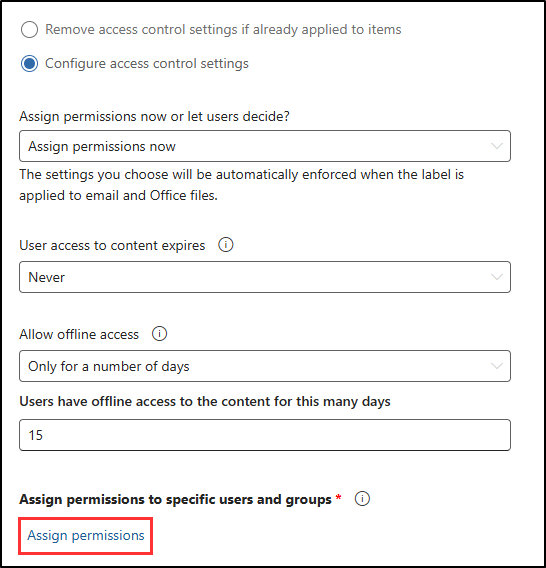

# 任务 2 - 创建敏感度标签

Contoso 开始使用 Microsoft 365 Copilot 来提高工作效率，他们需要确保敏感 HR 数据保持安全。 HR 处理员工记录、工资详细信息和绩效评审等机密信息，因此只有授权人员才能访问或编辑这些文件，这一点非常重要。 敏感度标签是保护此类信息的一种方法，还可确保即使在使用 Copilot 等工具，适当的保护也已就位。

在此实验室中，将创建和配置 Contoso HR 部门可用于保护文档并在使用 Microsoft 365 工具时保护文档的安全敏感度标签。

**任务**：

1. 启用对敏感度标签的支持
1. 创建敏感度标签
1. 发布敏感度标签

## 任务 1 - 为使用敏感度标签加密的文件启用共同创作

在此任务中，将为具有敏感度标签的文件启用共同创作。 此功能允许多个用户在保护文档的同时协作处理文档。 还为 OneDrive 和 SharePoint 中的文件启用敏感度标签（如果尚未启用）。

1. 你仍应以 Megan Bowen 的身份登录到 Microsoft Purview 门户。

1. 在左侧边栏中，选择“**设置**”。

1. 在“**设置**”页上，选择“**信息保护**”。

1. 在“**信息保护设置**”页上，选择“**为使用敏感度标签的文件启用共同创作**”选项卡。

1. 选中“**为使用敏感度标签的文件打开共同创作**”复选框。

   还在 SharePoint 和 OneDrive 中启用对敏感度标签的支持。

1. 在页面底部，选择“应用”****。

已成功为使用敏感度标签的文件启用共同创作。 现在，多个用户可以实时安全地编辑文档，敏感度标签支持在 OneDrive 和 SharePoint 中处于活动状态

## 任务 2 - 创建敏感度标签

在此任务中，你将为 Contoso 的 HR 部门创建敏感度标签来保护内部文档。 这些标签有助于控制谁可以访问和共享敏感信息（如员工数据）。 通过应用此标签，可确保只有经过授权的 HR 人员才能访问这些文档，即使使用 Microsoft 365 Copilot 也是如此。

1. 在 Microsoft Purview 门户中的左侧边栏中选择“**解决方案**”，然后选择“**信息保护**”。

1. 从左侧边栏中选择“**敏感度标签**”。

1. 在“**敏感度标签**”页上，选择“**+ 创建标签**”。

1. 此时会启动“**新建敏感度标签**”配置。 在“**提供此标签的基本详细信息**”上输入：

    - **名称**：`Internal`
    - **显示名称**：`Internal`
    - **** 面向用户的说明：`Internal sensitivity label.`
    - **** 面向管理员的说明：`Internal sensitivity label for Contoso.`

1. 选择**下一步**。

1. 在“**定义此标签的范围**”页上，确保在“**项**”下仅选择“**文件**”和“**电子邮件**”。 如果选择了“**会议**”，请取消选择。

1. 选择**下一步**。

1. 在“选择带标签项的保护设置”页面上，选择“下一步” 。

1. 在“自动标记文件和电子邮件”页面上，选择“下一步” 。

1. 在“定义组和网站的保护设置”页面上，选择“下一步” 。

1. 在“自动标记架构化的数据资产(预览)”页上，选择“下一步”********。

1. 在“查看设置并完成”页面上，选择“创建标签” 。

1. 在“你的敏感度标签已创建”页上，选择“现在不创建策略”，然后选择“完成”。************

已成功创建内部敏感度标签来保护公司文档。 此标签将成为更多特定标签的基础，如 HR 数据的标签。

## 任务 3 - 为 HR 员工数据创建子标签

在此任务中，你将在“**内部**”敏感度标签下创建一个子标签，以保护 HR 文档。 将添加动态水印，以便在文档上显示个性化的详细信息，如用户的电子邮件和访问时间戳。 此功能阻止未经授权的共享，并提供文档使用情况的可见性。

1. 在“**敏感度标签**”页上，找到新创建的“**内部**”敏感度标签。

1. 选择“**内部**”敏感度标签旁边的垂直省略号 (**...**)，然后从下拉菜单中选择“**+创建子标签**”。

   

1. 此时会启动“新建敏感度标签”向导。 在“**提供此标签的基本详细信息**”页中，输入：

   - **名称**：`Employee data (HR)`
   - **显示名称**：`Employee data (HR)`
   - **** 面向用户的说明：`This HR label is the default label for all specified documents in the HR Department.`
   - **** 面向管理员的说明：`This label was created with input from the Head of HR. Contact the HR department for any changes to the label settings.`

1. 选择**下一步**。

1. 在“**定义此标签的范围**”页上，保留默认选择，然后选择“**下一步**”。

1. 在“**选择带标签项的保护设置**”页面上，选择“**控制访问**”选项，然后选择“**下一步**”。

1. 在“**访问控制**”页上，选择“**配置访问控制设置**”。

1. 使用以下选项配置加密设置：

   - **立即分配权限或让用户自行决定?** ：立即分配权限
   - **用户对内容的访问权限过期**：从不
   - **允许脱机访问**：仅几天
   - **用户在多少天内可以脱机访问内容**:15
   - 选择“**分配权限**”链接。

   

1. 在“**分配权限**”浮出控件页上，选择“**+ 添加组织中的所有用户和组**”，然后选择“**保存**”。

1. 在“**访问控制**”页上，选中“**使用动态水印**”复选框，然后选择“**自定义文本(可选)**”。

1. 在“**将自定义文本添加到水印（可选）**”页上的自定义文本字段中，输入 `Confidential | HR only |`

1. 选择“**UPN**”和“**时间戳**”的令牌，然后选择页面底部的“**保存**”。

   

1. 在“访问控制”页上，选择“下一步”********。

1. 在“自动标记文件和电子邮件”页面上，选择“下一步” 。

1. 在“定义组和网站的保护设置”页面上，选择“下一步” 。

1. 在“自动标记架构化的数据资产(预览)”页上，选择“下一步”********。

1. 在“查看设置并完成”页面上，选择“创建标签” 。

1. 在“你的敏感度标签已创建”页上，选择“现在不创建策略”，然后选择“完成”。************

你已成功创建一个专用于 HR 文档的子标签，确保员工数据受到保护，并且只有经过授权的用户才能访问这些数据。 HR 部门现在可以应用此标签来安全地管理敏感的员工信息。

## 任务 4 - 发布敏感度标签

创建敏感度标签后，即可发布这些标签，以便将它们应用于 Contoso 中的 HR 文档。 这将确保 HR 文件受到保护，并且 Microsoft 365 Copilot 等工具遵守根据这些标签设置的规则，以防止未经授权的访问或意外共享。

1. 在“**敏感度标签**”页上，选择“**发布标签**”。

1. 此时会启动“发布敏感度标签”配置。

1. 在“选择要发布的敏感度标签”页面上，选择“选择要发布的敏感度标签”链接 。

1. 在浮出控件页上，选择“**内部**”和“**内部/员工数据(HR)**”复选框，然后选择底部的“**添加**”。

1. 返回“**选择要发布的敏感度标签**”页面上，选择“**下一步**”。

1. 在“分配管理单元”**** 页面上，选择“下一步”****

1. 在“发布到用户和组”页面上，选择“下一步” 。

1. 在“策略设置”页面上，选择“下一步” 。

1. 在“文档的默认设置”页上，选择“下一步” 。

1. 在“电子邮件的默认设置”页上，选择“下一步” 。

1. 在“会议和日历活动的默认设置”页上，选择“下一步” 。

1. 在“**Fabric 和 Power BI 内容的默认设置**”页上，选择“**下一步**”。

1. 在“**为策略命名**”页上输入：

   - **名称**：`Internal HR employee data`
   - **** 输入有关敏感度标签策略的说明：`This HR label is to be applied to internal HR employee data.`

1. 选择**下一步**。

1. 在“查看并完成”页面上，选择“提交” 。

1. 在“已创建新策略”中，选择“完成”以完成标签策略的发布 。

你成功发布了内部和人力资源敏感度标签。 请注意，最多可能需要 24 小时才能将更改复制到所有用户和服务。
