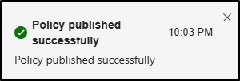

# 练习 3 - 创建 DLP 策略

Contoso 担心员工在生成式 AI 平台上共享敏感信息。 在实现 DLP 策略之前，他们需要将设备载入到 Microsoft Purview 终结点 DLP。 他们将首先在小组中以模拟模式测试策略，以确保在将其扩展到整个组织之前不会出现任何操作问题。 测试后，他们将激活策略，以在整个公司范围内强制执行。

**任务**：

1. 启用设备加入
1. 将设备加入到终结点 DLP
1. 在模拟模式下创建 DLP 策略
1. 修改 DLP 策略
1. 在模拟模式下激活策略

## 任务 1 - 启用设备加入

若要强制执行终结点 DLP 策略，Contoso 需要在 Microsoft Purview 中启用设备载入。 通过此步骤，组织将可以在其设备上跟踪和保护敏感信息。

1. 你仍应以 Joni Sherman 的身份登录 Microsoft Purview 门户。

1. 从左侧边栏中选择“**设置**”。

1. 在左侧边栏中，展开“**设备加入**”，然后选择“**设备**”。

1. 在“**设备**”页上，选择“**启用设备加入**”，为租户启用解决方案。

1. 选择“确定”，接受“启用设备加入”对话框中的内容 。

1. 选择“确定”，接受“正在开启设备监视”对话框中的内容 。

1. 等待过程完成。 刷新页面，直到设备载入处于活动状态。

>[!note]
>本过程可能需要大约 5 分钟才能完成。

已成功启用设备载入，准备环境以载入设备并应用终结点 DLP 策略。

## 任务 2 - 将设备加入到终结点 DLP

启用设备载入后，Contoso 将载入 Windows 11 设备以应用终结点 DLP 策略。 这将允许系统保护从此设备共享的敏感数据。

1. 在左侧边栏的“**设备**”中，展开“**设备载入**”，然后选择“**载入**”。

1. 在“**载入**”页上，确保选择“**Windows 10**”作为操作系统，并选择“**本地脚本（最多 10 台计算机）**”作为部署方法。

1. 选择**下载包**。

1. 在“**下载**”对话框中，将鼠标悬停在下载上方，然后选择文件夹图标以“**在文件夹中显示**”。

   

1. 提取 **DeviceComplianceOnboardingPackage** zip 文件，然后打开提取的文件夹。

1. 右键单击“**DeviceComplianceLocalOnboardingScript.cmd**”文件，选择“**显示更多选项**”，然后选择“**属性**”。

1. 在属性窗口的“**常规**”选项卡底部，选择“**安全**”部分中的“**取消阻止**”，然后选择“**确定**”以保存此设置。

   

1. 右键单击“**DeviceComplianceLocalOnboardingScript.cmd**”，然后选择“**以管理员身份运行**”。

1. 在“**用户帐户控制**”对话框中，选择“**是**”。

1. 在“**命令提示符**”屏幕中键入 **Y** 以进行确认。

1. 脚本完成后，将收到成功消息和“**按任意键继续**”提示。 按任意键关闭命令窗口。 完成此加入可能需要一分钟时间。

你已成功载入 Windows 11 设备，使其能够受到终结点 DLP 策略的保护。

## 任务 3 - 在模拟模式下创建终结点 DLP 策略

在此任务中，你将创建一个终结点 DLP 策略，阻止用户将敏感数据复制和粘贴到生成式 AI 平台。 Contoso 将首先在一小群员工中以模拟模式进行测试，以确保它不会造成任何问题。

1. 在 Microsoft Purview 门户中，从左侧边栏中选择“**解决方案**”，然后选择“**数据丢失防护**”。

1. 选择“**策略**”，然后选择“**+创建策略**”。

1. 在“从模板开始或创建自定义策略”页面上，依次选择“自定义”、“自定义策略”和“下一步”****************。

1. 在“**为 DLP 策略命名**”页上输入：

    - **名称**：`Generative AI sharing DLP policy`
    - **说明**：`Prevent sharing of sensitive data with generative AI platforms.`

1. 选择**下一步**。

1. 在“分配管理单元”**** 页面上，选择“下一步”****。

1. 在“**选择应用策略的位置**”页上，仅选择“**设备**”这一位置。 如果已选择任何其他位置，请确保将其取消选中。

1. 在“**操作**”列下的“**设备**”行上，选择“**编辑**”以更改策略范围。

   

1. 在“**设备范围**”页上，选择“**特定用户和组**”，然后在浮出控件页中选择“**包含用户和组**”。

1. 在“**选择用户和组**”页上，选中 `Retail` 组的复选框，然后选择页面底部的“**完成**”。

1. 在 **“设备范围**”上，选择“**完成**”。

1. 在“**选择应用策略的位置**”页上，选择“**下一步**”。

1. 在“定义策略设置”页面上，选择“创建或自定义高级 DLP 规则”，然后选择“下一步”************。

1. 在“自定义高级 DLP 规则”页面上选择“+ 创建规则” 。

1. 在“创建规则”**** 页面上，输入：

    - **名称**：`Sensitive data protection rule`
    - **说明**：`Detect and restrict sharing of sensitive information with generative AI platforms.`

1. 在“**条件**”下选择“**+ 添加条件**”，然后选择“**内容包含**”。

1. 在新打开的“**内容包含**”区域中，选择“**添加**”，然后选择“**敏感信息类型**”。

1. 在右侧的“**敏感信息类型**”浮出控件页上，搜索 `Credit` 并选中“**信用卡号码**”敏感信息类型的复选框。

1. 选择页面底部的“添加”。

1. 在“**操作**”部分，选择“**+添加操作**”下拉列表，然后选择“**审核或限制设备上的活动**”。

1. 在新打开的“**审核或限制设备上的活动**”区域中，选中“**服务域和浏览器活动**”部分中的“**上传到受限的云服务域或从不允许的浏览器访问**”复选框，然后在此选项下选择“**+ 为敏感服务域选择不同的限制**”。

1. 在“**敏感服务域限制**”浮出控件页中，选择“**+添加组**”。

1. 在“**选择敏感服务域组**”中，选中“**生成式 AI 网站**”复选框，然后选择浮出控件页底部的“**添加**”。

1. 返回“**敏感服务域限制**”页，确保“**生成式 AI 网站**”已列出，然后选择浮出控件页底部的“**保存**”。

1. 返回“**创建规则**”页，选中“**粘贴到支持的浏览器**”复选框，然后在此选项下选择“**+为敏感服务域选择不同的限制**”。

1. 在“**敏感服务域限制**”浮出控件页中，选择“**+添加组**”。

1. 在“**选择敏感服务域组**”中，选中“**生成式 AI 网站**”复选框，然后选择浮出控件页底部的“**添加**”。

1. 在“**敏感服务域限制**”页上选择“**保存**”。

1. 返回到“**服务域和浏览器活动**”部分中的“**创建规则**”，将“**上传到受限的云服务域或从不允许的浏览器访问**”和“**粘贴到受支持的浏览器**”对应的操作从“**仅审核**”更新为“**阻止**”。

1. 在“**用户通知**”部分中，将“**使用通知来通知用户并帮助引导他们正确使用敏感信息**” 设为“**开启**”。

1. 在“**终结点设备**”下，选中“**向用户显示策略提示通知**”复选框。

1. 在“Microsoft 365 服务”下，选中“使用策略提示通知 Office 365 服务用户”复选框 。

1. 选择页面底部的“保存”  。

1. 返回到“**自定义高级 DLP 规则**”页，选择“**下一步**”。

1. 在“**策略模式**”页上，选择“**在模拟模式下运行策略**”，然后选择“**下一步**”。

1. 在“查看并完成”页面上，查看策略设置，然后选择“提交”******** 以创建策略。

1. 创建策略后，请在“**已创建新策略**”页上选择“**完成**”。

你已成功在模拟模式下创建终结点 DLP 策略。

## 任务 4 - 修改 DLP 策略

在小组中测试策略后，Contoso 已准备好将其扩展到所有员工。 在此任务中，你将修改策略以将其应用于整个公司，以便保护每个人的敏感数据。

1. 在“**策略**”页上，选中最近创建的“**生成式 AI 共享 DLP 策略**”的复选框，然后选择“**编辑策略**”以打开策略配置。

1. 在“为 DLP 策略命名”页面上，选择“下一步” 。

1. 在“分配管理单元”**** 页上，选择“下一步”****。

1. 在“**操作**”列下的“**设备**”行上，选择“**编辑**”以更改策略范围。

1. 在“**设备范围**”页上，选择“**所有用户和组**”，然后选择页面底部的“**完成**”。

1. 选择“**下一步**”，直到到达“**策略模式**”页面。

1. 在“**策略模式**”页上，选择“**在模拟模式下运行策略**”，然后选择“**下一步**”。

1. 在“**查看并完成**”页上，选择“**提交**”，然后在“**策略已更新**”页上选择“**完成**”。

你已成功更新 DLP 策略，使其覆盖所有员工。

## 任务 5 - 在模拟模式下激活策略

现在，策略已经过测试和扩展，Contoso 已准备好将其启用它。 在此任务中，你将激活策略，使其开始阻止任何与生成式 AI 平台共享敏感数据的尝试。

1. 在“**策略**”页上，选择“**生成式 AI 共享 DLP 策略**”。

1. 在包含生成式 AI 共享 DLP 策略说明的浮出控件页上，选择“**查看模拟**”。

1. 选择“**打开策略**”，然后选择“**确认**”以确认选择。

1. 你应会收到一条浮出控件通知，确认 DLP 策略已发布。

   

你已成功激活 DLP 策略。 敏感数据现已受到保护，不会被复制和粘贴到生成式 AI 平台。
