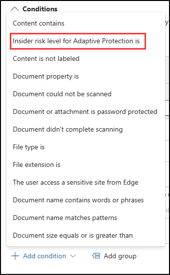

# 练习 5 - 创建自适应保护策略

Contoso 已实施 DLP 策略，以防止将数据复制到生成式 AI 平台。 但是，该公司已确定需要进行更为动态的控制，确保对参与风险行为的用户采取更严格的措施。 为了解决此问题，Contoso 将使用 Microsoft Purviews 自适应保护，根据用户的内部风险级别自动调整 DLP 策略的实施，确保风险较高的用户面临更多限制，同时为其他人保持灵活性。

**任务**：

1. 将自适应保护条件添加到 DLP 策略
1. 在内部风险管理中启用自适应保护

## 任务 1 – 将自适应保护条件添加到 DLP 策略

现在，Contoso 已准备好使用自适应保护，接下来首先将自适应条件添加到现有 DLP 策略。 此条件将根据内部风险管理确定的内部风险级别动态调整策略的限制。

1. 在 **Microsoft Edge** 中，通过选择“**解决方案** > **数据丢失防护**”导航到 DLP。

1. 从左侧边栏中选择“**策略**”。

1. 选择在上一练习中创建的“**生成式 AI 共享 DLP 策略**”策略，然后选择“**编辑策略**”按钮。

1. 在“**命名 DLP 策略**”页上，选择“**下一步**”，直到进入“**自定义高级 DLP 规则**”页。

在“**自定义高级 DLP 规则**”页上，选择铅笔图标以编辑**敏感数据保护规则**。

1. 在“**编辑规则**”浮出控件页上的“**条件**”部分中，选择“**+ 添加条件**”下拉列表，然后选择“**自适应保护内部风险级别**”的条件为条件。

   

1. 在“**自适应保护内部风险级别**”部分，选中“**提升风险级别**”复选框。

1. 在“**编辑规则**”页底部，选择“**保存**”。

1. 在“**自定义高级 DLP 规则**”页上，选择“**下一步**”，直到进入“**查看并完成**”页。

1. 在“**查看并完成**”页上选择“**提交**”，然后在“**策略已更新**”页上选择“**完成**”。

已使用自适应保护成功配置 DLP 策略，允许它根据用户的风险级别自动调整强制实施，从而提高数据保护，而不会影响低风险员工的工作效率。

## 任务 2 - 在内部风险管理中启用自适应保护

在此任务中，你将通过设置内部风险级别并在内部风险管理中启用自适应保护来配置自适应保护。 这可确保 DLP 策略根据用户行为和风险级别进行动态调整。

1. 在 Microsoft Purview 门户中，选择”**解决方案**“ > “**内部风险管理**”。

1. 在“**内部风险管理**”页上，从左侧边栏中选择“**自适应保护**”。

1. 在“**自适应保护**”页上，选择左侧的“**内部风险级别**”选项卡。

1. 在“**内部风险级别**”页上的“**内部风险策略**”下，选择在上一任务中创建的“**敏感数据保护**”策略。

1. 使用“**内部风险级别的条件**”的内置条件，然后选择页面底部的“**保存**”。

1. 选择左侧的“**数据丢失防护**”选项卡，并验证**生成式 AI 共享 DLP 策略**是否可用。

1. 选择“**自适应保护设置**”选项卡，并将**自适应保护**开关切换为“**开启**”，然后选择页面底部的“**保存**”。

你已成功在内部风险管理中启用自适应保护，确保 DLP 策略现在根据单个用户的风险级别动态应用，增强数据保护，同时最大程度地减少日常业务运营中断。
