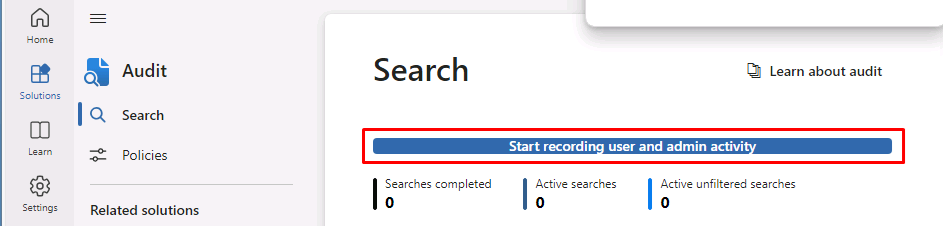

---
lab:
  title: 实验室设置：为管理准备环境
  module: Module 0 - Lab Setup
---

## WWL 租户 - 使用条款

如果在讲师引导式培训过程中向你提供租户，请注意，提供租户旨在支持讲师引导式培训中的动手实验室。

租户不应共享或用于动手实验室以外的用途。 本课程使用的租户为试用租户，课程结束后无法使用或访问，不符合扩展条件。

租户不得转换为付费订阅。 在本课程中获得的租户仍然是 Microsoft Corporation 的财产，我们保留随时获取访问权限和收回的权利。

# 实验室设置：为管理准备环境

在本实验室中，你将为管理任务配置和准备环境。 按照提供的步骤，你将确保提前启用基本功能和设置，从而在即将进行的实验室活动中获得更轻松的学习体验。 此准备工作将包括激活必要的功能、设置管理权限，以及确保正确配置关键元素。

## 任务 1 - 设置用于实验室练习的用户密码

在此任务中，你将为实验室所需的用户帐户设置密码。

1. 使用 **lon-cl1\admin** 帐户登录到客户端 1 VM (LON-CL1)。 密码应由实验室托管提供程序提供。

1. 在 **Microsoft Edge** 中，导航到 https://admin.microsoft.com 并以 MOD 管理员 admin@WWLxZZZZZZ.onmicrosoft.com（其中 ZZZZZZ 是实验室托管提供程序提供的唯一租户 ID）的身份登录到 Microsoft Purview 门户。

1. 在左侧导航窗格中，展开“**用户**”，然后选择“**活动用户**”。

1. 在“**活动用户**”页上，将鼠标悬停在 **Joni Sherman** 的用户帐户上，此时应会显示密钥。

1. 选择“**重置密码**”键，此时右侧应显示“**重置密码**”浮出控件页，以重置 Joni 的密码。

1. 确保在“**重置密码**”浮出控件页上未选中任何复选框。

1. 在“**密码**”字段中，输入可记住的 Joni 密码，例如 MOD 管理员帐户的密码：

    >**提示**：可以将 Joni 的密码重置为与管理员帐户相同的密码，该密码应由实验室托管提供商提供。

1. 选择“**重置密码**”按钮以重置 Joni 的密码。

1. 在“**密码已重置**”页上，选择“**关闭**”按钮以返回到“**活动用户**”页。

1. 重复步骤 4-8 以重置 **Megan Bowen** 和 **Lynne Robbins** 的密码。

## 任务 2 – 授权合规性管理员角色

1. 从用户列表中选择 **Joni Sherman**。

1. 在“**帐户**”选项卡的“**角色**”部分，选择“**管理角色**”。

1. 选择“**管理中心访问权限**”，然后选择“**按类别显示所有**”。

1. 向下滚动到“**安全与合规性**”部分下，然后选择“**合规性管理员**”。 然后选择底部的“**保存更改**”。

1. 关闭 Joni 的用户窗格。

## 任务 3 - 在 Microsoft Purview 门户中启用审核

在此任务中，你将在 Microsoft Purview 合规门户中启用“审核”。 此跟踪功能通过监视门户活动来确保可见性和实施问责。

<!-- 
1. You should still be signed in to Client 1 VM (LON-CL1) as the **lon-cl1\admin** account and Microsoft 365 with the MOD Administrator account.
-->

1. 在“Microsoft Edge”中，导航到 。

1. 选中“**我同意数据流披露条款**”的复选框，然后选择“**开始**”。

1. 在左侧导航中，选择“**解决方案**”，然后选择“**审核**”。

1. 在“搜索”页上，选择“**开始录制用户和管理活动**”按钮以激活审核日志记录。

    

## 任务 4 - 在 Microsoft Teams 中启用按名称搜索

在此任务中，你将在 Microsoft Teams 中启用“**按名称搜索**”功能，以进行实验室设置。 通过此操作，可以在组织内轻松实现定位和连接。 按照步骤预先激活它，以确保使用信息屏障时的可用性。

<!-- 
1. You should still be signed in to Client 1 VM (LON-CL1) as the **lon-cl1\admin** account and Microsoft 365 with the MOD Administrator account.
-->

1. 在“Microsoft Edge”中，导航到 。

1. 在左侧导航中，选择 **Teams**，然后选择“**Teams 设置**”。

1. 向下滚动到“**按名称搜索**”部分，然后将“**使用 Exchange 通讯簿策略的范围目录搜索**”切换为“**开启**”。

1. 选择“**保存**”以保存此设置，然后选择“**确认**”。

## 任务 5 - 在 SharePoint Online 和 OneDrive 中启用信息障碍

在此任务中，我们将在 SharePoint Online 和 OneDrive 中启用信息屏障，以促进安全协作并防止未经授权的通信。

<!-- 
1. You should still be signed in to Client 1 VM (LON-CL1) as the **lon-cl1\admin** account.
-->

1. 从 "开始 "菜单中搜索“**Windows PowerShell**”并选择“**以管理员身份运行**”，从而打开一个提升的 PowerShell 窗口。

1. 选择“是”确认“用户帐户控制”窗口 。

1. 运行以下 cmdlet，以安装最新版本的 Sharepoint Online PowerShell 模块：

    ```powershell
    Install-Module -Name Microsoft.Online.SharePoint.PowerShell
    ```

1. 如果系统提示安装 PowerShell NuGet 提供程序，请输入 **Y** 以安装该提供程序。

1. 如果系统提示从不受信任的存储库进行安装，请输入 **Y** 以从 PSGallery 安装模块。

1. 运行以下 cmdlet，以连接到 SharePoint Online 管理中心：

    ```powershell
    Connect-SPOService -Url https://WWLxZZZZZZ-admin.sharepoint.com
    ```

    >注意：请务必更新 ZZZZZZ。 ZZZZZZ 是实验室托管提供程序提供的唯一租户 ID。

1. 使用实验室托管提供商提供的 admin@WWLxZZZZZZ.onmicrosoft.com 登录。

1. 若要在 SharePoint 和 OneDrive 中启用信息屏障，请运行以下命令：

    ```powershell
    Set-SPOTenant -InformationBarriersSuspension $false
    ```

<!--
1. Close the PowerShell window once this is complete.
-->

1. 使 PowerShell 保持打开状态供以后使用。