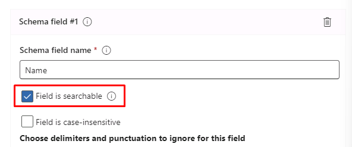
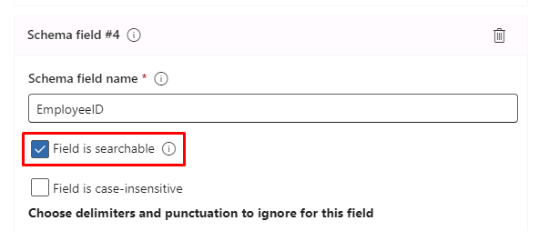
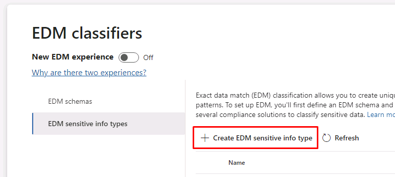
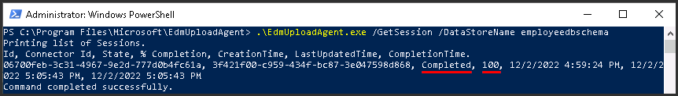

---
lab:
  title: 练习 3 - 管理敏感信息类型
  module: Module 1 - Implement Information Protection
---

<!--
# Lab 1 - Exercise 3 - Manage Sensitive Information Types
-->

# 练习 1 - 管理敏感信息类型

Contoso Ltd. 之前遇到过员工在使用票证解决方案处理支持票证时意外发送了客户个人信息的问题。 为了在将来指导用户使用，需要使用一种自定义敏感信息类型来识别电子邮件和文档中的员工 ID，这些 ID 由三个大写字符和六个数字组成。 为了降低假正率，将使用关键字“员工”和“ID”。 在本任务中，你将创建一种新的自定义敏感信息类型、用于基于 EDM 的分类的数据库以及关键字字典。 

## 任务 1 - 创建自定义敏感信息类型

在本练习中，你将使用安全与合规中心 PowerShell 模块创建新的自定义敏感信息类型，以识别关键字“员工”和“ID”旁边的员工 ID 的模式。

<!--
1. You should still be signed in to Client 1 VM (LON-CL1) as the **lon-cl1\admin** account.
-->

1. 在 **Microsoft Edge** 中，选择右上角的省略号并选择“**新建 InPrivate窗口**”，打开 InPrivate 窗口。

1. 转到 https://purview.microsoft.com 并以 **Joni Sherman**，JoniS@WWLxZZZZZZ.onmicrosoft.com（其中 ZZZZZZ 是实验室托管提供程序提供的唯一租户 ID）的身份登录到 Microsoft Purview 门户。 Joni 的密码应由实验室托管提供程序提供。

1. 从左侧窗格中选择“**解决方案**”，然后选择“**数据丢失防护**”。

1. 展开**分类器**并选择“**敏感信息类型**”。

    >**提示：** 如果 Purview 门户中没有显示“**敏感信息类型**”，则可能是因为之前实验室中将 Joni 的权限更新为合规性管理员尚未在浏览器中更新。  你可能需要注销，并以 JoniS 的身份登录。

1. 如果显示“什么是数据分类?”消息，选择“关闭” 。 

1. 选择“+ 创建敏感信息类型”打开新建敏感信息类型向导。

1. 在“**为敏感信息类型命名**”步骤，输入以下信息：

    - 名称：Contoso 员工 ID
    - 说明：Contoso 员工 ID 模式。

1. 选择“下一步”  。

1. 在“为此敏感信息类型定义模式”页面上，选择“+ 创建模式” 。

1. 在右侧的“新建模式”窗格中，选择“+ 添加主元素”，然后选择“正则表达式”  。

1. 在“**添加正则表达式**”中，输入以下内容：

    - ID：Contoso ID
    - 正则表达式：```[A-Z]{3}[0-9]{6}```
    - 选择“**字符串匹配**”单选按钮。

1. 选择“完成”。****

1. 在“**支持元素**”下，选择“**+ 添加支持元素或元素组**”，然后选择“**关键字列表**”。

1. 在“**添加关键字列表**”，输入以下内容：

    - ID：员工 ID 关键字
    - 不区分大小写：
        - *员工*
        - *ID*
    - 选择“**Word 匹配**”单选按钮。

1. 选择“完成”。****

1. 在“**新建模式**”窗格中，将“**字符相似度**”值减少到 *100* 个字符。

1. 选择“创建”按钮。

1. 返回“**为此敏感信息类型定义模式**”步骤，选择“**下一步**”。

1. 在“**选择建议的可信度级别以显示合规性策略**”步骤，使用默认值，并选择“**下一步**”。

1. 在“**查看设置并完成**”步骤，查看设置并选择“**创建**”。 成功创建后，选择“完成”。

1. 使 InPrivate 浏览器窗口保持打开状态。

你已成功创建新的敏感信息类型，以 3 个大写字母、6 个数字和 100 个字符范围内的关键字“员工”或“ID”的形式标识员工 ID。

## 任务 2 - 创建基于 EDM 的分类信息类型

作为额外的搜索模式，你将使用员工数据的数据库架构创建基于完全数据匹配 (EDM) 的分类。 数据库源文件将使用员工的以下数据字段进行格式化：Name、Birthdate、StreetAddress 和 EmployeeID。

<!--
1. You should still be signed in to Client 1 VM (LON-CL1) as the **lon-cl1\admin** account, and you should be signed in to Microsoft 365 as **Joni Sherman**.

1. To create the required Azure AD security group, sign out of Joni Sherman's account by selecting the user image in the upper right corner and select **Sign out**.

1. Close the browser window and open a new browser window.

1. In **Microsoft Edge**, navigate to **https://admin.microsoft.com**.

1. When the **Pick an account** page is displayed, select **Use another account** and sign in as **MOD Administrator** admin@WWLxZZZZZZ.onmicrosoft.com (where ZZZZZZ is your unique tenant ID provided by your lab hosting provider).  Admin's password should be provided by your lab hosting provider.
-->

1. 打开以“**MOD 管理员**”身份登录的常规 **Microsoft Edge** 窗口。

1. 转到 https://admin.microsoft.com。

1. 在左侧窗格中，依次选择“**团队和组**”和“**活动团队和组**”。

1. 在组列表上方，选择“**安全组**”选项卡，然后选择“**+ 添加安全组**”。

    

1. 在“**设置基本信息**”步骤，输入以下内容：
    - **名称**：EDM_DataUploaders
    - **说明**：为 EDM 上传数据的人员。

1. 选择**下一步**。

1. 在“**编辑设置**”步骤，保留为默认设置，然后选择“**下一步**”。

1. 在“**查看并完成添加组**”步骤，查看设置并选择“**创建组**”。

1. 创建后，选择“**关闭**”。

1. 确保已选择“**安全组**”选项卡，然后选择“**刷新**”。 

1. 从列表中选择新创建的 **EDM_DataUploaders** 组，以在右侧打开 **EDM_DataUploaders** 浮出控件页。

1. 依次选择“成员”选项卡和“查看全部并管理成员” 。

1. 选择“**(+) 添加成员**”。

1. 选择 **Joni Sherman**，然后选择底部的“**添加 (1)**”按钮。 

1. 选择浮出控件窗格左上角的后退箭头按钮。

1. 验证“成员”下是否列出“Joni Sherman” 。

1. 关闭 **EDM_DataUploaders** 窗格，右上角为 **X**。

<!--
1. Select the circle with the MOD Administrator initials **MA** and select **Sign out**.

1. Close the browser window and open a new one.

1. Navigate to the Microsoft Purview portal at https://compliance.microsoft.com.

1. When the **Pick an account** page is displayed, select **Joni Sherman** and sign in.
--> 

1. 打开以 **Joni Sherman** 身份登录的 **Microsoft Edge** InPrivate 窗口。

1. 如果从我们离开的位置导航，请从左窗格中选择“**数据丢失防护**”。

1. 展开**分类器**并选择“**EDM 分类器**”。

    >**注意：** 创建并提供基于完全数据匹配 (EDM) 的敏感信息类型 (SIT) 是一个多阶段过程。 可以将新体验与现有经典体验结合使用。 本实验室逐步介绍如何使用经典体验创建基于 EDM 的 SIT。 如需详细了解如何使用新体验创建基于 EDM 的 SIT，请参阅以下内容：[创建完全数据匹配敏感信息类型工作流新体验](https://learn.microsoft.com/en-us/microsoft-365/compliance/sit-create-edm-sit-unified-ux-workflow?view=o365-worldwide)

1. 确保将“**新式 EDM 体验**”切换为“**关闭**”，以使用经典体验。

    

1. 选择“+ 创建 EDM 架构”

1. 在“**新建 EDM 架构**”页上输入以下内容：
    - **名称**：employeedb
    - **说明**：员工数据库架构

1. 启用“忽略所有架构字段的分隔符和标点符号”。

1. 单击“**选择要忽略的分隔符和标点符号**”的下拉列表，然后选择：

    - **Hyphen**
    - **时间段**
    - **Space**
    - **左括号**
    - **右括号**

1. 在第一个“**架构字段名称**”中输入“*名称*”，并选中“**字段可搜索**”复选框。

    

1. 选择底部的“**+ 添加架构数据字段**”。

1. 在“架构字段名称”中的“架构字段 2”下，输入 Birthdate 。

1. 选择“**+ 添加架构数据字段**”。

1. 在“架构字段名称”中的“架构字段 3”下，输入 StreetAddress 。

1. 选择“**+ 添加架构数据字段**”。

1. 在“**架构字段名称**”的“**架构字段 #4**”下，输入 *EmployeeID*，然后选择“**字段可搜索**”复选框。

    

1. 选择“保存”。

1. 从“**EDM 分类器**”的左侧窗格中选择“**EDM 敏感信息类型**”。

1. 选择“+ 创建 EDM 敏感信息类型”以打开“EDM 规则包”向导 。  

    

1. 在“**定义数据存储架构**”步骤，选择“**选择现有 EDM 架构**”。

1. 依次选择“employeedb”和“添加” 。

1. 查看数据存储架构，然后选择“下一步”。

1. 在“**为此 EDM 敏感信息类型定义模式**”步骤，选择“**+ 创建模式**”。

1. 在“**新建模式**”窗格的“**主要元素**”字段中，选择“**EmployeeID**”。

1. 选择“**+ 选择敏感信息类型**”。

1. 在“**搜索**”栏中，输入 *Contoso* 并按 **Enter** 键。

1. 依次选择“Contoso 员工 ID”和“完成” 。

1. 在“**新建模式**”窗格中，选择“**完成**”。

1. 在“**为此 EDM 敏感信息类型定义模式**”步骤，选择“**下一步**”。

1. 在“**选择建议的可信度和字符相似度**”步骤，保留默认值，然后选择“**下一步**”。

1. 在“**命名并描述 EDM 敏感信息类型**”步骤，输入以下信息：
    - **名称**：Contoso 员工 EDM
    - **针对管理员的说明**：针对员工个人信息的基于 EDM 的敏感信息类型。

1. 选择**下一步**。

1. 查看设置并选择“**提交**”。 创建后，选择“**完成**”。

1. 使 Microsoft Purview 门户在浏览器中保持打开状态。

你已成功创建基于 EDM 的新分类敏感信息类型，用于从数据库文件源中识别员工数据。

## 任务 3 - 创建基于 EDM 的分类数据源

为了将基于 EDM 的分类与包含敏感数据的数据库关联，接下来需要通过 EDM 上传代理工具对敏感信息类型的实际数据进行哈希处理并上传这些数据。

<!--
1. You should still be signed in to Client 1 VM (LON-CL1) as the **lon-cl1\admin** account, and you should be signed in to Microsoft 365 as **Joni Sherman**.

1. In **Microsoft Edge**, navigate to **https://go.microsoft.com/fwlink/?linkid=2088639** to access the EDM download agent.
-->

1. 在 InPrivate 窗口中打开一个新选项卡，转到 https://go.microsoft.com/fwlink/?linkid=2088639 访问 EDM 下载代理。

1. 选择下载的文件，启动安装程序。

1. 选择**下一步**。

1. 依次选择“我接受许可协议中的条款”和“下一步” 。

1. 请勿更改默认的“目标文件夹”路径，并选择“下一步” 。

1. 选择“安装”  。

1. 当“用户帐户控制”窗口打开时，选择“是” 。

1. 安装完成后，选择“完成”。

1. 打开开始菜单，搜索并选择“**记事本**”。

1. 在记事本窗口中输入以下文本：

    ``` text
    Name,Birthdate,StreetAddress,EmployeeID
    Joni Sherman,01.06.1980,1 Main Street,CSO123456
    Lynne Robbins,31.01.1985,2 Secondary Street,CSO654321
    ```

1. 依次选择“文件”和“另存为”，以保存文件 。

1. 从左侧窗格中选择“文档”，并在“文件名”字段中输入以下内容 ：EmployeeData.csv

1. 选择“保存类型:”下拉菜单，然后选择“所有文件( *.* )” 。

1. 选择“编码:”下拉菜单，然后依次选择“UTF-8”和“保存”  。

<!--
1. Close Notepad.

1. Select the windows symbol in the 
bar with the right mouse button and select **Windows PowerShell (Admin)** and run as administrator.

1. When the **User Account Control** window opens, select **Yes**.
-->

1. 请让记事本保持打开状态，供以后使用。

1. 从任务栏中选择提升的 PowerShell 窗口。

1. 导航到 EDM 上传代理目录：

    ``` text
    cd "C:\Program Files\Microsoft\EdmUploadAgent"
    ```

1. 通过运行以下 cmdlet，使用你的帐户授权，将数据库上传到租户：

    ``` text
    .\EdmUploadAgent.exe /Authorize
    ```

1. 显示“选择帐户”窗口时，以 JoniS@WWLxZZZZZZ.onmicrosoft.com（其中 ZZZZZZ 是实验室托管提供程序提供的唯一租户 ID）登录。  Joni 的密码应由实验室托管提供程序提供。

1. 通过在 PowerShell 中运行以下脚本，下载基于 EDM 的分类敏感信息类型的数据库架构定义：

    ``` text
    .\EdmUploadAgent.exe /SaveSchema /DataStoreName employeedb /OutputDir "C:\Users\Admin\Documents\"
    ```

    注意：如果最后一条命令失败，则可能需要更多时间才能应用“EDM_DataUploaders”组成员身份。 可能需要一个小时才能下载架构文件。  如果失败，请继续下一个任务，稍后返回此步骤。

1. 通过在 PowerShell 中运行以下脚本，对数据库文件进行哈希处理并将其上传到基于 EDM 的分类敏感信息类型：

    ``` text
    .\EdmUploadAgent.exe /UploadData /DataStoreName employeedb /DataFile "C:\Users\Admin\Documents\EmployeeData.csv" /HashLocation "C:\Users\Admin\Documents\" /Schema "C:\Users\Admin\Documents\employeedb.xml"
    ```

1. 使用以下命令检查上传进度：

    ``` text
    .\EdmUploadAgent.exe /GetSession /DataStoreName employeedb
    ```

1. 状态显示为“已完成”后，即可使用 EDM 数据。

    

<!--
1. Close the PowerShell window.
-->

1. 使 PowerShell 保持打开状态供以后使用。

你已成功对基于 EDM 的分类敏感信息类型数据库文件进行了哈希处理，并上传了该文件。

## 任务 4 - 创建关键字字典

在同事报告病假后，用户发送电子邮件时发生了几次个人信息泄露违规。  发生这种情况时，疾病原因就会被散布出去。我们不希望发生这种情况。

<!--
1. You should still be signed in to Client 1 VM (LON-CL1) as the **lon-cl1\admin** account, and you should be signed in to Microsoft 365 as **Joni Sherman**.

1. In **Microsoft Edge**, the Microsoft Purview portal tab should still be open. If so, select it and proceed to the next step. If you closed it, then in a new tab, navigate to **https://purview.microsoft.com**.
-->

1. 打开以 **Joni Sherman** 登录的 InPrivate 窗口，如果已关闭，请返回到 https://purview.microsoft.com。

1. 从左窗格*中选择“**数据丢失防护**”。

1. 展开**分类器**并选择“**敏感信息类型**”。

1. 选择“+ 创建敏感信息类型”打开新建敏感信息类型向导。

1. 在“为敏感信息类型命名”页面上，输入以下信息：

    - 名称：Contoso 疾病列表
    - 描述：列出员工可能患有的疾病。

1. 选择“下一步”  。

1. 在“为此敏感信息类型定义模式”页面上，选择“+ 创建模式” 。

1. 在“**新建模式**”页上选择“**主要元素**”下面的下拉字段，然后选择“**关键字字典**”。

1. 在“**添加关键字字典**”页面上输入以下内容：

   - **名称**：疾病字典
   - **关键字**：
      - 流感
      - 流行性感冒
      - cold（冷）
      - 支气管炎
      - 耳炎  

1. 选择“完成”  。

1. 在“支持元素”下，选择“+ 添加支持元素或元素组”下拉列表并选择“关键字列表”以添加关键字字典的其他支持  。

1. 在“添加关键字列表”页面上，输入以下内容：

   - **ID**：员工缺勤
   - 不区分大小写：
     - employee
     - 缺勤
     - reason

1. 选择“完成”  。

1. 在“新建模式”页上查看配置，然后选择“创建” 。

1. 在“**为此敏感信息类型定义模式**”步骤，选择“**下一步**”。

1. 在“**选择建议的可信度级别以显示合规性策略**”步骤保持使用默认值，并选择“**下一步**”。

1. 在“查看设置并完成”页面上查看设置，然后选择“创建” 。  完成进程后，选择“完成”。

<!--
1. Leave the browser window in the Microsoft Purview portal open.
-->

你已基于关键字字典成功创建了新的敏感信息类型，并添加了更多关键字以降低误报率。 继续进行下一个任务。

## 任务 5 - 使用自定义敏感信息类型

在策略中使用自定义敏感信息类型之前，应始终对其进行测试，否则自定义搜索模式故障可能会导致数据丢失或泄漏。

<!--
1. You should still be signed in to Client 1 VM (LON-CL1) as the **lon-cl1\admin** account, and you should be signed in to Microsoft 365 as **Joni Sherman**.
-->

1. 从任务栏中打开“**记事本**”，然后选择顶部栏中的“**+图标**”以打开“新建”选项卡。

1. 在记事本窗口中输入以下文本：

    ``` text
    Employee Joni Sherman EMP123456 is absent because of the flu/influenza.
    ```

1. 依次选择“文件”和“另存为” 。

1. 在左侧窗格中选择“**文档**”。

1. 在“文件名”字段中，输入“SickTestData”并选择“保存”。

<!--
1. Close the Notepad window.

1. In **Microsoft Edge**, the Microsoft Purview portal tab should still be open. If so, select it and proceed to the next step. If you closed it, then in a new tab, navigate to **https://purview.microsoft.com**.

-->

1. 打开 InPrivate 浏览器窗口，该窗口仍应位于**数据丢失防护**中。

1. 选择要展开的“**分类器**”，并从子菜单中选择“**敏感信息类型**”。

1. 在右上角的“搜索”框中输入“Contoso”，然后按 Enter 键。

1. 选择“Contoso 员工 ID”。

1. 选择“测试”。

1. 在“上传要测试的文件”窗格上，选择“上传文件” 。

1. 选择“**文档**”，然后选择文件 **SickTestData**，再选择“**打开**”。

1. 选择底部的“**测试**”以开始分析。

1. 在“**匹配结果**”页上，查看找到的匹配项。

1. 选择“完成”以结束测试。

1. 关闭“**Contoso 员工 EDM**”窗格，然后选择“**Contoso 疾病列表**”。

1. 选择“测试”。

1. 在“上传要测试的文件”窗格上，选择“上传文件” 。

1. 选择“**文档**”，然后选择文件 **SickTestData**，再选择“**打开**”。

1. 选择“测试”以开始分析。

1. 在“**匹配结果**”页上，查看找到的匹配项。 查看完后，选择“完成”。

你已成功测试了两种自定义敏感信息类型，并验证了搜索模式可以识别所需的模式。 你已完成敏感信息类型的创建，可以继续下一个练习。
