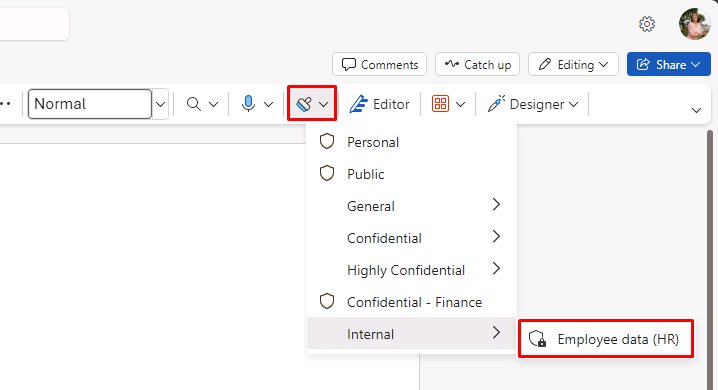

---
lab:
  title: 练习 5 - 管理敏感度标签
  module: Module 1 - Implement Information Protection
---

<!-- 
# Lab 1 - Exercise 5 - Manage Sensitivity Labels
-->

# 练习 2 - 管理敏感度标签

在本实验室中，你将扮演 Contoso Ltd. 的系统管理员 Joni Sherman。你的组织位于德国的雷德尼茨亨巴赫，目前打算实现一个敏感度计划，以确保人力资源部门的所有员工文档都已使用敏感度标签标记为组织信息保护策略的一部分。

## 任务 1 - 启用对敏感度标签的支持

在本任务中，你将安装 MSOnline 模块和 SharePoint Online PowerShell 模块，并在租户上启用对敏感度标签的支持。

<!--
1. Sign in to the Client 1 VM (LON-CL1) as the **lon-cl1\admin** account.

1. Open an elevated PowerShell window by selecting the start menu with the right mouse button and then select **Windows PowerShell** and run as administrator.

1. Confirm the **User Account Control** window with **Yes** and press Enter.
-->

1. 从任务栏中打开以前提升的 PowerShell 窗口。

1. 输入以下 cmdlet，以安装最新版 MS Online PowerShell 模块：

    ```powershell
    Install-Module -Name MSOnline
    ```

1. 输入表示“是”的 **Y** 并按 **Enter** 键以确认“NuGet 安全性”对话框以及“不受信任的存储库安全性”对话框。 这可能需要一段时间才能处理完成。

1. 输入以下 cmdlet，以连接到 MS Online 服务：

    ```powershell
    Connect-MsolService
    ```

1. 在“登录到帐户”窗体中，以 Joni Sherman 的身份 JoniS@WWLxZZZZZZ.onmicrosoft.com（其中 ZZZZZZ 是实验室托管提供程序提供的唯一租户 ID）登录。 Joni 的密码应由实验室托管提供程序提供。

1. 输入以下 cmdlet 以获取并存储域值：

    ```powershell
    $domain = get-msoldomain
    ```

1. 输入以下 cmdlet，以配置 SharePoint 管理员 URL：

    ```powershell
    $adminurl = "https://" + $domain.Name.split('.')[0] + "-admin.sharepoint.com"
    ```

1. 输入以下 cmdlet，以登录到 SharePoint Online 管理中心：

    ```powershell
    Connect-SPOService -url $adminurl
    ```

1. 以 “**MOD 管理员**”的身份登录。 admin@WWLxZZZZZZ.onmicrosoft.com（其中 ZZZZZZ 是实验室托管提供程序提供的唯一租户 ID）。 <!--Admin's password should be provided by your lab hosting provider.-->

1. 输入以下 cmdlet，以启用对敏感度标签的支持：

    ```powershell
    Set-SPOTenant -EnableAIPIntegration $true
    ```

1. 输入表示“是”的 Y 并按 Enter 键，以确认更改。

<!--
1. Close the PowerShell window.
-->

1. 使 PowerShell 窗口保持打开状态供以后的用户使用。

你通过 Teams 和 SharePoint 网站成功启用了对敏感度标签的支持。

## 任务 2 - 创建敏感度标签

在本任务中，人力资源部门申请了敏感度标签，以应用于人力资源员工文档。 你将为内部文档创建敏感度标签，为人力资源部门创建子标签。

<!--
1. You should still be signed in to Client 1 VM (LON-CL1) as the **lon-cl1\admin** account.

1. In **Microsoft Edge**, navigate to **https://purview.microsoft.com** and sign in to the Microsoft Purview portal as **Joni Sherman** JoniS@WWLxZZZZZZ.onmicrosoft.com (where ZZZZZZ is your unique tenant ID provided by your lab hosting provider).  Joni's password should be provided by your lab hosting provider.
-->

1. 打开以 **Joni Sherman** 登录的 InPrivate 窗口，如果已关闭，请返回到 https://purview.microsoft.com。

1. 在左侧窗格中选择“**解决方案**”，然后选择“**信息保护**”。

1. 选择“**敏感度标签**”。

1. 从现有标签列表上方的行中选择“**+创建标签**”。

1. 在“**为标签命名并创建工具提示**”步骤，输入以下信息：

    - **名称**：内部
    - **显示名称**：内部
    - 针对用户的说明：内部敏感度标签。
    - 针对管理员的说明：Contoso 的内部敏感度标签。

1. 选择**下一步**。

1. 在“**定义此标签的范围**”步骤，选择 **“项**”，然后选择“**文件**”和“**电子邮件**”。 如果选择了此页上的任何其他选项，请取消选择这些选项。

1. 选择“**下一步**”，直到到达“**查看设置并完成**”步骤。

1. 选择“**创建标签**”。

1. 在“**已创建敏感度标签**”步骤，选择“**现在不创建策略**”，然后选择“**完成**”。

1. 在“敏感度标签”页上，突出显示（无需选择）新创建的“**内部**”标签，然后选择垂直的 **...**。

    

1. 从下拉菜单中选择“+ 创建子标签”。

1. 在“**提供此标签的基本详细信息**”步骤，输入以下信息：

   - **名称**：员工数据（人力资源）
   - **显示名称**：员工数据（人力资源）
   - 针对用户的说明：该人力资源标签是人力资源部门中所有指定文档的默认标签。
   - 针对管理员的说明：该标签是在与 Jones 女士（人力资源部主管）协商后创建的。 如果想更改标签的设置，请与她联系。

1. 选择**下一步**。

1. 在“**定义此标签的范围**”页上选择“**项**”、“**文件**”和“**电子邮件**”。 如果选择了此页上的任何其他选项，请取消选择这些选项。 选择**下一步**。

1. 在“**选择带标签项的保护设置**”步骤，选择“**控制访问**”复选框。 选择**下一步**。

1. 在“**访问控制**”步骤，选择“**配置访问控制设置**”。

1. 在加密设置中输入以下信息：

   - **立即分配权限或让用户自行决定?** ：立即分配权限
   - **用户对内容的访问权限过期**：从不
   - **允许脱机访问**：仅几天
   - **用户在多少天内可以脱机访问内容**:15

1. 选择“**分配权限**”链接。

1. 在“分配权限”侧菜单上，选择“+ 添加任何经身份验证的用户”。

1. 选择“保存”。

1. 在“**访问控制**”步骤，选择“**下一步**”。

1. 选择“**下一步**”，直到到达“**查看设置并完成**”步骤。

1. 选择“**创建标签**”。

1. 在“**已创建敏感度标签**”步骤，选择“**现在不创建策略**”，然后选择“**完成**”。

你已成功为组织的内部策略创建了敏感度标签，为人力资源 (HR) 部创建了敏感度子标签。

## 任务 3 - 发布敏感度标签

现在，你将发布内部敏感度标签和人力资源部敏感度标签，以便人力资源部的用户可以在其人力资源文档中使用发布的敏感度标签。

<!--
1. You should still be signed in to Client 1 VM (LON-CL1) as the **lon-cl1\admin** account, and you should be signed in to Microsoft 365 as **Joni Sherman**.  Sign in as JoniS@WWLxZZZZZZ.onmicrosoft.com (where ZZZZZZ is your unique tenant ID provided by your lab hosting provider).  Joni's password should be provided by your lab hosting provider.

1. In **Microsoft Edge**, the Microsoft Purview portal tab should still be open. If so, select it and proceed to the next step. If you closed it, then in a new tab, navigate to **https://purview.microsoft.com**.
-->

1. 你仍应位于 Purview 的“敏感度标签”页上。

1. 在使用“**+ 创建标签**”的同一行中，选择“**发布标签**”。

1. 选择“**选择要发布的敏感度标签**”链接。

1. 在新窗格中，选中“**内部**”和“**内部/员工数据 (HR) **”复选框，然后选择“**添加**”。

1. 在“**选择要发布的敏感度标签**”步骤，选择“**下一步**”。

1. 选择“**下一步**”，直到到达“**命名策略**”步骤。

1. 输入以下信息：

   - **名称**：内部人力资源员工数据
   - **输入敏感度标签策略的描述**：此人力资源标签将应用于内部人力资源员工数据。

1. 选择**下一步**。

1. 在“**查看并完成**”步骤，选择“**提交**”。

1. 在“**已创建新策略**”步骤，选择“**完成**”以完成标签策略的发布。

你成功发布了内部和人力资源敏感度标签。 请注意，最多可能需要 24 小时才能将更改复制到所有用户和服务。

## 任务 4 - 使用敏感度标签

在本任务中，你将在 Word 和 Outlook 电子邮件中创建敏感度标签。 创建的文档将存储在 OneDrive 中，并通过电子邮件发送给人力资源员工。

<!--
1. You should still be signed in to Client 1 VM (LON-CL1) as the **lon-cl1\admin** account, and you should be signed in to Microsoft 365 as **Joni Sherman** JoniS@WWLxZZZZZZ.onmicrosoft.com (where ZZZZZZ is your unique tenant ID provided by your lab hosting provider).  Joni's password should be provided by your lab hosting provider.

1. In **Microsoft Edge**, the Microsoft Purview portal tab should still be open. Select the address bar and navigate to **https://www.microsoft365.com**.
-->

1. 打开以 **Joni Sherman** 身份登录的 InPrivate 窗口中的新选项卡，然后转到 https://www.microsoft365.com。

1. 选择“登录”。

1. 滚动浏览“欢迎使用 Microsoft 365”消息，然后将其关闭。

1. 选择页面左上角的“**应用启动器**”菜单（9 个点），然后选择 **Word**。

1. 选择“**空白文档**”以创建新文档。

1. 如果显示消息“**隐私选项**”，请选择“**关闭**”。

1. 在 Word 文档中输入以下内容：

    ``` text
    Important HR employee document.
    ```

1. 从顶部窗格选择“敏感度”，以打开下拉菜单。 选择“内部”>“员工数据 (HR)”以应用标签。

    

    >**注意：** 你在本练习的任务 1 中运行的脚本为租户激活了 Word 中的敏感度标签。  有时，可能需要一个小时才能在 Microsoft Word Online 中实现该激活。  如果 Word 中未显示敏感度标签菜单，则可能需要稍后返回本实验室，或确保正确完成了本练习的任务 1。

    >你可能会看到一条警告，指出“无法在 Word 网页版中应用此标签...”，如果看到此警告，请稍等片刻，重新启动 Word，然后重试。

    

1. 选择 Word 徽标旁边的窗口左上角的“**文档**”，将其重命名。

1. 输入 **HR Document** 作为文件名，然后按 **Enter**。

1. 关闭选项卡。 

1. 从 Microsoft 365 中选择“**应用启动器**”菜单，然后选择 **Outlook** 来启动它。

1. 如果显示欢迎消息，请选择 **X** 将其关闭。

1. 在 Outlook 中，从窗口的左上方选择“**新建邮件**”。

1. 在“**收件人**”字段中，输入姓名 **Allan**，然后从下拉列表中选择 **Allan Deyoung**。

1. 在“**添加主题**”字段中，输入：**人力资源员工数据**

1. 在电子邮件正文（页面底部的大内容面板）中，插入以下消息：

    ``` text
    Dear Mr. Deyoung, 

    Please find attached the important HR employee document. 

    Kind regards,

    Joni Sherman
    ```

1. 在顶部菜单中选择回形针图标以添加附件。 选择“建议的文件”下的“HR Document.docx”以附加该文档 。

    >由于传播时间的原因，文件名可能仍显示为 **Document.docx**。 它应该是“**建议文件**”下的唯一 .docx 文件。

1. 选择“**发送**”，发送附有文档的电子邮件。

1. 使浏览器窗口保持打开状态。

你成功创建了具有敏感度标签的人力资源 Word 文档，该文档已保存到 OneDrive。 然后，你通过也设置了敏感度标签的电子邮件将该文档发送给了人力资源工作人员。

## 任务 5 - 配置自动标记

在本任务中，你将创建敏感度标签，该标签发现文档和电子邮件中包含与欧洲一般数据保护条例 (GPDR) 相关的信息时将自动对其进行标记。

<!--
1. You should still be signed in to Client 1 VM (LON-CL1) as the **lon-cl1\admin** account.

1. In **Microsoft Edge**, navigate to **https://purview.microsoft.com** and sign in to the Microsoft Purview portal as **Joni Sherman**.

1. In the Microsoft Purview portal, on the left navigation pane, select **Information Protection**.
-->

1. 返回到 Purview 选项卡或通过转到 https://purview.microsoft.com 重新打开它。

1. 如果仍然不在“敏感度标签”页上，请从最左侧的窗格中选择“**信息保护**”，然后选择“**敏感度标签**”。

1. 突出显示（无需选择）现有的**内部**标签，然后选择三个点。

1. 选择“+ 创建子标签”菜单项。

1. 在“**提供此标签的基本详细信息**”步骤，输入以下信息：

   - **名称**：GDPR 德国
   - **显示名称**：GDPR 德国
   - 针对用户的说明：本文档或电子邮件包含与欧洲一般数据保护条例 (GPDR) 德国区域相关的数据。
   - 针对管理员的说明：本标签自动应用于 GDPR 德国文件。

1. 选择**下一步**。

1. 在“**定义此标签的范围**”步骤，选择“**项目**”、“**文件**”和“**电子邮件**”。 如果选择了此页上的任何其他选项，请取消选择这些选项。 选择**下一步**。

1. 在“**选择带标签项的保护设置**”步骤，选择“**下一步**”。

1. 在“**自动标记文件和电子邮件**”步骤，将“**自动标记文件和电子邮件**”切换开关切换为“启用”。

1. 在“检测符合这些条件的内容”部分，选择“+ 添加条件”，然后选择“内容包含”  。

1. 在“**内容包含**”部分，选择“**添加**”，然后选择“**敏感信息类型**”。

1. 在右侧打开的“**敏感信息类型**”搜索面板中，输入以下内容，然后按 **Enter**：

    ``` text
    German
    ```

1. 按顶部的“**全选**”复选框，选择与德国相关的所有敏感度信息类型，然后选择底部的“**添加**”。

1. 在“**自动标记文件和电子邮件**”步骤，选择“**下一步**”。

1. 选择“**下一步**”，直到到达“**查看设置并完成**”步骤。

1. 选择“**创建标签**”。

1. 在“**已创建敏感度标签**”步骤，选择“**现在不创建策略**”，然后选择“**完成**”。

1. 在“敏感度标签”页上，选择“**发布标签**”。

1. 选择“**选择要发布的敏感度标签**”链接。

1. 在“**要发布的敏感度标签**”窗格中，选中“**内部**”和“**内部/GDPR 德国**”复选框。 然后选择“添加”。****

1. 在“**选择要发布的敏感度标签**”步骤，选择“**下一步**”。

1. 选择“**下一步**”，直到到达“**命名策略**”步骤。

1. 在“**命名策略**”步骤，输入以下信息：

   - **名称**：GDPR 德国策略
   - **输入敏感度标签策略的描述**：此自动应用敏感度标签策略适用于 GDPR 德国区域。

1. 选择**下一步**。

1. 在“**查看并完成**”步骤，选择“**提交**”。

1. 创建后，选择“**完成**”。

你已成功为德国区域的 GDPR 文档创建并发布了自动应用敏感度标签。

请注意，应用自动应用的敏感度标签最多可能需要 24 小时，如果要应用的文档超过 25,000 个（即每日限制），则用时更长。
