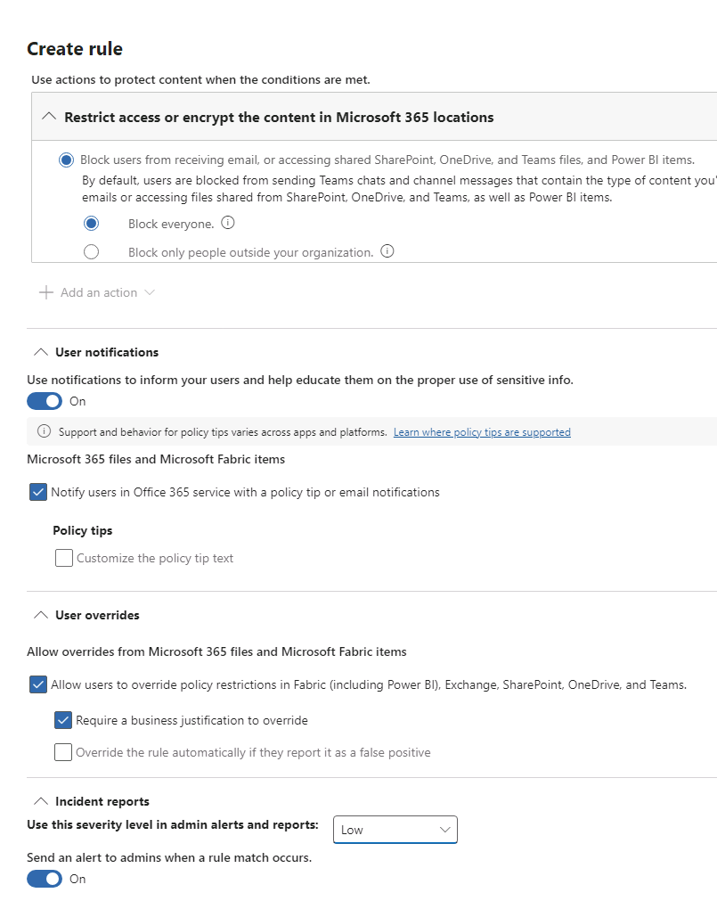

---
lab:
  title: 练习 1 - 管理 DLP 策略
  module: Module 2 - Implement Data Loss Prevention
---
## WWL 租户 - 使用条款

如果在讲师引导式培训过程中向你提供租户，请注意，提供租户旨在支持讲师引导式培训中的动手实验室。

租户不应共享或用于动手实验室以外的用途。 本课程使用的租户为试用租户，课程结束后无法使用或访问，不符合扩展条件。

租户不得转换为付费订阅。 在本课程中获得的租户仍然是 Microsoft Corporation 的财产，我们保留随时获取访问权限和收回的权利。

<!--
# Lab 2 - Exercise 1 - Manage DLP Policies
-->

# 练习 4 - 管理 DLP 策略

你是 Joni Sherman，Contoso Ltd. 新上任的合规性管理员，负责配置公司的 Microsoft 365 租户以防止数据丢失。 Contoso Ltd. 是美国的一家提供驾驶指导服务的公司，你需要确保敏感客户信息不会泄露到组织外部。

## 任务 1 - 在测试模式下创建 DLP 策略

在本练习中，你将在 Microsoft Purview 门户中创建数据丢失防护策略以防止敏感数据被用户共享。 当你的用户想共享包含信用卡信息的内容时，你创建的 DLP 策略会向他们发出通知，并让他们提供发送此信息的正当理由。 由于你目前不想用户被阻止操作影响，所以将在测试模式下实现策略。

1. 使用 **lon-cl1\admin** 帐户登录到客户端 1 VM (LON-CL1)。

<!--
1. In **Microsoft Edge**, navigate to **https://purview.microsoft.com** and sign in to the Microsoft Purview portal as **Joni Sherman**. sign in as JoniS@WWLxZZZZZZ.onmicrosoft.com (where ZZZZZZ is your unique tenant ID provided by your lab hosting provider).  Joni's password should be provided by your lab hosting provider.

1. If the **Stay signed in?** dialog box appears, select the **Don’t show this again** checkbox and then select **No**.
-->

1. 在以 **Joni Sherman** 身份登录的 InPrivate 浏览器窗口中，转到 Purview 选项卡，或转到 https://purview.microsoft.com。

1. 在左侧导航窗格中，选择“**数据丢失防护**”。

1. 选择“策略”。

1. 在“策略”页上，选择“**+创建策略**”，启动用于创建新数据丢失防护策略的向导。

1. 在“**从模板开始或创建自定义策略**”步骤，选择“**类别**”下的“**自定义**”，然后选择“**法规**”下的“**自定义策略**”。 选择**下一步**。

1. 在“**为 DLP 策略命名**”步骤，输入：

   - 名称****：信用卡 DLP 策略
   - 说明****：防止共享信用卡号

1. 选择**下一步**。

1. 在“**分配管理单元（预览版）**”步骤，选择“**下一步**”。

1. 在“**选择应用策略的位置**”页上，仅启用“**Teams 聊天和频道消息**”复选框，然后选择“**下一步**”。

    

1. 在“**定义策略设置**”步骤，选择“**下一步**”。

1. 在“自定义高级 DLP 规则”页面上选择“+ 创建规则” 。

1. 在“**创建规则**”浮出控件页上，在“**名称**”字段中输入“_信用卡信息_”。

1. 在“**条件**”下，选择“**+ 添加条件**”，然后从下拉列表中选择“**内容包含**”。

1. 在新的“**内容包含**”部分中，选择“**添加**”，然后从下拉列表中选择“**敏感信息类型**”。

    

1. 在“**敏感信息类型**”搜索字段中，查找并选择“**信用卡号**”，然后选择“**添加**”。

1. 在“**内容包含**”部分下方，选择“**+ 添加条件**”，然后从下拉列表中选择“**从 Microsoft 365 共享内容**”。

1. 在新的“**从 Microsoft 365 共享内容**”部分中，选择“**仅与组织内的人员进行共享**”选项。

1. 继续向下滚动并选择“**+ 添加操作**”，然后选择“** 限制访问或加密 Microsoft 365 位置中的内容**”。

1. 选择单选按钮以**阻止所有人。**

1. 向下滚动到“**用户通知**”部分，将开关切换到“**开**”以启用用户通知。

1. 选中“**使用策略提示在 Office 365 服务中通知用户**”旁边的复选框。

1. 在“**用户替代**”部分，选中“**在 Fabric (包括 Power BI)、Exchange、SharePoint、OneDrive 和 Teams 中允许用户替代策略限制**”复选框。

1. 选中“**需要业务理由才可替代**”复选框。

1. 在“**事件报告**”部分中，选择“**在管理员警报和报告中使用此严重性级别**”旁边的下拉列表，然后选择“**低**”。

    

1. 选择“**保存**”，完成规则创建。

1. 返回到“**自定义高级 DLP 规则**”步骤，选择“**下一步**”。

1. 在“**策略模式**”步骤，选择“**在模拟模式下运行策略**”，并选择“**在处于模拟模式时显示策略提示**”。 然后选择**下一步**。

1. 在“**查看并完成**”步骤查看设置，然后选择“**提交**”。

1. 创建后，选择“**完成**”。

你现在已创建了一个 DLP 策略，该策略可扫描 Microsoft Teams 聊天和频道中的信用卡号，并允许用户在提供业务理由后替代此策略。

## 任务 2 - 修改 DLP 策略

在本任务中，你将修改在上一步中创建的现有 DLP 策略以扫描电子邮件，查看是否存在信用卡信息，并在用户尝试在电子邮件中共享此内容时告知用户。

<!--
1. You should still be signed in to Client 1 VM (LON-CL1) as the **lon-cl1\admin** account, and you should be signed in to Microsoft 365 as **Joni Sherman**.

1. In **Microsoft Edge**, the Microsoft Purview portal tab should still be open. If so, select it and proceed to the next step. If you closed it, then in a new tab, navigate to **https://purview.microsoft.com**.

1. In the Microsoft Purview portal, in the left navigation pane, select **Data Loss Prevention**.

1. Select **Policies**.
-->

1. 在“Purview 策略”页上，选中最近创建的“**信用卡 DLP 策略**”旁边的复选框，然后选择“**编辑策略**”（铅笔图标）以打开策略向导。

1. 选择“**下一步**”，直到到达“**选择应用策略的位置**”步骤。

1. 选中“**Exchange 电子邮件**”选项的复选框，然后选择“**下一步**”，直到到达“**查看并完成**”。

1. 选择“提交”以应用在策略中进行的修改****。

1. 更新策略后，选择“完成”。

你已经修改了现有的 DLP 策略，并更改了它扫描内容的位置。

## 任务 3 - 在 PowerShell 中创建 DLP 策略

在本任务中，你将使用 PowerShell 创建一个 DLP 策略来保护 Contoso EmployeeID，并防止这些 ID 在 Exchange 中被共享。 如果用户要发送的电子邮件中包含 Contoso EmployeeID，系统则会提示用户他们正在尝试共享敏感数据，并且将阻止邮件发送操作。

<!--
1. You should still be signed in to Client 1 VM (LON-CL1) as the **lon-cl1\admin** account.

1. In the start menu, select **Windows PowerShell**.

1. In the **PowerShell** window, enter
-->

1. 从任务栏中打开 PowerShell 窗口并输入：

    ```powershell
    Connect-IPPSSession
    ```

1. 以 **Joni Sherman**JoniS@WWLxZZZZZZ.onmicrosoft.com（其中 ZZZZZZ 是实验室托管提供程序提供的唯一租户 ID）的身份登录。  Joni 的密码应由实验室托管提供程序提供。

1. 在 PowerShell 中输入以下命令，以创建扫描所有 Exchange 邮箱的 DLP 策略：

    ```powershell
    New-DlpCompliancePolicy -Name "EmployeeID DLP Policy" -Comment "This policy blocks sharing of Employee IDs" -ExchangeLocation All
    ```

1. 在 PowerShell 中输入以下命令，以将 DLP 规则添加到在先前步骤中创建的 DLP 策略：

    ```powershell
    New-DlpComplianceRule -Name "EmployeeID DLP rule" -Policy "EmployeeID DLP Policy" -BlockAccess $true -ContentContainsSensitiveInformation @{Name="Contoso Employee IDs"}
    ```

1. 使用以下命令查看 EmployeeID DLP 规则：

    ```powershell
    Get-DLPComplianceRule -Identity "EmployeeID DLP rule"
    ```

你已经使用 PowerShell 创建了一个在 Exchange 中扫描 Contoso EmpoloyeeID 的 DLP 策略。

## 任务 4 - 测试 DLP 策略

在此任务中，你将测试在上一个任务中创建的 DLP 策略。

<!--
1. You should still be signed in to Client 1 VM (LON-CL1) as the **lon-cl1\admin** account and signed in to Microsoft 365 as Joni Sherman.
-->

1. 在以 **Joni Sherman** 身份登录的 InPrivate 窗口中， 如果标签页之前已关闭，则转到 https://outlook.office.com。

1. 选择左上角的“**新建邮件**”按钮，撰写新电子邮件。

1. 在“**收件人**”字段中，输入 _Megan_，然后选择 **Megan Bowen** 的电子邮件地址。

1. 在“**添加主题**”字段中输入“_帮助查找员工信息_”。

1. 在电子邮件正文中输入：

    ``` text
    Please help me with the start dates for the following employees:
    ABC123456
    DEF678901
    GHI234567

    Thank you, 
    Joni Sherman
    ```

1. 选择邮件窗格左上角的“**发送**”按钮，发送电子邮件。

1. 你应该会收到一条消息，指出电子邮件无法送达并被 DLP 策略阻止。

    

你已成功测试自己的 DLP 策略。

## 任务 5 - 在测试模式下激活策略

在本任务中，你将激活在测试模式中创建的信用卡信息 DLP 策略，使该策略执行其保护操作。

<!--
1. You should still be signed in to Client 1 VM (LON-CL1) as the **lon-cl1\admin** account, and you should be signed in to Microsoft 365 as **Joni Sherman**.

1. In **Microsoft Edge**, the Microsoft Purview portal tab should still be open. If so, select it and proceed to the next step. If you closed it, then in a new tab, navigate to **https://purview.microsoft.com**.
-->

1. 转到 Purview 选项卡，该选项卡仍应位于**数据丢失防护**中的**策略**上。 否则，请在新选项卡中重新打开 https://purview.microsoft.com 。

1. 在“策略”页上，选中“**信用卡 DLP 策略**”旁边的复选框，然后选择“**编辑策略**”（铅笔图标）以打开策略向导。

1. 选择“**下一步**”，直到到达“**策略模式**”步骤，然后选择“**立即打开策略**”。 选择**下一步**。

1. 在“**查看并完成**”上选择“**提交**”。

1. 更新后，选择“**完成**”。

你已成功激活该 DLP 策略。 如果策略检测到有人试图共享信用卡信息，它将阻止该操作，并允许用户提供业务正当理由来覆盖该阻止操作。

## 任务 6 - 修改策略优先级

在创建两个 DLP 策略之后，你希望确保限制性更高的策略在处理时能得到比限制性较低的策略更高的优先级。 因此，你需要将 EmployeeID DLP 策略移动至更高的优先级。

<!--

1. You should still be signed in to Client 1 VM (LON-CL1) as the **lon-cl1\admin** account, and you should be signed in to Microsoft 365 as **Joni Sherman**.

1. In **Microsoft Edge**, the Microsoft Purview portal tab should still be open. If so, select it and proceed to the next step. If you closed it, then in a new tab, navigate to **https://purview.microsoft.com**.

1. In the Microsoft Purview portal, in the left navigation pane, select **Data Loss Prevention**.

1. Select **Policies**.
-->

1. 在“策略”页上，选择“**EmployeeID DLP 策略**”旁边三个垂直分布的点以打开“**操作**”列表并选择“**移动到顶部（最高优先级）**”。

1. 根据需要选择“**刷新**”，然后查看策略表的“**优先级**”列中的优先级。

你已成功修改 DLP 策略的优先级。 如果两个策略匹配到相同的内容，则将执行高优先级策略的操作。

## 任务 7 - 在 Microsoft Defender 中启用文件监视

你需要使用 Microsoft Defender 中的文件策略来保护 OneDrive 和 SharePoint Online 位置中的文件。 在创建文件策略之前，你需要启用文件监视，从而让 Microsoft 365 Defender 扫描组织中的文件。

<!--
1. You should still be signed in to Client 1 VM (LON-CL1) as the **lon-cl1\admin** account.

1. In **Microsoft Edge**, the Microsoft Purview portal tab should still be open. Select the **Profile picture** of Joni Sherman in the top right and select **Sign out**, then close the browser.

1. Open **Microsoft Edge** and navigate to **https://security.microsoft.com** and sign in to the Microsoft 365 Defender portal as **MOD Administrator** admin@WWLxZZZZZZ.onmicrosoft.com (where ZZZZZZ is your unique tenant ID provided by your lab hosting provider). Admin's password should be provided by your lab hosting provider.
-->

1. 以“**MOD 管理员**”的身份 admin@WWLxZZZZZZ.onmicrosoft.com（其中 ZZZZZZ 是实验室托管提供商提供的唯一租户 ID）登录后，从任务栏中打开常规 Edge 窗口。 管理员的密码应由实验室托管提供程序提供。

1. 转到新标签页中的 https://security.microsoft.com，转到 Microsoft Defender 门户。

1. 在左侧导航中，向下滚动并选择“**系统**”，然后从子菜单中选择“**设置**”。

1. 选择“Cloud Apps”****。

1. 在“**云应用**”中的左窗格中，向下滚动到“**信息保护**”部分，然后选择“**文件**”。

1. 选中“启用文件监视”复选框，然后选择“保存”（如果尚未标记）********。

你已成功在 Microsoft 365 Defender 中启用了文件监视，现在可以使用文件策略扫描文件，以查看是否存在敏感内容。

## 任务 8 - 为 Microsoft Defender 创建文件策略

在本任务中，你需要在 Microsoft Defender 中创建一个文件策略，用于扫描 OneDrive 和 SharePoint Online 中的文件，并在共享文件时自动隔离包含信用卡信息的文件。

<!--
1. You should still be signed in to Client 1 VM (LON-CL1) as the **lon-cl1\admin** account.

1. In **Microsoft Edge**, the Microsoft Defender for Cloud Apps portal tab should still be open. Select the **Profile picture** of the MOD Admin in the top right and select **Sign out** next to the cogwheel, then close the  browser.

1. Open **Microsoft Edge** and navigate to **https://security.microsoft.com** and sign in to the Microsoft 365 Defender portal as **Joni Sherman** JoniS@WWLxZZZZZZ.onmicrosoft.com (where ZZZZZZ is your unique tenant ID provided by your lab hosting provider). Joni Sherman's password should be provided by your lab hosting provider.
-->

1. 在 Microsoft Defender 门户的左侧导航中，依次选择“**云应用**”、“**策略**”、“**策略管理**”。

1. 在“策略”页上，选择“**+ 创建策略**”，然后从下拉列表中选择“**文件策略**”。

1. 将“**策略模板**”选择保留为“**无模板**”。

1. 使用下列信息以了解基本详情：

   - 策略名称****：文件的信用卡信息
   - **策略严重性**：低（单点图标）
   - **类别**：DLP（文件策略的默认值）
   - 说明****：防止在文件中共享信用卡号

1. 在以下“**与所有项匹配的文件**”部分，选择“**公共 (Internet)、外部、公共**”，然后选择“**内部**”。

1. 在“**检查方法**”下拉列表中，选择“**数据分类服务**”。

1. 在“**选择检查类型…**”下拉列表中，选择“**敏感信息类型…**”。

1. 在“选择敏感信息类型”对话框中，选择“信用卡号”，然后选择右上角的“完成”************。

1. 在“警报”下，勾选“为每个匹配的文件创建警报”复选框，并查看你的选项 。 通过选择“另存为默认设置”，将设置保留为默认设置****。

1. 在“治理操作”部分，展开“Microsoft OneDrive for Business”并选择“放入用户隔离”  。

1. 在“治理操作”部分，展开“Microsoft SharePoint Online”并选中“放入用户隔离”复选框************。

1. 在页面底部选择“创建”  。

你现在已经创建了一个文件策略，该策略将持续扫描保存在 OneDrive 和 SharePoint 中的文件，以查看是否存在信用卡信息，并在组织内部共享这些文件时隔离它们。

## 任务 9 - 为 Power Platform 创建 DLP 策略

贵公司使用 Power Automate 流在 SharePoint Online 和 Salesforce 之间共享数据。 在本任务中，你将为 Power Platform 创建一个 DLP 策略，该策略允许现有的流继续工作，但会阻止创建将在 SharePoint Online 和定义为非业务类的应用之间共享数据的流。

<!--
1. Sign in to Client 2 VM (LON-CL2) as the **lon-cl2\admin** account.

1. In **Microsoft Edge**, navigate to **https://admin.powerplatform.microsoft.com** and Sign in to the Power Platform admin center as **MOD Administrator** admin@WWLxZZZZZZ.onmicrosoft.com (where ZZZZZZ is your unique tenant ID provided by your lab hosting provider).  Admin's password should be provided by your lab hosting provider.

-->

1. 从以**MOD 管理员**身份登录的同一常规浏览器窗口中，打开一个新标签页，转到 https://admin.powerplatform.microsoft.com，进入 Power Platform 管理中心。

1. 在左侧导航中，选择“**策略**”，然后从子菜单中选择“**数据策略**”。

1. 选择 **+ 新建策略**。

1. 在“**为策略命名**”步骤，输入“_租户范围 SharePoint 策略_”，然后选择“**下一步**”。

1. 在“**分配连接器**”步骤的“**非业务|默认**”选项卡上，选择“**SharePoint**”和“**Salesforce**”，然后选择页面顶部的“**移至业务**”。

1. 选择“**业务**”选项卡以确保现在同时显示 SharePoint 和 Salesforce，然后选择“**下一步**”。

1. 在“**自定义连接器模式**”步骤，选择“**下一步**”。

1. 在“**定义范围**”步骤，选择“**添加所有环境**”，然后选择“**下一步**”。

1. 在“**查看并创建策略**”步骤，查看策略设置并选择“**创建策略**”。

你现在已经创建了一个 PowerPlatform DLP 策略，该策略阻止用户创建涉及 SharePoint Online 连接器和任何非 Salesforce 连接器的流。
