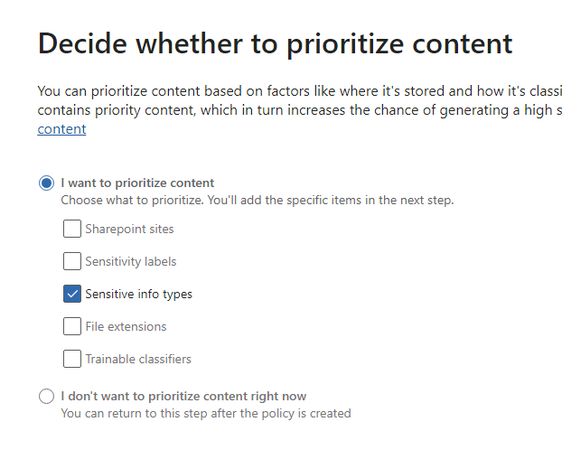
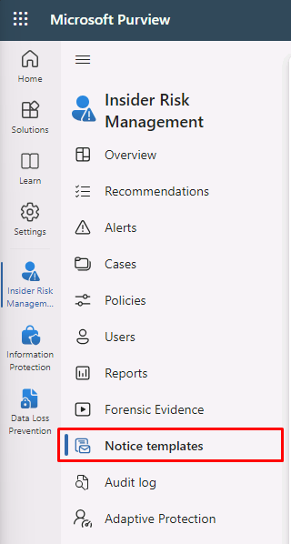

---
lab:
  title: 练习 2 - 配置内部风险管理
  module: Module 5 - Manage insider and privacy risk in Microsoft 365
---

<!--
# Lab 5 - Exercise 2 - Configure Insider Risk Management
-->
# 练习 5 - 配置内部风险管理

你是 Contoso Ltd. 的合规性管理员 Joni Sherman。你的角色涉及确保法规合规性和保护组织内的敏感信息。 最近，Contoso Ltd. 认识到需要主动解决可能损害公司声誉、损害数据安全或导致法律问题的内部风险。

为了有效管理内部风险，你实现了 Microsoft Purview 内部风险管理，这是一个全面的解决方案，旨在识别、分析和响应潜在内部威胁。

## 任务 1：分配内部风险管理角色

在本练习中，你将向 Joni 分配内部风险管理角色，以授予在 Microsoft Purview 门户中执行内部风险任务的权限。

<!--
1. Sign in to the Client 1 VM (LON-CL1) as the **lon-cl1\admin** account.

1. In Microsoft Edge, navigate to **https://purview.microsoft.com** and sign in to the Microsoft Purview portal as MOD Administrator, **admin@WWLxZZZZZZ.onmicrosoft.com** (where ZZZZZZ is your unique tenant ID provided by your lab hosting provider). Admin’s password should be provided by your lab hosting provider.
-->

1. 如果尚未登录，请以 **lon-cl1\admin** 帐户身份登录到客户端 1 VM (LON-CL1)。

1. 从以 **MOD 管理员**身份登录的常规浏览器窗口中，转到 Purview 选项卡。如果之前已关闭，请转到 https://purview.microsoft.com。

1. 从左侧导航中选择“**设置**”。

1. 选择“**角色和范围**”，然后从子菜单选择“**角色组**”。

1. 通过搜索或对“**名称**”列进行排序，从列表中选择“**内部风险管理**”。

1. 在右侧的“内部风险管理”弹出页中，选择“编辑” 。

1. 在“**编辑角色组的成员**”步骤，选择“**选择用户**”。

1. 在“**选择用户**”窗格中，选中 **Joni Sherman** 旁边的复选框，然后选择“**选择**”按钮。

1. 在“**编辑角色组的成员**”步骤，选择“**下一步**”。

1. 在“**查看角色组并完成**”步骤，选择“**保存**”。

1. 更新后，选择“**完成**”。

<!--
1. Sign out of the **MOD Administrator** account and close all browser windows.
-->

你已成功将内部风险管理角色分配给 Joni Sherman，授予她在 Microsoft Purview 门户中执行内部风险任务的权限。

## 任务 2：内部风险设置配置

在此任务中，你将在 Microsoft Purview 门户中自定义内部风险管理设置。 这将使 Joni Sherman 能够有效地管理组织内潜在的内部风险并确保敏感信息的安全。

<!--
1. In **Microsoft Edge**, navigate to **https://purview.microsoft.com** and sign in to the Microsoft Purview portal as JoniS@WWLxZZZZZZ.onmicrosoft.com (where ZZZZZZ is your unique tenant ID provided by your lab hosting provider).
-->

1. 打开以 **Joni Sherman** 身份登录的 InPrivate Edge 浏览器窗口，然后转到“Purview”选项卡。如果之前已关闭，请转到 https://purview.microsoft.com。

1. 从左侧导航中选择“**设置**”。

1. 在“**解决方案设置**”部分下，选择“**内部风险管理**”。

1. 浏览设置：

    - **分析**：评估潜在的内部风险，而无需配置策略来指导策略创建。
    - **数据共享**：使用 Office 365 管理活动 API 将风险警报信息导出到 SIEM 解决方案。
    - **内联警报自定义**：允许直接从“警报”仪表板优化策略和调整阈值。
    - **智能检测**：控制警报量，从风险评分中排除某些实体，并允许筛选 Microsoft Defender 警报。
    - **Microsoft Teams**：使 Microsoft Teams 能够协作处理内部风险管理案例。
    - **通知**：自动向内部风险管理角色组发送电子邮件通知。
    - **策略指示器**：涉及使用特定风险指示器配置策略模板。
    - **策略期限**：根据事件和活动定义由策略匹配项触发的评审期。
    - **Power Automate 流(预览版)** ：使用 Microsoft Power Automate 流自动执行内部风险管理任务。
    - **优先物理资产**：识别和监视对将活动与用户事件关联的优先物理资产的访问。
    - **优先用户组**：确定高风险用户，以便进行更深入的检查和更敏感的风险评分。
    - **隐私**：用于选择在警报和案例中是显示用户名还是匿名版本。

1. 从内部风险管理设置菜单中选择“**隐私**”。

1. 选择“**不显示用户名的假名版本**”，然后选择“**保存**”。

1. 从内部风险管理设置菜单中选择“**策略指示器**”。

1. 选择“**Office 指示器**”以展开其菜单，选中“**全选**”复选框，然后向下滚动到底部以选择“**保存**”。

1. 从内部风险管理设置菜单中选择“**优先用户组**”。

1. 选择“+ 创建优先用户组”以打开“新建优先用户组向导” 。

1. 在“**命名并描述优先用户组**”步骤，输入：

    - 名称：财务团队
    - 说明：管理财务运营、预算和报告的团队成员

1. 选择**下一步**。

1. 在“**成员**”步骤，选择“**+ 成员**”。

1. 在“**成员**”窗格中，选中 **Debra Berger**、**Lynne Robbins**和 **Megan Bowen** 旁边的复选框，然后选择“**添加**”以添加这 3 个成员。

1. 选择**下一步**。

1. 在“**选择谁可以查看涉及此优先组中的用户的数据**”上，选择“**+ 选择用户和角色组**”。

1. 在“**选择用户和角色组**”窗格上，选中“**内部风险管理**”旁边的复选框，以添加在 Purview 中具有内部风险管理角色的所有成员，然后选择“**添加**”。

1. 选择**下一步**。

1. 在“查看”页上，选择“提交” 。

1. 创建后，选择“**完成**”。 这将返回到内部风险管理设置页。

你已成功自定义内部风险管理设置。 现在，Joni Sherman 拥有必要的工具和功能，可以主动识别和缓解内部风险，保护 Microsoft Purview 门户中的宝贵数据。

## 任务 3 - 内部风险策略创建

在此任务中，你将在 Microsoft Purview 中配置名为“财务数据保护”的策略，以监视和保护组织内的敏感财务数据访问。

1. 你应该仍然以 **Joni Sherman** 的身份登录 Microsoft Purview。

1. 在左侧导航栏中，选择“**解决方案**”，然后选择“**内部风险管理**”。

1. 从内部风险管理菜单中选择“**策略**”选项卡。

1. 选择“+ 创建策略”。

1. 在“**选择策略模板**”步骤，选择“**数据泄露**”，然后选择“**下一步**”。

1. 在“**为策略命名**”步骤，输入：

    - 名称：财务数据保护
    - 说明：敏感财务数据访问监视

1. 选择**下一步**。

1. 在“**选择用户和组**”步骤，保持选中“**所有用户、组和自适应范围**”，然后选择“**下一步**”。

1. 在“**排除用户和组（可选）**”步骤，选择“**下一步**”。

1. 在“**决定是否确定内容的优先级**”步骤，仅启用“**敏感信息类型**”，然后选择“**下一步**”。

    

1. 在“**要确定优先级的敏感信息类型**”步骤，选择“**+ 添加或编辑敏感信息类型**”。

1. 搜索“_银行_”，然后按 **Enter**。 选中“**美国银行帐户号**”和“**国际银行帐户号 (IBAN) **”旁边的复选框。 

1. 搜索“_信用额度_”，然后按 **Enter**。 选中“**信用卡号**”旁边的复选框，然后选择“**添加**”。

1. 验证是否已添加三种敏感信息类型，然后选择“**下一步**”。

1. 在“**决定是否仅对具有优先内容的活动进行评分**”步骤，保持选中“**获取所有活动的警报**”，然后选择“**下一步**”。

1. 在“**为该策略选择触发事件**”步骤，选择“**用户执行外泄活动**”。

1. 在“**选择哪些活动将触发此策略**”下，只选择并启用以下内容：

   - **从 SharePoint 下载内容**
   - **向组织外部的收件人发送带附件的电子邮件**
   - **与组织外部人员共享 SharePoint 文件**
   - **从 Microsoft 365 位置下载后外泄**

    >注意：如果无法选择策略触发器，可能会显示“打开指示器”的提示。 如果此选项可用，请选择“打开指示器”。 在“选择要打开的指示器”弹出窗口中，单击“Office 指示器”的“全选”旁边的复选框，然后选择“保存”   。

    

1. 选择**下一步**。

1. 在“**选择触发事件的阈值**”步骤，选择“**应用内置阈值**”，然后选择“**下一步**”。

1. 在“**指示器**”步骤，选择“**物理访问指示器**”，取消选中“**对敏感资产的访问终止或失败后的物理访问**”（如果已选中），然后选择“**下一步**”。

1. 在“**检测选项**”步骤，确保为以下部分选择了“**全选**”：

    - **序列检测**
    - **累积外泄检测**
    - **风险评分助推器** 
    
1. 选择**下一步**。

1. 在“**为指示器选择阈值类型**”步骤，选择“**应用 Microsoft 提供的阈值**”，然后选择“**下一步**”。

1. 在“**查看设置并完成**”步骤，选择“**提交**”。

1. 创建后，选择“**完成**”。

    >**备注：** 如本页所述，策略匹配项最多可能需要 24 小时才会开始显示在“警报”选项卡中。

你已成功创建“财务数据保护”策略，这将有助于检测和防止未经授权访问敏感财务信息。 请记住，策略匹配项最多可能需要 24 小时才会显示在“警报”选项卡中。

## 任务 4 - 创建通知模板

在此任务中，你将在 Microsoft Purview 的内部风险管理中创建一个通知模板，使你能够在针对风险活动生成案例时自动向用户发送电子邮件消息，作为提醒或提供合规性培训信息。

<!--
1. You should still be signed in as Joni in Microsoft Purview in Insider risk management.
-->

1. 在内部风险管理导航菜单中，选择“**通知模板**”。

    >如果未看到该选项，请尝试刷新页面。

    

1. 选择“**创建通知模板**”。

1. 填写以下必要信息：

    - **模板名称**：数据泄露策略警报
    - **发件人**：Joni Sherman
    - **主题**：检测到潜在的数据泄漏
    - **消息正文**：

        ````html
        <!DOCTYPE html>
        <html>
        <body>
        <h2>Alert: Potential Data Leak Detected</h2>
        <p>We detected a potential data leak associated with your account. As part of our Insider Risk Management policy, we are required to investigate any suspicious activity related to data breaches.</p>
        <p>Please review your recent actions, report any unusual behavior, and refer to the Contoso User Code of Conduct training at <a href='https://contoso.com'>https://contoso.com</a> for more information.</p>
        <p>Thank you for your cooperation,</p>
        <p><em>Human Resources</em></p>
        </body>
        </html>
        ````

1. 选择“创建”。

你已成功创建“数据泄漏策略警报”通知模板，能够在检测到潜在数据泄漏时自动向用户发送通知，加强安全措施，并促进遵守 Contoso 用户行为准则。
