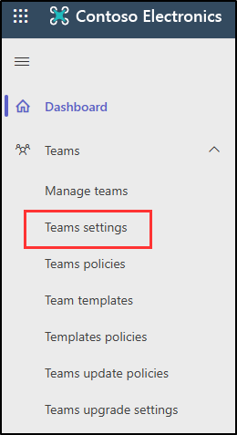

---
lab:
  title: 实验室设置：为管理准备环境
  module: Module 0 - Lab Setup
---

## WWL 租户 - 使用条款

如果在讲师引导式培训过程中向你提供租户，请注意，提供租户旨在支持讲师引导式培训中的动手实验室。

租户不应共享或用于动手实验室以外的用途。 本课程使用的租户为试用租户，课程结束后无法使用或访问，不符合扩展条件。

租户不得转换为付费订阅。 在本课程中获得的租户仍然是 Microsoft Corporation 的财产，我们保留随时获取访问权限和收回的权利。

# 实验室设置：为管理准备环境

在此实验室中，你将为管理任务配置和准备环境。 你将激活必要的功能、设置管理权限，以及确保正确配置关键元素。

**任务**：

- 设置用于实验室练习的用户密码
- 在 Microsoft Purview 门户中启用审核
- 在 Microsoft Teams 中启用按名称搜索
- 在 SharePoint Online 和 OneDrive 中启用信息障碍

## 任务 - 设置用于实验室练习的用户密码

在此任务中，你将为实验室所需的用户帐户设置密码。

1. 使用 **SC-400-CL1\admin** 帐户登录到客户端 1 VM (SC-400-CL1)。 密码应由实验室托管提供程序提供。

1. 打开 **Microsoft Edge** 并导航到**`https://admin.microsoft.com`**，然后以 MOD 管理员身份登录到 Microsoft 365 管理中心 `admin@WWLxZZZZZZ.onmicrosoft.com`（其中 ZZZZZZ 是实验室托管服务提供商提供的唯一租户 ID）。

1. 在左侧导航窗格中，展开“**用户**”，然后选择“**活动用户**”。

1. 选中 **Joni Sherman**、**Lynne Robbins** 和 **Megan Bowen** 左侧的复选框。

   这些帐户将在实验室练习中使用。

   

1. 从顶部导航功能区选择“**重置密码**”按钮，重置所有三个密码。

   

1. 在右侧的“**重置密码**”浮出控件页面，确保取消选择所有选项。

   这将确保你可以为用于练习的三个用户选择密码，并且首次登录时无需重置这些密码。

1. 在“**密码**”字段中，输入可记住的密码以重置用户密码，供今后练习使用。

1. 在“**重置密码**”浮出控件页面底部，选择“**重置密码**”按钮。

1. 在“**密码已重置**”页面，应会看到已重置的三个用户帐户。 在此浮出控制页底部，选择“**关闭**”。

已成功重置实验室练习的密码。

## 任务 - 在 Microsoft Purview 门户中启用审核

在此任务中，你将在 Microsoft Purview 门户中启用“审核”以监视门户活动。

1. 你仍应使用 **SC-400-CL1\admin** 帐户登录到客户端 1 VM (SC-400-CL1)，并使用 MOD 管理员帐户登录到 Microsoft 365。

1. 在 Microsoft Edge 中，导航到 Microsoft Purview 门户，`https://purview.microsoft.com`，然后登录。

1. 有关新的 Microsoft Purview 门户的消息将显示在屏幕上。 选择同意数据流披露条款和隐私声明的选项，然后选择“**立即试用**”。

    

1. 从左侧边栏中选择“**解决方案**”，然后选择“**审核**”。

1. 在“**搜索**”页面，选择“**开始录制用户和管理活动**”栏以启用审核日志记录。

    

1. 选择此选项后，蓝色栏应从此页面消失。

>[！提醒]如果在本练习中启用“审核”时收到错误，请使用以下步骤来解决此问题：
>1. 鼠标右键选择 Windows 按钮，然后选择“终端（管理员）”以打开已提升权限的终端窗口。
>1. 运行`Install-Module -Name ExchangeOnlineManagement`以安装 ExchangeOnlineManagement 模块
>1. 运行`Connect-ExchangeOnline`以连接到 ExchangeOnlineManagement 
>1. 出现提示时，输入实验室托管服务提供商提供的管理员用户名和密码进行登录。
>1. 要验证是否已启用“审核”，请运行`Get-AdminAuditLogConfig | FL UnifiedAuditLogIngestionEnabled`
>1. 如果为 false，则审核日志已关闭。
>1. 要启用“审核”，请运行`Set-AdminAuditLogConfig -UnifiedAuditLogIngestionEnabled $true`
>   1. 如果收到错误，指出无法在组织中运行脚本，请运行`Enable-OrganizationCustomization`
>   1. 尝试重新运行`Set-AdminAuditLogConfig -UnifiedAuditLogIngestionEnabled $true`
>1. 要确认已启用“审核”，请运行`Get-AdminAuditLogConfig | FL UnifiedAuditLogIngestionEnabled`
>1. 完成后，运行`Disconnect-ExchangeOnline`以结束会话

已在 Microsoft 365 中成功启用审核。

## 在 Microsoft Teams 中启用按名称搜索

在此任务中，你将在 Microsoft Teams 中启用“**按名称搜索**”功能，以方便用户定位。 在后面的练习中配置信息屏障时需要这样做。

1. 你仍应使用 **SC-400-CL1\admin** 帐户登录到客户端 1 VM (SC-400-CL1)，并使用 MOD 管理员帐户登录到 Microsoft 365。

1. 在“Microsoft Edge”中，导航到 `https://admin.teams.microsoft.com`。

1. 在左侧导航窗格中的“**Teams**”下拉列表下，选择“**Teams 设置**”。

    

1. 向下滚动到“**按名称搜索**”部分，然后将“**使用 Exchange 通讯簿策略的范围目录搜索**”切换为“**开启**”。

1. 选择页面底部的“保存”  。

1. 在“**更改可能需要一些时间才能生效**”对话框中，选择“**确认**”。

你已成功在 Microsoft Teams 中启用按名称搜索功能，以消除信息屏障。

## 任务 - 在 SharePoint Online 和 OneDrive 中启用信息障碍

在此任务中，你将在 SharePoint Online 和 OneDrive 中启用信息屏障，以确保安全协作。

1. 你仍然应该会使用 **SC-400-CL1\admin** 帐户登录到客户端 1 VM (SC-400-CL1)。

1. 打开提升的 PowerShell 窗口，方法是右键选择 Windows 按钮，然后选择“Windows PowerShell (管理员)”。

1. 选择“是”确认“用户帐户控制”窗口 。

1. 运行以下 cmdlet，以安装最新版本的 Sharepoint Online PowerShell 模块：

    ```powershell
    Install-Module -Name Microsoft.Online.SharePoint.PowerShell
    ```

1. 如果系统提示安装 PowerShell NuGet 提供程序，请输入 **Y** 以安装该提供程序。

1. 如果系统提示从不受信任的存储库进行安装，请输入 **Y** 以从 PSGallery 安装模块。

1. 运行以下 cmdlet，以连接到 SharePoint Online 管理中心：

    ```powershell
     Connect-SPOService -Url https://WWLxZZZZZZ-admin.sharepoint.com
    ```

    >注意：请务必更新 ZZZZZZ。 ZZZZZZ 是实验室托管提供程序提供的唯一租户 ID。

1. 使用实验室托管提供程序提供的 MOD 管理员密码登录。

1. 若要在 SharePoint 和 OneDrive 中启用信息屏障，请运行以下命令：

    ```powershell
    Set-SPOTenant -InformationBarriersSuspension $false
    ```

1. 完成此操作后，关闭 PowerShell 窗口。

你已成功在 SharePoint Online 和 OneDrive 中启用信息障碍。
