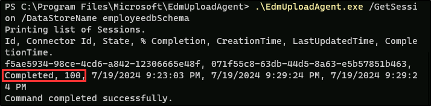

---
lab:
  title: 练习 2 - 管理敏感信息类型
  module: Module 1 - Implement Information Protection
---


# 实验室 1 - 练习 2 - 管理敏感信息类型

Contoso Ltd. 之前遇到过员工在使用票证解决方案处理支持票证时意外发送了客户个人信息的问题。 若要防止这种情况，需要创建自定义敏感信息类型来标识电子邮件和文档中的员工 ID。

**任务**：

1. 创建自定义敏感信息类型
1. 创建基于 EDM 的分类信息类型
1. 创建基于 EDM 的分类数据源
1. 创建关键字字典
1. 测试自定义敏感信息类型

## 任务 1 - 创建自定义敏感信息类型

在此任务中，你将创建新的自定义敏感信息类型，以识别关键字“员工”和“ID”旁边的员工 ID 的模式。

1. 你仍然应该会使用 **SC-400-CL1\admin** 帐户登录到客户端 1 VM (SC-400-CL1)。

1. 在 Microsoft Edge 中，导航到 `https://purview.microsoft.com` 并以 `JoniS@WWLxZZZZZZ.onmicrosoft.com` （其中 ZZZZZZ 是实验室托管提供程序提供的唯一租户 ID）登录到 Microsoft Purview 门户 。 Joni 的密码是在上一练习中设置的。

1. 在左侧边栏上，选择“**解决方案**”，然后选择“**信息保护**”。

1. 在左侧边栏上，展开“**分类器**”，然后选择“**敏感信息类型**”。

1. 在“**敏感信息类型**”页面，选择“**+ 创建敏感信息类型**”开始敏感信息类型配置。

1. 在“**为敏感信息类型命名**”页面上，输入：

    - **名称**：`Contoso Employee IDs`
    - **说明**：`Pattern for Contoso employee IDs.`

1. 选择**下一步**。

1. 在“定义此敏感信息类型的模式”页面上，选择“+ 创建模式”。********

1. 在右侧的“**新建模式**”浮出控件面板上，选择“**+ 添加主元素** > **正则表达式**”。

1. 在右侧的“**+ 添加正则表达式**”浮出控件”面板上，输入：

    - **ID**：`Contoso IDs`
    - 正则表达式：`[A-Z]{3}[0-9]{6}`
    - 选择“*字符串匹配*”的单选按钮

1. 在浮出面板底部选择“**完成**”。

1. 返回“**新建模式**”浮出控件面板的“**支持元素**”下，选择“**+ 添加支持元素或元素组**”下拉菜单，然后选择“**关键字列表**”。

1. 在右侧的“**添加关键字列表**”浮出控件面板上，输入：

    - **ID**：`Employee ID keywords`
    - 不区分大小写：

       ```text
       Employee
       ID
       ```

    - 选择“*Word 匹配*”的单选按钮

1. 在浮出面板底部选择“**完成**”。

1. 返回“**新建模式**”浮出控件面板，在“**字符邻近度**”下，将“**检测主要元素和支持元素**”值减少到 `100` 字符。

1. 选择浮出控件面板底部的“**创建**”按钮。

1. 回到“为此敏感信息类型定义模式”页面上，选择“下一步” 。

1. 在“选择建议的可信度级别以显示合规性策略”页面上使用默认值，并选择“下一步” 。

1. 在“查看设置并完成”页面上查看设置，然后选择“创建” 。 成功创建后，选择“完成”。

1. 通过在右上角选择 Joni Sherman 的个人资料图片，注销 Joni 的帐户。 选择“**注销**”，然后关闭浏览器窗口。

1. 关闭浏览器窗口，然后打开新的浏览器窗口。

你已成功创建新的敏感信息类型，以 3 个大写字母、6 个数字和 100 个字符范围内的关键字“员工”或“ID”的形式标识员工 ID。

## 任务 2 - 创建基于 EDM 的分类信息类型

在此任务中，你将使用员工数据的数据库架构创建基于完全数据匹配 (EDM) 的分类。

1. 你仍然应该会使用 **SC-400-CL1\admin** 帐户登录到客户端 1 VM (SC-400-CL1)。

1. 打开 **Microsoft Edge**，然后导航到 **`https://admin.microsoft.com`**。

1. 显示“选择帐户”页面时，选择“使用其他帐户”并以“MOD 管理员”身份 `admin@WWLxZZZZZZ.onmicrosoft.com`（其中 ZZZZZZ 是实验室托管提供程序提供的唯一租户 ID）登录  。  管理员的密码应由实验室托管提供程序提供。

1. 在左侧窗格中，展开“**团队和组**”，然后选择“**活动团队和组**”。

1. 在“**活动团队和组**”页的顶部导航功能区中，选择“**安全组**”，然后选择“** + 添加安全组**”。

    

1. 在“设置基本信息”屏幕上，输入以下内容：

    - **名称**：`EDM_DataUploaders`
    - **说明**：`People who upload data for EDM.`

1. 选择**下一步**。

1. 在“**编辑设置**”页面，保留为默认设置，然后选择“**下一步**”。

1. 在“查看并完成添加组”页面上，查看设置并选择“创建组” 。

1. 在“**创建的 EDM_DataUploaders 组**”页面，选择“**关闭**”。

1. 返回“**活动团队和组**”页，确保从顶部导航功能区中选择“**安全性**”选项卡，然后选择“**刷新**”按钮以显示新创建的安全组。 从列表中选择 **EDM_DataUploaders** 组，以在右侧打开 **EDM_DataUploaders** 浮出控件页。

1. 选择“**成员**”选项卡，然后选择“**查看全部并管理成员**”。

1. 在“**成员**”页选择“**+添加成员**”。

1. 在 **“添加成员**”页面，选中 ** Joni Sherman** 左侧的复选框，然后选择浮出控件面板底部的“**添加 (1)**”按钮。

1. 验证“成员”**** 下方是否已列出“Joni Sherman”****，然后选择浮出控件面板右上角的“X”**** 关闭浮出控件面板。

1. 选择右上角的“MA”图标，然后选择“**注销**”，以注销 Mod 管理员帐户。

1. 关闭浏览器窗口，然后打开一个新窗口。

1. 通过 `https://purview.microsoft.com` 导航到 Microsoft Purview 门户。

1. 显示“选择帐户”页面时，请选择“Joni Sherman”并登录 。

1. 从左侧边栏中选择“解决方案”**** > “信息保护”**** 导航到“信息保护”****。

1. 在“信息保护”**** 页上，展开“分类器”****，然后选择“EDM 分类器”****。

1. 在“EDM 分类器”**** 页上，选择“+ 创建 EDM 分类器”****。

1. 检查“熟悉将分类器投入使用所需的步骤”**** 以了解创建 EDM 分类器的工作流程，然后选择“创建 EDM 分类器”****。

1. 在“命名和介绍 EDM 分类器”**** 页上，输入：

    - **名称**：`employeedb`
    - **说明**：`Employee Database schema`

1. 选择**下一步**。

1. 在“选择用于定义架构的方法”**** 页上，选择“手动定义数据结构”****，然后选择“下一步”****。

1. 在“定义包含要检测数据的列”**** 上，输入以下列：

   - `Name`
   - `BirthDate`
   - `StreetAddress`
   - `EmployeeID`

   应该有四列。 需要选择“+ 添加列”**** 按钮，为新列添加新字段。

      

1. 选择**下一步**。

1. 在“选择主元素”**** 页上，对于 EmployeeID**** 列，展开“匹配模式”**** 下拉列表，此处显示“Single-token”****，然后为“选择 SIT”**** 选择“+”****（加号）。

      

1. 在右侧的“为‘EmployeeID’选择敏感信息类型”**** 浮出控件面板上，在搜索栏中搜索“`Contoso`”。

1. 应显示在上一任务中创建的 Contoso 员工 ID**** 敏感信息类型。 选中此敏感信息类型左侧的复选框，然后选择“**保存**”。

1. 返回“**选择主要元素**”页，选中 **EmployeeID** 右侧的复选框，将此字段标识为**主要元素**。

      

1. 选择**下一步**。

1. 在“**配置所选列中数据的设置**”上，确保对“**所有列使用相同的设置**”的切换设置为“**是**”。

1. 选中“**忽略所有列中数据的分隔符和标点符号**”的复选框。

1. 选择“**选择要忽略的分隔符和标点符号**”下拉列表，然后选择“*连字符*”、“*句点*”、“*空格*”、“*左括号*”和“*右括号*”，然后选择“**下一步**”。

1. 在“**配置主要元素的检测规则**”中，保留默认配置，然后选择“**下一步**”。

1. 在“查看设置并完成”页上，选择“提交” 。

1. 在“**已成功创建 EDM 分类器**”页上，确保复制并粘贴**架构名称**，以便在下一个任务中使用。

      

1. 获取架构名称后，选择“**完成**”。

1. 使 Microsoft Purview 门户在浏览器中保持打开状态。

你已成功创建基于 EDM 的新分类敏感信息类型，用于从数据库文件源中识别员工数据。

## 任务 3 - 创建基于 EDM 的分类数据源

在此任务中，将通过 EDM 上传代理工具对基于 EDM 的分类敏感信息类型的实际数据进行哈希处理并上传。

1. 应仍使用 **SC-400-CL1\admin** 帐户登录到客户端 1 VM (SC-400-CL1)，并且应该以 **Joni Sherman** 的身份登录到 Microsoft 365。

1. 在“Microsoft Edge”**** 中，导航到“`https://go.microsoft.com/fwlink/?linkid=2088639`”**** 以下载 EDM 上传代理 。

1. 完成下载后，在 Microsoft Edge 浏览器窗口中选择“打开文件”**** 以打开“Microsoft 精确数据匹配上传代理设置”**** 向导。

1. 在“欢迎使用 Microsoft 精确数据匹配上传代理设置向导”**** 页上，选择“下一步”****。

1. 在“最终用户许可协议”**** 页上，选中“我接受许可协议中的条款”**** 复选框，然后选择“下一步”****。

1. 在“目标文件夹”**** 页上，不要更改默认目标路径，然后选择“下一步”****。

1. 在“准备安装 Microsoft 精确数据匹配上传代理”**** 页上，选择“安装”****。

1. 如果弹出“用户帐户控制”**** 窗口，选择“是”**** 以允许此应用程序对设备进行更改。

1. 安装完成后，在“完成 Microsoft 精确数据匹配上传代理设置向导”**** 页上选择“完成”****。

1. 在任务栏的搜索字段中，搜索“`Notepad`”。 从搜索的“最佳匹配”**** 部分选择“记事本”**** 应用。

1. 在记事本中，输入：

    ``` text
    Name,Birthdate,StreetAddress,EmployeeID
    Joni Sherman,01.06.1980,1 Main Street,CSO123456
    Lynne Robbins,31.01.1985,2 Secondary Street,CSO654321
    ```

1. 在记事本中，依次选择“文件”**** 和“另存为”**** 以保存文件。

1. 从左侧窗格中选择“文档”****，然后输入“`EmployeeData.csv`”作为“文件名”****，然后选择“保存”****。

1. 关闭记事本窗口。

1. 右键单击任务栏中的 Windows 符号，然后选择“终端（管理员）”****。

1. 如果弹出“用户帐户控制”**** 窗口，选择“是”**** 以允许此应用程序对设备进行更改。

1. 在终端窗口中，导航到 EDM 上传代理目录：

    ``` powershell
    cd "C:\Program Files\Microsoft\EdmUploadAgent"
    ```

1. 运行以下 cmdlet，使用你的帐户授权以将数据库上传到租户：

    ``` powershell
    .\EdmUploadAgent.exe /Authorize
    ```

1. 显示“选择帐户”窗口时，以 `JoniS@WWLxZZZZZZ.onmicrosoft.com`（其中 ZZZZZZ 是实验室托管提供程序提供的唯一租户 ID）登录。 Joni 的密码是在上一练习中设置的。

1. 返回终端窗口，在 PowerShell 中运行此脚本，以下载基于 EDM 的分类敏感信息类型的数据库架构定义。 对于 DataStoreName****，你将在此处使用上一个任务中保存的架构名称。

    ``` powershell
    .\EdmUploadAgent.exe /SaveSchema /DataStoreName employeedbSchema /OutputDir "C:\Users\Admin\Documents\"
    ```

    应会收到命令已成功完成的消息。

    > **备注**：如果最后一条命令失败，则可能需要更多时间才能应用“EDM_DataUploaders”**** 组成员身份。 可能需要一个小时才能下载架构文件。  如果失败，请继续下一个任务，稍后返回此步骤。

1. 通过在 PowerShell 中运行以下脚本，对数据库文件进行哈希处理并将其上传到基于 EDM 的分类敏感信息类型：

    ``` powershell
    .\EdmUploadAgent.exe /UploadData /DataStoreName employeedbSchema /DataFile "C:\Users\Admin\Documents\EmployeeData.csv" /HashLocation "C:\Users\Admin\Documents\" /Schema "C:\Users\Admin\Documents\employeedbSchema.xml"
    ```

    应会收到命令已成功完成的消息。

1. 使用以下命令检查上传进度：

    ``` powershell
    .\EdmUploadAgent.exe /GetSession /DataStoreName employeedbSchema
    ```

1. 在终端窗口中，状态显示为“**已完成**”后，即可使用 EDM 数据。

    或者，还可以刷新 Microsoft Purview 门户中的 **EDM 分类器**窗口，以检查哈希的状态。 状态设置为“**索引完成**”后，哈希就完成了。

    > **备注**：此过程需要时间，在状态显示哈希完成之前，可能需要运行 GetSession 脚本或刷新 EDM 分类器页几次。

    

    

1. 关闭 PowerShell 窗口。

你已成功对基于 EDM 的分类敏感信息类型数据库文件进行了哈希处理，并上传了该文件。

## 任务 4 - 创建关键字字典

在同事报告病假后，用户发送电子邮件时发生了几次个人信息泄露违规。 发生这种情况时，疾病原因就会被散布出去。我们不希望发生这种情况。 在此任务中，你将创建关键字字典，以防止电子邮件中个人信息泄露。

1. 应仍使用 **SC-400-CL1\admin** 帐户登录到客户端 1 VM (SC-400-CL1)，并且应该以 **Joni Sherman** 的身份登录到 Microsoft 365。

1. Microsoft Purview 门户仍应位于 Microsoft Edge 的 EDM 分类器页上。 如果没有，请在 Microsoft Edge 中导航到 `https://purview.microsoft.com` > “**解决方案**” > “**信息保护**”。

1. 在左侧边栏中，展开“**分类器**”，然后选择“**敏感信息类型**”。

1. 选择“**+ 创建敏感信息类型**”，以打开新敏感信息类型的配置。

1. 在“**为敏感信息类型命名**”页面上，输入：

    - **名称**：`Contoso Diseases List`
    - **说明**：`List of possible diseases of employees`。

1. 选择**下一步**。

1. 在“为此敏感信息类型定义模式”页面上，选择“+ 创建模式” 。

1. 在右侧的“**新建模式**”浮出控件面板中的“**主元素**”下，选择“**+ 添加主元素**”，然后选择“**关键字字典**”。

1. 在“**添加关键字字典**”页面上输入：

   - **名称**：`Diseases Dictionary`
   - **关键字**：

    ```text
    flu
    influenza
    cold
    bronchitis
    otitis
    ```

1. 在浮出面板底部选择“**完成**”。

1. 返回“新建模式”**** 页，在“支持元素”**** 下，选择“+ 添加支持元素或元素组”****，然后选择“关键字列表”**** 以添加对关键字字典的其他支持。

1. 在“添加关键字列表”**** 页上输入：

   - **ID**：`Employee absence`
   - 不区分大小写：

    ``` text
    employee
    absence
    reason
    ```

1. 在浮出面板底部选择“**完成**”。

1. 返回“新建模式”**** 页，查看配置并选择“创建”****。

1. 返回“为此敏感信息类型定义模式”****，选择“下一步”****。

1. 在“选择要在合规性策略中显示的建议置信度级别”**** 上，保留默认值，然后选择“下一步”****。

1. 在“查看设置并完成”页面上查看设置，然后选择“创建” 。 创建敏感信息类型后，在“已创建敏感信息类型”**** 页上选择“完成”****。

1. 使 Microsoft Purview 门户在浏览器窗口中保持打开状态。

你已基于关键字字典成功创建了新的敏感信息类型，并添加了更多关键字以降低误报率。

## 任务 5 - 测试自定义敏感信息类型

在策略中使用自定义敏感信息类型之前，应始终对其进行测试，否则自定义搜索模式故障可能会导致数据丢失或泄漏。 在此任务中，你将测试自定义敏感信息类型，以确保其识别所需的模式。

1. 应仍使用 **SC-400-CL1\admin** 帐户登录到客户端 1 VM (SC-400-CL1)，并且应该以 **Joni Sherman** 的身份登录到 Microsoft 365。

1. 在任务栏的搜索字段中，搜索“`Notepad`”。 从搜索的“最佳匹配”**** 部分选择“记事本”**** 应用。

1. 在记事本中，输入：

    ``` text
    Employee Joni Sherman EMP123456 is absent because of the flu/influenza.
    ```

1. 选择“**文件** > ”“**另存为**”。

1. 在左侧窗格中选择“文档”****，然后输入“`SickTestData`”作为“文件名”****，然后选择“保存”****。

1. 关闭记事本窗口。

1. 返回 Microsoft Edge****，Microsoft Purview 门户在“敏感信息类型”页上应该仍处于打开状态。

1. 在右上角的“搜索”**** 栏中输入“`Contoso`”，然后按 Enter 键。

1. 选择“Contoso 员工 ID”。

1. 选择“测试”。

1. 在右侧的“上传文件以测试‘Contoso 员工 ID’”**** 浮出控件面板上，选择“上传文件”****。

1. 从左侧窗格中选择“文档”****，选择“SickTestData.txt”** 文件，然后选择“打开”****。

1. 选择“测试”以开始分析。

1. 在“匹配结果”****，查看匹配项，然后选择“完成”**** 以结束测试。

1. 导航回“敏感信息类型”****，然后再次搜索“`Contoso`”。

1. 这次选择“Contoso 疾病列表”**** 敏感信息类型，然后选择“测试”****。

1. 在右侧的“上传文件以测试‘Contoso 疾病列表’”**** 浮出控件面板上，选择“上传文件”****。

1. 在“上传要测试的文件”窗格上，选择“上传文件” 。

1. 从左侧窗格中选择“文档”****，选择“SickTestData.txt”** 文件，然后选择“打开”****。

1. 选择“测试”以开始分析。

1. 在“匹配结果”****，查看匹配项，然后选择“完成”**** 以结束测试。

你已成功测试了两种自定义敏感信息类型，并验证了搜索模式可以识别所需的模式。
