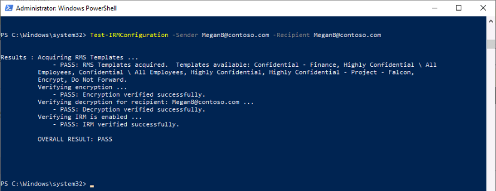
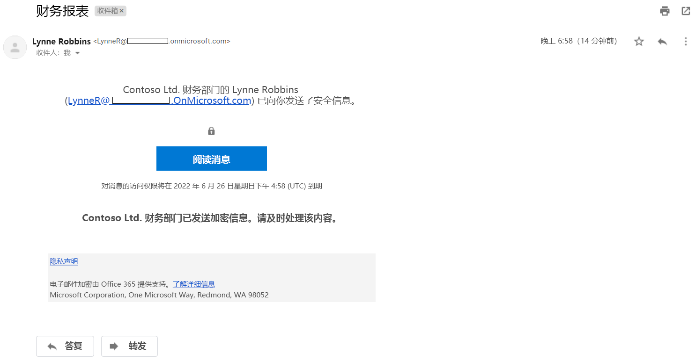

---
lab:
  title: 练习 2 - 管理 Microsoft Purview 邮件加密
  module: Module 1 - Implement Information Protection
---

# <a name="lab-1---exercise-2---manage-office-365-message-encryption"></a>实验室 1 - 练习 2 - 管理 Office 365 邮件加密

Joni Sherman 需要对其试点团队配置和测试的第一个设置是 Microsoft 365 内置 Office 365 邮件加密 (OME)。 为此，她将修改默认模板并创建一个新的品牌模板，该模板将分配给其中一位试点用户。 然后，试点用户将使用其帐户测试 OME 功能。

### <a name="task-1--verify-azure-rms-functionality"></a>任务 1 - 验证 Azure RMS 功能

在此任务中，你将安装 Exchange Online PowerShell 模块并在 Joni Sherman 的上下文中验证租户的正确 Azure RMS 功能，Joni Sherman 在上一练习中被指定为合规性管理员。

1. 你仍应使用 lon-cl1\admin 帐户登录到客户端 1 VM (LON-CL1)。

1. 打开提升的 PowerShell 窗口，方法是右键选择 Windows 按钮，然后选择“Windows PowerShell (管理员)”。

1. 选择“是”确认“用户帐户控制”窗口 。

1. 输入以下 cmdlet，安装最新版 Exchange Online PowerShell 模块：

    ```powershell
    Install-Module ExchangeOnlineManagement
    ```

1. 输入表示“是”的 Y 并按 Enter 键，以确认“NuGet 提供程序安全”对话框 。 完成此进程可能需要几秒钟时间。

1. 输入表示“是”的 Y 并按 Enter 键，以确认“不受信任的存储库安全”对话框 。  完成此进程可能需要几秒钟时间。

1. 输入以下 cmdlet 以更改执行策略，然后按 Enter 键

    ```powershell
    Set-ExecutionPolicy -ExecutionPolicy RemoteSigned -Scope CurrentUser
    ```

1. 单击表示“是”的 Y 并按 Enter 键，以确认“执行策略更改” 。 

1. 关闭 PowerShell 窗口。

1. 在不提升权限的情况下打开常规 PowerShell 窗口，方法是右键选择 Windows 按钮，然后选择“Windows PowerShell”。

1. 输入以下 cmdlet 以使用 Exchange Online PowerShell 模块并连接到租户：

    ```powershell
    Connect-ExchangeOnline
    ```

1. 显示“登录”窗口时，以 JoniS@WWLxZZZZZZ.onmicrosoft.com（其中 ZZZZZZ 是实验室托管提供程序提供的唯一租户 ID）登录。  Joni 的密码应由实验室托管提供程序提供。

1. 使用以下 cmdlet 并按 Enter 键，以验证是否在租户中激活了 Azure RMS 和 IRM：

    ```powershell
    Get-IRMConfiguration | fl AzureRMSLicensingEnabled
    ```

1. 当“AzureRMSLicensingEnabled”结果为“True”时，将为租户激活 Azure RMS 。 继续下一个步骤。 

1. 使用以下 cmdlet 并按 Enter 键，以针对另一个试点用户 Megan Bowen 测试用于 Office 365 邮件加密的 Azure RMS 模板 ：

    ```powershell
    Test-IRMConfiguration -Sender MeganB@contoso.com -Recipient MeganB@contoso.com
    ```

    

1. 验证是否所有测试均为“通过”状态，并且未显示任何错误。

1. 使 PowerShell 窗口保持打开状态。

你已成功安装 Exchange Online PowerShell 模块，将其连接到租户，并验证了 Azure RMS 的正确功能。

### <a name="task-2--modify-default-ome-template"></a>任务 2 - 修改默认 OME 模板

组织中要求限制对外部标识提供者（例如 Google 或 Facebook）的信任。 由于默认情况下，这些用于访问受 OME 保护的邮件的社交 ID 处于激活状态，因此需要在组织中停用所有用户的社交 ID。

1. 你仍应使用 lon-cl1\admin 帐户登录到客户端 1 VM (LON-CL1)，并且仍然应该有一个处于打开状态且已连接 Exchange Online 的 PowerShell 窗口。

1. 运行以下 cmdlet 以查看默认的 OME 配置：

    ```powershell
    Get-OMEConfiguration -Identity "OME Configuration" | fl
    ```

1. 查看设置，并确认 SocialIdSignIn 参数设置为 True。

1. 运行以下 cmdlet，以限制使用社交 ID 从受 OME 保护的租户访问邮件：

    ```powershell
    Set-OMEConfiguration -Identity "OME Configuration" -SocialIdSignIn:$false
    ```

1. 输入表示“是”的 Y 并按 Enter 键，以确认有关自定义默认模板的警告消息 。

1. 再次检查默认配置，并验证 SocialIdSignIn 参数现在是否已设置为 False。

    ```powershell
    Get-OMEConfiguration -Identity "OME Configuration" | fl
    ```

1. 注意结果应显示 SocialIDSignIn 设置为 False。 使 PowerShell 窗口和客户端保持打开状态。

你已成功停用 Office 365 邮件加密中的外部标识提供者（例如 Google 和 Facebook）。

### <a name="task-3--test-default-ome-template"></a>任务 3 - 测试默认 OME 模板

必须确认在从租户的用户收到受 Office 365 消息加密保护的消息时不会为外部收件人显示任何社交 ID 对话框，并且他们需要在访问加密内容时使用 OTP。

1. 将客户端 1 VM (LON-CL1) 保持为打开状态，并使用 lon-cl2\admin 帐户登录到客户端 2 VM (LON-CL2)。

1. 请确保已安装所有可用的 Windows 更新，并且客户端不需要重启即可完成更新安装。

[//]: <> (安装最新的 OS 更新还会将 Edge 浏览器更新为执行此实验室所需的新 Chromium 版本。)

1. 从任务栏打开 Microsoft Edge，当显示“欢迎使用 Microsoft Edge”窗口时，选择“不使用你的数据开始”，再选择“不使用此数据继续”，然后选择“确认并开始浏览”    。

1. 如果缺少欢迎使用消息，请导航到 https://microsoft.com/edge ，选择“下载 Windows 版”和“Windows 10” 。 选择“接受并下载”和“运行”以安装最新版本的 Edge 浏览器 。 完成此操作后，执行上一步。

1. 在 Microsoft Edge 中，导航到 https://outlook.office.com 并以 LynneR@WWLxZZZZZZ.onmicrosoft.com （其中 ZZZZZZ 是实验室托管提供程序提供的唯一租户 ID）登录 Outlook 网页版。  Lynne Robin 的密码应由实验室托管提供程序提供。 提示：密码通常与实验室租户中 MOD 管理员的密码相同。

1. 在“保持登录?”对话框上，选中“不再显示此内容”复选框，然后选择“否”  。

1. 在“保存密码”对话框中选择“保存”，将试点用户密码保存在浏览器中 。

1. 如果显示“从其中翻译页面…”窗口，请选择向下箭头，然后选择“从不从其中翻译…” 。

1. 从 Outlook 网页版的左上角选择“新建邮件”。

1. 在“收件人”行中，输入不在租户域中的个人或其他第三方电子邮件地址。 在主题行中输入“机密邮件”，并在正文中输入“我的超级机密邮件。”  。

1. 在顶部窗格中，选择“选项”，然后选择“加密”以加密邮件 。 在成功加密消息后，应会看到一条显示“加密: 此消息已加密。 收件人无法删除加密”的通知。

      

1. 选择“发送”发送该消息。

1. 登录到个人电子邮件帐户，然后打开来自 Lynne Robbins 的邮件。 如果将此电子邮件发送到 Microsoft 帐户（如 @outlook.com），则系统会自动处理加密，并自动显示该邮件。 如果将电子邮件发送到其他电子邮件服务（如 @gmail.com），则可能必须执行以下步骤才能处理加密和阅读邮件。

    >注意：你可能需要在垃圾邮件文件夹中查找来自 Lynne Robbins 的消息。

1. 选择“阅读邮件”。

1. 如果未激活社交 ID，则没有用于对 Google 帐户进行身份验证的按钮。

1. 选择“使用一次性密码登录”以接收限时密码。

1. 转到个人电子邮件门户并打开主题为“用于查看邮件的一次性密码”的邮件。

1. 复制密码，将其粘贴到 OME 门户中，然后选择“继续”。

1. 查看已加密的邮件。

1. 将客户端 1 VM (LON-CL1) 保持为打开状态。

你已成功使用已停用的社交 ID 测试了修改后的默认 OME 模板。

### <a name="task-4--create-custom-branding-template"></a>任务 4 - 创建自定义品牌模板

组织财务部门发送的受保护邮件需要特殊的品牌信息，包括自定义的简介和正文文本，以及页脚中的“免责声明”链接。 财务邮件也应在 7 天后过期。 在此任务中，你将创建新的自定义 OME 配置以及传输规则，以将 OME 配置应用于财务部门发送的所有邮件。

1. 使用 lon-cl1\admin 帐户登录到客户端 1 VM (LON-CL1)，并且仍然应该有一个处于打开状态且已连接 Exchange Online 的 PowerShell 窗口。

1. 运行以下 cmdlet 以创建新的 OME 配置：

    ```powershell
    New-OMEConfiguration -Identity "Finance Department" -ExternalMailExpiryInDays 7
    ```

1. 输入表示“是”的 Y 并按 Enter 键，以确认有关自定义模板的警告消息 。 

1. 使用以下 cmdlet 更改说明文本消息：

    ```powershell
    Set-OMEConfiguration -Identity "Finance Department" -IntroductionText " from Contoso Ltd. finance department has sent you a secure message."
    ```

1. 输入表示“是”的 Y 并按 Enter 键，以确认有关自定义模板的警告消息 。

1. 使用以下 cmdlet 更改邮件的正文电子邮件文本：

    ```powershell
    Set-OMEConfiguration -Identity "Finance Department" -EmailText "Encrypted message sent from Contoso Ltd. finance department. Handle the content responsibly."
    ```

1. 输入表示“是”的 Y 并按 Enter 键，以确认有关自定义模板的警告消息 。

1. 将免责声明 URL 更改为指向 Contoso 的隐私声明站点：

    ```powershell
    Set-OMEConfiguration -Identity "Finance Department" -PrivacyStatementURL "https://contoso.com/privacystatement.html"
    ```

1. 输入表示“是”的 Y 并按 Enter 键，以确认有关自定义模板的警告消息 。

1. 使用以下 cmdlet 创建邮件流规则，该规则将自定义 OME 模板应用于财务团队发送的所有邮件。  完成此进程可能需要几秒钟时间。

    ```powershell
    New-TransportRule -Name "Encrypt all mails from Finance team" -FromScope InOrganization -FromMemberOf "Finance Team" -ApplyRightsProtectionCustomizationTemplate "Finance Department" -ApplyRightsProtectionTemplate Encrypt
    ```

1. 键入以下 cmdlet 以验证更改。
    
    ```powershell
    Get-OMEConfiguration -Identity "Finance Department" | Format-List
    ```
    
1. 使 PowerShell 保持打开状态。

你已经成功创建了新的传输规则，当财务部门的成员向外部收件人发送邮件时，该规则将自动应用自定义 OME 模板。

### <a name="task-5--test-the-custom-branding-template"></a>任务 5 - 测试自定义品牌模板

要验证新的自定义 OME 配置，需要再次使用财务团队成员 Lynne Robbins 的帐户。

1. 使用 lon-cl2\admin 帐户登录到客户端 2 VM (LON-CL2)。 

1. 从任务栏中选择 Microsoft Edge。 Outlook 网页版选项卡应仍处于打开状态，你应该已作为 Lynne Robbins 登录了。 

1. 从 Outlook 网页版的左上角选择“新建邮件”。

1. 在“收件人”行中，输入不在租户域中的个人或其他第三方电子邮件地址。 在主题行中输入“财务报告”，并在正文中输入“机密财务信息。”  。

1. 选择“发送”发送该消息。

1. 登录到个人电子邮件帐户，然后打开来自 Lynne Robbins 的邮件。

1. 你应会看到 Lynne Robbins 发送的邮件，如下图所示。  选择“阅读邮件”。

    

1. 由于这两个选项均可用，因此自定义 OME 配置已激活社交 ID。 选择“使用一次性密码登录”以接收限时密码。

1. 转到个人电子邮件门户并打开主题为“用于查看邮件的一次性密码”的邮件。

1. 复制密码，将其粘贴到 OME 门户中，然后选择“继续”。

1. 查看包含自定义品牌信息的加密邮件。

你已经成功测试了新的自定义 OME 模板。