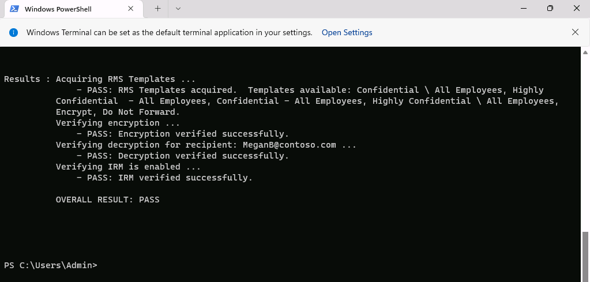

---
lab:
  title: 练习 3 - 管理 Microsoft Purview 邮件加密
  module: Module 1 - Implement Information Protection
---

# 实验室 1 - 练习 3 - 管理 Microsoft Purview 邮件加密

若要确保 Contoso Ltd.中的安全通信，需要配置和测试 Microsoft Purview 邮件加密。 这包括修改默认模板并为财务部门创建新的品牌模板。

**任务**：

1. 验证 Azure RMS 功能
1. 修改默认品牌模板
1. 测试默认品牌模板
1. 创建自定义品牌模板
1. 测试自定义品牌模板

## 任务 1 - 验证 Azure RMS 功能

在此任务中，你将验证租户的正确 Azure RMS 功能。

1. 你仍然应该会使用 **SC-400-CL1\admin** 帐户登录到客户端 1 VM (SC-400-CL1)。

1. 右键单击任务栏中的“Windows”按钮，然后选择“**终端(管理员)**”，打开提升的 PowerShell 窗口。

1. 选择“是”确认“用户帐户控制”窗口 。

1. 在终端窗口中运行 **Install-Module** cmdlet，以安装最新的 Exchange Online PowerShell 模块版本：

    ```powershell
    Install-Module ExchangeOnlineManagement
    ```

1. 输入表示“是”的 Y 并按 Enter 键，以确认“NuGet 提供程序安全”对话框 。 此过程可能需要一些时间才能完成。

1. 输入表示“是”的 Y 并按 Enter 键，以确认“不受信任的存储库安全”对话框 。  此过程可能需要一段时间才能完成。

1. 运行 **Set-ExecutionPolicy** cmdlet，以更改执行策略，然后按 **Enter**

    ```powershell
    Set-ExecutionPolicy -ExecutionPolicy RemoteSigned -Scope CurrentUser
    ```

1. 关闭 PowerShell 窗口。

1. 打开常规 PowerShell 窗口，无需提升权限，右键单击任务栏中的“Windows”按钮，然后选择“**终端**”。

1. 输入 **Connect-ExchangeOnline** cmdlet，以使用 Exchange Online PowerShell 模块并连接到租户：

    ```powershell
    Connect-ExchangeOnline
    ```

1. 显示“登录”窗口时，以 `JoniS@WWLxZZZZZZ.onmicrosoft.com`（其中 ZZZZZZ 是实验室托管提供程序提供的唯一租户 ID）登录。 你将使用上一个实验室中 Joni 密码重置后的密码。

1. 运行 **Get-IRMConfiguration** cmdlet，验证是否已在租户中激活 Azure RMS 和 IRM：

    ```powershell
    Get-IRMConfiguration | fl AzureRMSLicensingEnabled
    ```

   **AzureRMSLicensingEnabled** 结果应为 **True**。

1. 运行 **Test-IRMConfiguration** cmdlet，以使用用户 **Megan Bowen** 来测试用于 Office 365 消息加密的 Azure RMS 模板：

    ```powershell
    Test-IRMConfiguration -Sender MeganB@contoso.com -Recipient MeganB@contoso.com
    ```

    

    验证是否所有测试均为“通过”状态，并且未显示任何错误。

1. 使 PowerShell 窗口保持打开状态。

你已成功安装 Exchange Online PowerShell 模块，将其连接到租户，并验证了 Azure RMS 的正确功能。

## 任务 2 – 修改默认品牌模板

组织中要求限制对外部标识提供者（例如 Google 或 Facebook）的信任。 默认情况下，这些用于访问受邮件加密保护的邮件的社交 ID 处于激活状态，因此需要在组织中停用所有用户的社交 ID。

1. 你仍应以 **SC-400-CL1\admin** 帐户身份登录到 Client 1 VM (SC-400-CL1) ，并且仍应有一个处于打开状态且已连接 Exchange Online 的 PowerShell 窗口。

1. 运行 **Get-OMEConfiguration** cmdlet，以查看默认配置：

    ```powershell
    Get-OMEConfiguration -Identity "OME Configuration" | fl
    ```

   查看设置，并确认 SocialIdSignIn 设置为 **True**。

    

1. 运行 **Set-OMEConfiguration** cmdlet，以限制使用社交 ID 访问来自受 OME 保护的租户的消息：

    ```powershell
    Set-OMEConfiguration -Identity "OME Configuration" -SocialIdSignIn:$false
    ```

1. 输入 **Y** 表示“是”并按 **Enter**，以确认自定义默认模板的警告消息。

1. 运行 **Get-OMEConfiguration** cmdlet，以再次检查默认配置并验证：

    ```powershell
    Get-OMEConfiguration -Identity "OME Configuration" | fl
    ```

    

   注意结果应显示 SocialIDSignIn 设置为 **False**。 使 PowerShell 窗口和客户端保持打开状态。

你已成功停用 Office 365 邮件加密中的外部标识提供者（例如 Google 和 Facebook）。

## 任务 3 – 测试默认品牌模板

必须确认在从租户的用户收到受 Office 365 消息加密保护的消息时不会为外部收件人显示任何社交 ID 对话框，并且他们需要在访问加密内容时使用 OTP。

1. 你仍应以 **SC-400-CL1\admin** 身份登录到 Client 1 VM (SC-400-CL1)。

1. 通过在任务栏中右键单击 Microsoft Edge 并选择“**新建 InPrivate窗口**”，在 InPrivate 窗口中打开**Microsoft Edge**。

1. 导航到 **`https://outlook.office.com`** 并以 `LynneR@WWLxZZZZZZ.onmicrosoft.com` 身份（其中 ZZZZZZ 是实验室托管提供程序提供的唯一租户 ID）登录到 Outlook 网页版。 Lynne 的密码是在上一练习中设置的。

1. 在“**保持登录?**”对话框上，选中“**不再显示此内容**”复选框，然后选择“**否**”。

1. 在 Outlook 网页版中，选择“**新建邮件**”。

1. 在“**收件人**”行中，输入不在租户域中的个人或其他第三方电子邮件地址。 在主题行中输入 **`Secret Message`** 并在电子邮件的正文中输入 **`My super-secret message.`**。

1. 在顶部窗格中，选择“选项”，然后选择“加密”以加密邮件 。 在成功加密消息后，应会看到一条显示“加密: 此消息已加密。 收件人无法移除加密”。

      

1. 选择“发送”发送该消息。 保持 Outlook 窗口的打开状态。

1. 在新窗口中登录到个人电子邮件帐户并打开来自 Lynne Robbins 的邮件。 如果将此电子邮件发送到 Microsoft 帐户（如 @outlook.com），系统会自动处理加密，并自动显示该邮件。 如果将电子邮件发送到其他电子邮件服务（如 @gmail.com），则可能必须执行以下步骤才能处理加密和阅读邮件。

    >**备注**：你可能需要在垃圾邮件文件夹中查找来自 Lynne Robbins 的邮件。

1. 选择“阅读邮件”。

1. 如果未激活社交 ID，就没有使用非 Microsoft 帐户进行身份验证的按钮。

1. 选择“使用一次性密码登录”以接收限时密码。

1. 转到个人电子邮件门户并打开主题为“用于查看邮件的一次性密码”的邮件。

1. 复制密码，将其粘贴到 OME 门户中，然后选择“继续”****。

1. 查看已加密的邮件。

你已成功使用已停用的社交 ID 测试了修改后的默认 OME 模板。

## 任务 4 - 创建自定义品牌模板

组织财务部门发送的受保护邮件需要特殊的品牌信息，包括自定义的简介和正文文本，以及页脚中的“免责声明”链接。 财务邮件也应在 7 天后过期。 在此任务中，你将创建新的自定义 OME 配置以及传输规则，以将 OME 配置应用于财务部门发送的所有邮件。

1. 你仍应以 **SC-400-CL1\admin** 身份登录到 Client 1 VM (SC-400-CL1)，并且仍应有一个处于打开状态且已连接 Exchange Online 的 PowerShell 窗口。

1. 运行 **New-OMEConfiguration** cmdlet，以创建新的配置：

    ```powershell
    New-OMEConfiguration -Identity "Finance Department" -ExternalMailExpiryInDays 7
    ```

1. 输入表示“是”的 Y 并按 Enter 键，以确认有关自定义模板的警告消息 。

1. 运行带有 _IntroductionText_ 参数的 **Set-OMEConfiguration** cmdlet，以更改简介文本：

    ```powershell
    Set-OMEConfiguration -Identity "Finance Department" -IntroductionText " from Contoso Ltd. finance department has sent you a secure message."
    ```

1. 输入表示“是”的 Y 并按 Enter 键，以确认有关自定义模板的警告消息 。

1. 运行带有 _EmailText_ 参数的 **Set-OMEConfiguration** cmdlet，以更改电子邮件正文：

    ```powershell
    Set-OMEConfiguration -Identity "Finance Department" -EmailText "Encrypted message sent from Contoso Ltd. finance department. Handle the content responsibly."
    ```

1. 输入表示“是”的 Y 并按 Enter 键，以确认有关自定义模板的警告消息 。

1. 运行带有 _PrivacyStatementURL_ 参数的 **Set-OMEConfiguration** cmdlet，将免责声明 URL 更改为指向 Contoso 的隐私声明网站：

    ```powershell
    Set-OMEConfiguration -Identity "Finance Department" -PrivacyStatementURL "https://contoso.com/privacystatement.html"
    ```

1. 输入表示“是”的 Y 并按 Enter 键，以确认有关自定义模板的警告消息 。

1. 运行 **TransportRule** cmdlet 以创建邮件流规则，将自定义 OME 模板应用于财务团队发送的所有邮件。 此过程可能需要几秒钟才能完成。

    ```powershell
    New-TransportRule -Name "Encrypt all mails from Finance team" -FromScope InOrganization -FromMemberOf "Finance Team" -ApplyRightsProtectionCustomizationTemplate "Finance Department" -ApplyRightsProtectionTemplate Encrypt
    ```

1. 运行 **Get-OMEConfiguration** cmdlet 以验证更改。

    ```powershell
    Get-OMEConfiguration -Identity "Finance Department" | Format-List
    ```

1. 查看结果后关闭 PowerShell 窗口

你已经成功创建了新的传输规则，当财务部门的成员向外部收件人发送邮件时，该规则将自动应用自定义品牌模板。

## 任务 5 - 测试自定义品牌模板

要验证新的自定义配置，需要再次使用财务团队成员 Lynne Robbins 的帐户。

1. 返回到 **Microsoft Edge**，在 InPrivate 模式下打开的 Outlook 网页版窗口中，你仍应以 **Lynne Robbins** 的身份保持登录状态。

1. 从 Outlook 网页版的左上角选择“新建邮件”。

1. 在“**收件人**”行中，输入不在租户域中的个人或其他第三方电子邮件地址。 在主题行中输入 **`Finance Report`** 并在电子邮件的正文中输入 **`Secret finance information.`**。

1. 选择“**发送**”以发送邮件，然后关闭以 Lynne 身份登录的 InPrivate 窗口。

1. 登录到个人电子邮件帐户，然后打开来自 Lynne Robbins 的邮件。

1. 你应会看到 Lynne Robbins 发送的邮件，如下图所示。  选择“阅读邮件”。

    

1. 由于这两个选项均可用，因此自定义配置已激活社交 ID。 选择“使用一次性密码登录”以接收限时密码。

1. 转到个人电子邮件门户并打开主题为“用于查看邮件的一次性密码”的邮件。

1. 复制密码，将其粘贴到门户中，然后选择“继续”****。

1. 查看包含自定义品牌信息的加密邮件。 关闭窗口并使电子邮件帐户保持打开状态。

你已经成功测试了新的自定义模板。
