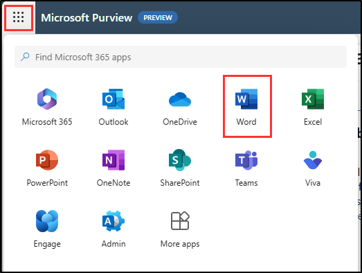
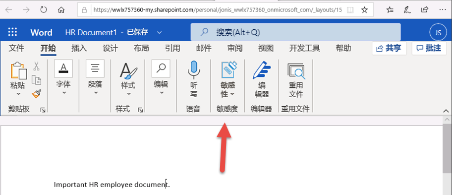

---
lab:
  title: 练习 4 - 管理敏感度标签
  module: Module 1 - Implement Information Protection
---

# 实验室 1 - 练习 4 - 管理敏感度标签

Contoso Ltd. 的系统管理员 Joni Sherman 正在实施敏感度标签计划，以确保人力资源部门中的所有员工文档都根据公司的信息保护策略进行适当标记。 Contoso Ltd. 总部位于德国雷德尼茨亨巴赫，致力于遵守内部数据处理标准和区域法规。

**任务**：

1. 启用对敏感度标签的支持
1. 创建敏感度标签
1. 发布敏感度标签
1. 应用敏感度标签
1. 配置自动标记

## 任务 1 - 启用对敏感度标签的支持

在此任务中，你将安装必要的模块，并在租户上启用对敏感度标签的支持。

1. 你仍然应该会使用 **SC-400-CL1\admin** 帐户登录到客户端 1 VM (SC-400-CL1)。

1. 右键单击任务栏中的“Windows”按钮，然后选择“**终端(管理员)**”，打开提升的 PowerShell 窗口。

1. 输入表示“是”的 Y 并按 Enter，以确认“用户帐户控制”窗口 。

1. 运行 **Install-Module** cmdlet，以安装最新版 MS Online PowerShell 模块：

    ```powershell
    Install-Module -Name MSOnline
    ```

1. 输入表示“是”的 Y 并按 Enter 键以确认“NuGet 安全性”对话框以及“不受信任的存储库安全”对话框。 这可能需要一段时间才能处理完成。

1. 运行 **Install-Module** cmdlet，以安装最新版本的 Sharepoint Online PowerShell 模块：

    ```powershell
    Install-Module -Name Microsoft.Online.SharePoint.PowerShell
    ```

1. 输入表示“是”的 Y 并按 Enter 键，以确认“不受信任的存储库安全”对话框。

1. 运行 **Connect-MsolService** 以连接到 MS Online 服务：

    ```powershell
    Connect-MsolService
    ```

1. 在“登录到帐户”窗体中，以 Joni Sherman 的身份 `JoniS@WWLxZZZZZZ.onmicrosoft.com`（其中 ZZZZZZ 是实验室托管提供程序提供的唯一租户 ID）登录。 Joni 的密码是在上一练习中设置的。

1. 登录后，导航回终端窗口。

1. 运行 **Get-Msoldomain** cmdlet 并将域另存为变量：

    ```powershell
    $domain = get-msoldomain
    ```

1. 使用在上一步中创建的 _$domain_ 变量为 _$adminurl_ 创建新变量：

    ```powershell
    $adminurl = "https://" + $domain.Name.split('.')[0] + "-admin.sharepoint.com"
    ```

1. 使用在上一步中创建的 _$adminurl_ 变量运行 **Connect-SPOService** cmdlet：

    ```powershell
    Connect-SPOService -url $adminurl
    ```

1. 在“登录到帐户”窗体中，以 MOD 管理员身份登录。 `admin@WWLxZZZZZZ.onmicrosoft.com`（其中 ZZZZZZ 是实验室托管提供程序提供的唯一租户 ID）。 管理员的密码应由实验室托管提供程序提供。

1. 登录后，导航回终端窗口。

1. 运行 **Set-SPOTenant** cmdlet，以启用对敏感度标签的支持：

    ```powershell
    Set-SPOTenant -EnableAIPIntegration $true
    ```

1. 输入表示“是”的 Y 并按 Enter 键，以确认更改。

1. 关闭 PowerShell 窗口。

你已为 Teams 和 SharePoint 网站成功启用对敏感度标签的支持。

## 任务 2 - 创建敏感度标签

在本任务中，人力资源部门申请了敏感度标签，以应用于人力资源员工文档。 你将为内部文档创建敏感度标签，为人力资源部门创建子标签。

1. 你仍然应该会使用 **SC-400-cl1\admin** 帐户登录到客户端 1 VM (SC-400-CL1)。

1. 打开 Microsoft Edge 并导航到 `https://purview.microsoft.com` 。 以 **Joni Sherman**`JoniS@WWLxZZZZZZ.onmicrosoft.com`（其中 ZZZZZZ 是实验室托管提供商提供的唯一租户 ID）的身份登录 Microsoft Purview。 Joni 的密码是在上一练习中设置的。

1. 在 Microsoft Purview 门户中的左侧边栏中选择“**解决方案**”，然后选择“**信息保护**”。

1. 在“**Microsoft 信息保护**”页上的左侧边栏中，选择“**敏感度标签**”。

1. 在“**敏感度标签**”页上，选择“**+ 创建标签**”。

1. 此时会启动“**新建敏感度标签**”配置。 在“**提供此标签的基本详细信息**”上输入：

    - **名称**：`Internal`
    - **显示名称**：`Internal`
    - **** 面向用户的说明：`Internal sensitivity label.`
    - **** 面向管理员的说明：`Internal sensitivity label for Contoso.`

1. 选择**下一步**。

1. 在“**定义此标签的范围**”页上选择“**项**”，然后选择“**文件**”和“**电子邮件**”。 如果已选中“**会议**”复选框，请确保将其取消选中。

1. 选择**下一步**。

1. 在“选择带标签项的保护设置”页面上，选择“下一步” 。

1. 在“自动标记文件和电子邮件”页面上，选择“下一步” 。

1. 在“定义组和网站的保护设置”页面上，选择“下一步” 。

1. 在“自动标记架构化的数据资产(预览)”页上，选择“下一步”********。

1. 在“查看设置并完成”页面上，选择“创建标签” 。

1. 在“你的敏感度标签已创建”页上，选择“现在不创建策略”，然后选择“完成”。************

1. 在“**敏感度标签**”页上，找到新创建的“**内部**”敏感度标签。 选择其旁边的垂直省略号 (**...**)，然后从下拉列表中选择“**+ 创建子标签**”。

    

1. 此时会启动“新建敏感度标签”向导。 在“**提供此标签的基本详细信息**”页中，输入：

   - **名称**：`Employee data (HR)`
   - **显示名称**：`Employee data (HR)`
   - **** 面向用户的说明：`This HR label is the default label for all specified documents in the HR Department.`
   - **** 面向管理员的说明：`This label is created in consultation with Ms. Jones (Head of HR department). Contact her, when you want to change settings of the label.`

1. 选择**下一步**。

1. 在“**定义此标签的范围**”页上选择“**项**”，然后选择“**文件**”和“**电子邮件**”。 如果已选中“**会议**”复选框，请确保将其取消选中。

1. 选择**下一步**。

1. 在“**选择带标签项的保护设置**”页面上，选择“**控制访问**”选项，然后选择“**下一步**”。

1. 在“**访问控制**”页上，选择“**配置访问控制设置**”。

1. 使用以下选项配置加密设置：

   - **立即分配权限或让用户自行决定?** ：立即分配权限
   - **用户对内容的访问权限过期**：从不
   - **允许脱机访问**：仅几天
   - **用户在多少天内可以脱机访问内容**:15
   - 选择“**分配权限**”链接。 在“**分配权限**”浮出控件面板上，选择“**+ 添加任何经过身份验证的用户**”，然后选择“**保存**”以应用此设置。

1. 在“访问控制”页上，选择“下一步”********。

1. 在“自动标记文件和电子邮件”页面上，选择“下一步” 。

1. 在“定义组和网站的保护设置”页面上，选择“下一步” 。

1. 在“自动标记架构化的数据资产(预览)”页上，选择“下一步”********。

1. 在“查看设置并完成”页面上，选择“创建标签” 。

1. 在“你的敏感度标签已创建”页上，选择“现在不创建策略”，然后选择“完成”。************

你已成功为组织的内部策略创建了敏感度标签，为人力资源 (HR) 部创建了敏感度子标签。

## 任务 3 - 发布敏感度标签

现在，你将发布内部敏感度标签和人力资源部敏感度标签，以便人力资源部的用户可以在其人力资源文档中使用发布的敏感度标签。

1. 你仍然应该会使用 **SC-400-cl1\admin** 帐户登录到客户端 1 VM (SC-400-CL1)，并且应该会以 **Joni Sherman** 的身份登录到 Microsoft Purview。

1. 在 Microsoft Edge 中，Microsoft Purview 门户选项卡应该仍处于打开状态。 如果没有，请导航到“**`https://purview.microsoft.com`**” > “**解决方案**” > “**信息保护**” > “**敏感度标签**”。

1. 在“**敏感度标签**”页上，选择“**发布标签**”。

1. 此时会启动“发布敏感度标签”配置。

1. 在“选择要发布的敏感度标签”页面上，选择“选择要发布的敏感度标签”链接 。

1. 在“**用于发布的敏感度标签**”浮出面板上，选择“**内部**”和“**内部/员工数据(HR)**”复选框，然后选择浮出面板底部的“**添加**”。

1. 返回“**选择要发布的敏感度标签**”页面上，选择“**下一步**”。

1. 在“分配管理单元”**** 页面上，选择“下一步”****

1. 在“发布到用户和组”页面上，选择“下一步” 。

1. 在“策略设置”页面上，选择“下一步” 。

1. 在“文档的默认设置”中，选择“下一步” 。

1. 在“电子邮件的默认设置”中，选择“下一步” 。

1. 在“会议和日历活动的默认设置”中，选择“下一步” 。

1. 在“Power BI 内容的默认设置”中，选择“下一步” 。

1. 在“**为策略命名**”页上输入：

   - **名称**：`Internal HR employee data`
   - **** 输入有关敏感度标签策略的说明：`This HR label is to be applied to internal HR employee data.`

1. 选择**下一步**。

1. 在“查看并完成”页面上，选择“提交” 。

1. 在“已创建新策略”中，选择“完成”以完成标签策略的发布 。

你成功发布了内部和人力资源敏感度标签。 请注意，最多可能需要 24 小时才能将更改复制到所有用户和服务。

## 任务 4 - 应用敏感度标签

在本任务中，你将在 Word 和 Outlook 电子邮件中创建敏感度标签。 创建的文档将存储在 OneDrive 中，并通过电子邮件发送给人力资源员工。

1. 你仍应使用 **SC-400-cl1\admin** 帐户登录到客户端 1 VM (SC-400-CL1)，并且应该以 **Joni Sherman**`JoniS@WWLxZZZZZZ.onmicrosoft.com`（其中 ZZZZZZ 是实验室托管提供商提供的唯一租户 ID）的身份登录到 Microsoft 365。 Joni 的密码是在上一练习中设置的。

1. 在 **Microsoft Edge** 中，选择左上角的 meatball 菜单并选择“**Word**”，打开新的 Word 文档。

    

1. 选择“**空白文档**”以创建新文档。

1. 在“**隐私选项**”对话框中，选择“**关闭**”。

1. 在新空白文档中输入此文本：

   `Important HR employee document.`

1. 从导航功能区中选择“**敏感度**”，然后选择“**内部**” > “**员工数据(HR)**，将新创建的敏感度标签应用于此文档。

    

    >**备注：** 新发布的敏感度标签可能需要 24-48 小时才能可供应用。 如果新创建的敏感度标签不可用，则可以使用此练习的“**机密**” > “**所有员工**”。

1. 在文档的左上角，选择“**文档**”以重命名此文件，并将其重命名为 **`HR Document`**。 按 Enter 应用此名称更改。

    

1. 关闭选项卡以返回到“Word Online”选项卡。选择左上角的 meatball 菜单，然后选择“**Outlook**”打开 Outlook 网页版。

1. 在 Outlook 网页版中，选择“**新建邮件**”。

1. 在“**收件人**”字段中，输入姓名 **`Allan`**，然后从下拉列表中选择“**Allan Deyoung**”。

1. 在主题行中，输入：**`Employee data for HR`**

1. 在电子邮件正文中输入：

    ``` text
    Dear Mr. Deyoung, 

    Please find attached the important HR employee document. 

    Kind regards,

    Joni Sherman
    ```

1. 在顶部菜单中选择回形针图标以添加附件。 在“**建议的文件**”下，选择“**HR Document.docx**”。

1. 选择“发送”，发送附有文档的电子邮件。

你成功创建了具有敏感度标签的人力资源 Word 文档，该文档已保存到 OneDrive。 然后，你通过也设置了敏感度标签的电子邮件将该文档发送给了人力资源工作人员。

## 任务 5 - 配置自动标记

在本任务中，你将创建敏感度标签，该标签发现文档和电子邮件中包含与欧洲一般数据保护条例 (GPDR) 相关的信息时将自动对其进行标记。

1. 你仍然应该会使用 **SC-400-cl1\admin** 帐户登录到客户端 1 VM (SC-400-CL1)。

1. 在 Microsoft Edge 中，导航到 `https://purview.microsoft.com` ，并以 Joni Sherman 的身份登录到 Microsoft Purview 门户  。

1. 在 Microsoft Purview 门户中的左侧边栏中，选择“**解决方案**”，然后选择“**信息保护**”。 选择“**敏感度标签**”。

1. 在“**敏感度标签**”页上，找到新创建的“**内部**”敏感度标签。 选择其旁边的垂直省略号 (**...**)，然后从下拉列表中选择“**+ 创建子标签**”。

1. 此时会启动“**新建敏感度标签**”配置。 在“**提供此标签的基本详细信息**”页中，输入：

   - **名称**：`GDPR Germany`
   - **显示名称**：`GDPR Germany`
   - **** 面向用户的说明：`This document or email contains data related to the European General Data Protection Regulation (GPDR) for the region Germany.`
   - **** 面向管理员的说明：`This label is auto applied to German GDPR documents.`

1. 选择**下一步**。

1. 在“**定义此标签的范围**”页上选择“**项**”，然后选择“**文件**”和“**电子邮件**”。 如果已选中“**会议**”复选框，请确保将其取消选中。

1. 选择**下一步**。

1. 在“选择带标签项的保护设置”页面上，选择“下一步” 。

1. 在“自动标记文件和电子邮件”页面上，将“自动标记文件和电子邮件”设置为“已启用” 。

1. 在“**检测符合这些条件的内容**”部分，选择“**+ 添加条件**” > “**内容包含**”。

1. 在“**内容包含**”部分下，选择“**添加**” > “**敏感信息类型**”。

1. 在“**敏感信息类型**”浮出面板中，搜索 `German` 以显示与德国相关的敏感信息类型。

1. 选中“**名称**”字段旁边的复选框，以选择所有与德国相关的敏感信息类型，然后选择“**添加**”。

    

1. 在“自动标记文件和电子邮件”**** 页面上，选择“下一步”****。

1. 在“定义组和网站的保护设置”页面上，选择“下一步” 。

1. 在“自动标记架构化的数据资产(预览)”页上，选择“下一步”********。

1. 在“查看设置并完成”页面上，选择“创建标签” 。

1. 在“**已创建敏感度标签**”页上，选择“**将标签发布到用户应用**”，然后选择“**完成**”。

1. 在“**创建自动标记策略**”浮出面板中，选择“**查看策略**”以启动用于创建新标签策略的配置。

1. 在“**命名自动标记策略**”页上输入：

   - **名称**：`GDPR Germany policy`
   - **** 输入有关敏感度标签策略的说明：`This auto apply sensitivity labels policy is for the GDPR region of Germany.`

1. 选择**下一步**。

1. 在“分配管理单元”**** 页面上，选择“下一步”****。

1. 在“**选择要应用标签的位置**”页上，保留默认值，然后选择“**下一步**”。

1. 在“**设置普通或高级规则**”页上，选择“**下一步**”。

1. 在“**为所有位置中的内容定义规则**”页上，选择“**下一步**”。

1. 在“**决定是现在测试策略还是稍后测试策略**”上，选择“**在模拟模式下运行策略**”，然后选中“**在模拟中未修改达 7 天时自动启用策略**”的复选框，然后选择“**下一步**”。

1. 在“查看并完成”页上，选择“创建策略” 。

1. 在“你的自动标记策略已创建”页上，选择“完成”。********

你已成功为德国区域的 GDPR 文档创建并发布了自动应用敏感度标签。

应用自动应用的敏感度标签最多可能需要 24 小时。 当应用于超过 25,000 个文档（即每日限制）时，此持续时间将更长。
