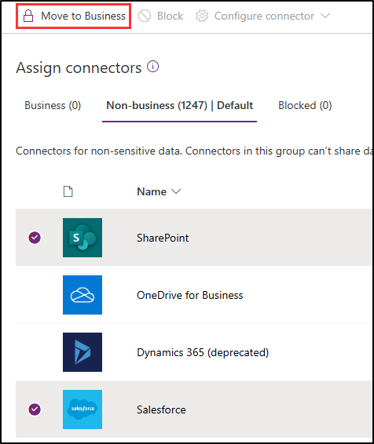

---
lab:
  title: 练习 1 - 管理 DLP 策略
  module: Module 2 - Implement Data Loss Prevention
---
## WWL 租户 - 使用条款

如果在讲师引导式培训过程中向你提供租户，请注意，提供租户旨在支持讲师引导式培训中的动手实验室。

租户不应共享或用于动手实验室以外的用途。 本课程使用的租户为试用租户，课程结束后无法使用或访问，不符合扩展条件。

租户不得转换为付费订阅。 在本课程中获得的租户仍然是 Microsoft Corporation 的财产，我们保留随时获取访问权限和收回的权利。

# 实验室 2 - 练习 1 - 管理 DLP 策略

你是 Joni Sherman，Contoso Ltd. 新上任的合规性管理员，负责配置公司的 Microsoft 365 租户以防止数据丢失。 Contoso Ltd. 是美国的一家提供驾驶指导服务的公司，你需要确保敏感客户信息不会泄露到组织外部。

**任务**：

1. 在模拟模式下创建 DLP 策略
1. 修改 DLP 策略
1. 在 PowerShell 中创建 DLP 策略
1. 测试 DLP 策略
1. 在模拟模式下激活策略
1. 修改策略优先级
1. 在 Microsoft 365 Defender 中启用文件监视
1. 为 Microsoft 365 Defender 创建文件策略
1. 为 Power Platform 创建 DLP 策略

## 任务 1 - 在模拟模式下创建 DLP 策略

在本练习中，你将创建数据丢失防护 (DLP) 策略以防止敏感数据被用户共享。 当你的用户想共享包含信用卡信息的内容时，你创建的 DLP 策略会向他们发出通知，并让他们提供发送此信息的正当理由。 由于你目前不想用户被阻止操作影响，所以将在模拟模式下实现策略。

1. 使用 **SC-400-CL1\admin** 帐户登录到客户端 1 VM (SC-400-CL1)。

1. 在 Microsoft Edge 中，导航到 `https://purview.microsoft.com` ，并以 Joni Sherman 的身份登录到 Microsoft Purview 门户  。 以 `JoniS@WWLxZZZZZZ.onmicrosoft.com` 身份登录（其中 ZZZZZZ 是实验室托管提供程序提供的唯一租户 ID）。 Joni 的密码是在上一练习中设置的。

1. 从左侧边栏中选择“**解决方案**”，然后选择“**数据丢失防护**”。

1. 在左侧边栏上选择“**策略**”。

1. 在“**策略**”页中，选择“**+创建策略**”以启动用于创建新数据丢失防护策略的配置。

1. 在“**从模板开始或创建自定义策略**”页上，选择“**自定义**”作为类别，然后选择“**法规**”下的“**自定义策略**”。

1. 选择**下一步**。

1. 在“为 DLP 策略命名”页面上输入****：

   - **名称**：`Credit Card DLP Policy`
   - **说明**：`Protect credit card numbers from being shared`

1. 选择**下一步**。

1. 在“分配管理单元”**** 页上，选择“下一步”****。

1. 在“**选择应用策略的位置**”页上，仅启用“**Teams 聊天和频道消息**”位置。 如果已选择任何其他位置，请取消选择。

1. 选择**下一步**。

1. 在“定义策略设置”页上，选择“创建或自定义高级 DLP 规则”，然后选择“下一步”************。

1. 在“自定义高级 DLP 规则”页面上选择“+ 创建规则” 。

1. 在“**创建规则**”浮出控件页上，在“**名称**”字段中输入 `Credit card information` 作为名称。

1. 在“**条件**”下选择“**+ 添加条件**”，然后选择“**内容包含**”。

1. 在新的“**内容包含**”区域中，选择“**添加**”，然后选择“**敏感信息类型**”。

1. 在“**敏感信息类型**”页面上，选择“**信用卡号**”，然后选择“**添加**”。

1. 选择“**+ 添加条件**”，然后选择“**内容共享自 Microsoft 365**”。

1. 在新的“从 Microsoft 365 共享内容”部分中，选择“仅与组织内的人员进行共享”选项********。

1. 在“**操作**”下，选择“**+ 添加操作**”，然后选择“**限制对 Microsoft 365 位置中内容的访问或对这些内容进行加密**”。

1. 在新的“**限制对 Microsoft 365 位置中内容的访问或对这些内容进行加密**”区域中，选择“**阻止所有人**”。

1. 在“**用户通知**”下，将“**使用通知来通知用户并帮助引导他们如何正确使用敏感信息。**”选项设置为“**开启**”，然后选中“**使用策略提示通知 Office 365 服务中的用户**”。

1. 在“**用户替代**”下，选中“**在 Fabric (包括 Power BI)、Exchange、SharePoint、OneDrive 和 Teams 中允许用户替代策略限制。**”复选框。

1. 选中“**需要业务理由才可替代**”复选框。

1. 在“**事件报告**”部分的“**在管理员警报和报告中使用此严重性级别**”下拉菜单中，选择“**低**”。

1. 在“**创建规则**”浮出面板的底部，选择“**保存**”。

1. 返回到“**自定义高级 DLP 规则**”页，选择“**下一步**”。

1. 在“**策略模式**”页上，选择“**在模拟模式下运行策略**”，并选择“**在处于模拟模式时显示策略提示**”复选框。

1. 选择**下一步**。

1. 在“**查看并完成**”页上查看设置，然后选择“**提交**”。

1. 在“新策略已创建”页上，选择“完成” 。

你现在已创建了一个 DLP 策略，该策略可扫描 Microsoft Teams 聊天和频道中的信用卡号，允许用户提供业务理由来替代此策略。

## 任务 2 - 修改 DLP 策略

在此任务中，你将修改在上一任务中创建的现有 DLP 策略，扫描电子邮件以获取信用卡信息。 此修改可确保在更多通信渠道中保护敏感数据。

1. 应仍使用 **SC-400-CL1\admin** 帐户登录到客户端 1 VM (SC-400-CL1)，并且应该以 **Joni Sherman** 的身份登录到 Microsoft 365。

1. 你应仍位于 Microsoft Purview 的“**策略**”页上。 如果没有，请打开 **Microsoft Edge** 并导航到 `https://purview.microsoft.com`。 选择“**解决方案**” > “**数据丢失防护**” > “**策略**”。

1. 在“**策略**”页上，选中最近创建的“**信用卡 DLP 策略**”的复选框，然后选择“**编辑策略**”以打开策略配置。

1. 在“为 DLP 策略命名”页面上，选择“下一步” 。

1. 在“分配管理单元”**** 页上，选择“下一步”****。

1. 在“**选择要应用策略的位置**”页上，选中“**Exchange 电子邮件**”复选框，将此位置添加到 DLP 策略。

1. 选择“**下一步**”，直到到达“**查看并完成**”页面。

1. 选择“**查看并完成**”页上的“**提交**”以应用对策略做出的修改。

1. 更新策略后，选择“**策略已更新**”页上的“**完成**”。

已成功修改 DLP 策略以包括电子邮件扫描，从而增强对敏感信息的保护。

## 任务 3 - 在 PowerShell 中创建 DLP 策略

在本任务中，你将使用 PowerShell 创建一个 DLP 策略来保护 Contoso 员工 ID，并防止这些 ID 在 Exchange 中被共享。 此策略将通知尝试共享此敏感数据的用户，并阻止电子邮件（如果其中包含员工 ID）。

1. 你仍然应该会使用 **SC-400-CL1\admin** 帐户登录到客户端 1 VM (SC-400-CL1)。

1. 右键单击任务栏中的“Windows”按钮，然后选择“**终端(管理员)**”，打开提升的 PowerShell 窗口。

1. 运行 **Connect-IPPSSession** cmdlet 以连接到安全性和合规性 PowerShell：

   ```powershell
   Connect-IPPSSession
   ```

1. 在“**登录到帐户**”弹出窗口中，以 **Joni Sherman**`JoniS@WWLxZZZZZZ.onmicrosoft.com`（其中 ZZZZZZ 是实验室托管提供程序提供的唯一租户 ID）的身份登录。 Joni 的密码是在上一练习中设置的。

1. 运行 **New-DlpCompliancePolicy** cmdlet 以创建扫描所有 Exchange 邮箱的 DLP 策略：

   ```powershell
   New-DlpCompliancePolicy -Name "EmployeeID DLP Policy" -Comment "This policy blocks sharing of Employee IDs" -ExchangeLocation All
   ```

1. 运行 **New-DlpComplianceRule** cmdlet，将 DLP 规则添加到在上一步中创建的 DLP 策略：

   ```powershell
   New-DlpComplianceRule -Name "EmployeeID DLP rule" -Policy "EmployeeID DLP Policy" -BlockAccess $true -ContentContainsSensitiveInformation @{Name="Contoso Employee IDs"}
   ```

1. 运行 **Get-DLPComplianceRule** cmdlet 以查看 **EmployeeID DLP 规则**：

   ```powershell
   Get-DLPComplianceRule -Identity "EmployeeID DLP rule"
   ```

你已经使用 PowerShell 创建了一个在 Exchange 中扫描 Contoso 员工 ID 的 DLP 策略。

## 任务 4 - 测试 DLP 策略

在此任务中，你将测试在上一个任务中创建的 DLP 策略。

1. 你应仍使用 **SC-400-CL1\admin** 帐户登录到客户端 1 VM (SC-400-CL1)，并以 Joni Sherman 的身份登录到 Microsoft 365。

1. 打开 Microsoft Edge 浏览器窗口，导航到 `https://outlook.office.com`****

1. 选择左上角的“新建邮件”按钮以撰写新电子邮件****。

1. 在“**收件人**”字段中，输入 `Megan`，然后选择 **Megan Bowen** 的电子邮件地址。

1. 在主题字段中，输入 `Help with employee information`。

1. 在电子邮件正文中输入：

   ``` text
   Please help me with the start dates for the following employees:
   ABC123456
   DEF678901
   GHI234567

   Thank you, 
   Joni Sherman
   ```

1. 选择邮件窗口右上角的“发送”按钮以发送电子邮件****。

1. 你应该会收到一条消息，指出电子邮件无法送达并被 DLP 策略阻止。

      

你已成功测试自己的 DLP 策略。

## 任务 5 - 在模拟模式下激活策略

在本任务中，你将激活在测试模式中创建的**信用卡 DLP 策略**，使该策略执行其保护操作。

1. 应仍使用 **SC-400-CL1\admin** 帐户登录到客户端 1 VM (SC-400-CL1)，并且应该以 **Joni Sherman** 的身份登录到 Microsoft 365。

1. 在 **Microsoft Edge** 中导航到 DLP 策略，方法是前往“`https://purview.microsoft.com`” > “**解决方案**” > “**数据丢失防护**”，然后从左侧边栏中选择“**策略**”。

1. 在“**策略**”页面上，选中“**信用卡 DLP 策略**”旁边的复选框，然后选择“**编辑策略**”以打开策略配置。

1. 选择“下一步”，直到出现“策略模式”页，然后选择“立即打开策略”************。

1. 在“查看并完成”页上，选择“提交”********。

1. 在“策略已更新”页面上，选择“完成”********。

已成功激活 DLP 策略，从而确保阻止任何共享信用卡信息的尝试，并且任何此类尝试都需要业务理由。

## 任务 6 - 修改策略优先级

在创建两个 DLP 策略之后，你希望确保限制性更高的策略在处理时能得到比限制性较低的策略更高的优先级。 因此，你需要将 EmployeeID DLP 策略移动至更高的优先级。

1. 应仍使用 **SC-400-CL1\admin** 帐户登录到客户端 1 VM (SC-400-CL1)，并且应该以 **Joni Sherman** 的身份登录到 Microsoft 365。

1. 在 **Microsoft Edge** 中，Microsoft Purview 门户选项卡的“**策略**”页应该仍处于打开状态。 如果没有，请打开 **Microsoft Edge** 并导航到 `https://purview.microsoft.com`。 选择“**解决方案**” > “**数据丢失防护**” > “**策略**”。

1. 在“**策略**”页上，选择“**EmployeeID DLP 策略**”DLP 策略。

1. 从顶部导航功能区中选择“**调整优先级**”，然后选择“**移动到顶部(最高优先级)**”。

1. 在“数据丢失防护”窗口中，选择“刷新”，然后查看策略表的“顺序”列中的优先级  。

已成功修改策略优先级，从而确保在匹配内容时首先强制实施限制性最高的 DLP 策略。

## 任务 7 - 在 Microsoft 365 Defender 中启用文件监视

你需要使用 Microsoft 365 Defender 中的文件策略来保护 OneDrive 和 SharePoint Online 位置中的文件。 在创建文件策略之前，你需要启用文件监视，从而让 Microsoft 365 Defender 扫描组织中的文件。

1. 你仍然应该会使用 **SC-400-CL1\admin** 帐户登录到客户端 1 VM (SC-400-CL1)。

1. 在 Microsoft Edge 中，Microsoft Purview 门户选项卡应该仍处于打开状态。 通过在右上角选择 Joni Sherman 的个人资料图片，注销 Joni 的帐户。 选择“**注销**”，然后关闭浏览器窗口。

1. 打开 Microsoft Edge，导航到 `https://security.microsoft.com` 并以 MOD 管理员身份 `admin@WWLxZZZZZZ.onmicrosoft.com`（其中 ZZZZZZ 是实验室托管提供程序提供的唯一租户 ID）登录到 Microsoft 365 Defender 门户************。 管理员的密码应由实验室托管提供程序提供。

1. 在左侧边栏中，展开“**系统**”，然后选择“**设置**”。

1. 在“设置”页面中，选择“云应用”********。

1. 在“云应用”窗口的左窗格中，向下滚动到“信息保护”部分，然后选择“文件”************。

1. 选中“**启用文件监视**”复选框，然后选择“**保存**”（如果尚未标记）。

你已成功在 Microsoft 365 Defender 中启用了文件监视，现在可以使用文件策略扫描文件，以查看是否存在敏感内容。

## 任务 8 - 为 Microsoft 365 Defender 创建文件策略

在本任务中，你需要在 Microsoft 365 Defender 中创建一个文件策略，用于扫描 OneDrive 和 SharePoint Online 中的信用卡信息。 策略将自动隔离包含敏感数据的文件

1. 你仍然应该会使用 **SC-400-CL1\admin** 帐户登录到客户端 1 VM (SC-400-CL1)。

1. 选择右上角的“**MA**”图标，然后选择 “**注销**”来注销 MOD 管理员帐户。注销后关闭浏览器窗口。

1. 打开 Microsoft Edge，导航到 `https://security.microsoft.com` 并以 Joni Sherman 的身份 `JoniS@WWLxZZZZZZ.onmicrosoft.com`（其中 ZZZZZZ 是实验室托管提供程序提供的唯一租户 ID）登录到 Microsoft 365 Defender 门户************。 Joni 的密码是在上一练习中设置的。

1. 在 **Microsoft 365 Defender** 门户的左侧导航栏中，向下滚动到“**云应用**”部分。 展开“**策略**”，然后选择“**策略管理**”。

1. 在“**策略**”页面上，展开“**+ 创建策略**”，然后选择“**文件策略**”。

1. 在“创建文件策略”页面上，将“策略模板”选项保留为“无模板”。************

1. 在“**策略名称**”和“**描述**”字段中，输入：

   - **策略名称**：`Credit card information for files`
   - **说明**：`Protect credit card numbers from being shared in files.`

1. 将“**策略严重性**”设为“**低**”（一个点亮的图标），并确保将“**类别**”设为“**DLP**”。 这些应该是文件策略的默认设置。

    

1. 在“**与以下所有项匹配的文件**”区域中，展开下拉列表“**公开(Internet)、外部、公开**”并添加“**内部**”。

    

1. 在“检查方法”下拉菜单中，选择“数据分类服务”********。

1. 在“选择检查类型…”下拉菜单中，选择“敏感信息类型…” 。

1. 在“**选择敏感信息类型**”对话框中，搜索“`Credit card`”，然后选择“**信用卡号**”复选框。

1. 在“**选择敏感信息类型**”屏幕右上角选择“**完成**”。

1. 在“**警报**”下，勾选“**为每个匹配的文件创建警报**”复选框，并查看你的选项。 通过选择“另存为默认设置”，将设置保留为默认设置****。

1. 在“治理操作”部分，展开“Microsoft OneDrive for Business”并选择“放入用户隔离”  。

1. 在“治理操作”部分，展开“Microsoft SharePoint Online”并选中“放入用户隔离”复选框************。

1. 选择页面底部的“**创建**”，以创建文件策略。

1. 通过在右上角选择 Joni Sherman 的个人资料图片，注销 Joni 的帐户。 选择“**注销**”，然后关闭浏览器窗口。

你已成功创建一个文件策略，该策略在 OneDrive 和 SharePoint 中扫描和隔离包含信用卡信息的文件。

## 任务 9 - 为 Power Platform 创建 DLP 策略

贵公司使用 Power Automate 流在 SharePoint Online 和 Salesforce 之间共享数据。 在本任务中，你将为 Power Platform 创建一个 DLP 策略，该策略允许现有的流继续工作，但会阻止创建将在 SharePoint Online 和定义为非业务类的应用之间共享数据的流。

1. 你仍然应该会使用 **SC-400-CL1\admin** 帐户登录到客户端 1 VM (SC-400-CL1)。

1. 在“Microsoft Edge”中，导航到 `https://admin.powerplatform.microsoft.com` 并以“MOD 管理员”身份 `admin@WWLxZZZZZZ.onmicrosoft.com` （其中 ZZZZZZ 是实验室托管提供程序提供的唯一租户 ID）登录到 Power Platform 管理中心  。 管理员的密码应由实验室托管提供程序提供。

1. 在“**Power Platform 管理中心**”的左侧边栏中，选择“**策略**”下拉列表，然后选择“**数据策略**”。

1. 在“数据策略”页面上，选择“+ 新建策略” 。

1. 在“**为策略命名**”页上，输入 `Tenant-wide SharePoint Policy` 作为策略名称，然后选择“**下一步**”。

1. 在“分配连接器”页面上的“非业务类|默认”选项卡上，选择“SharePoint”和“Salesforce”，然后选择页面顶部的“移动至业务类”    。

    

1. 在“**分配连接器**”页面中，选择“**业务**”选项卡以确保此选项卡现在同时显示 SharePoint 和 Salesforce，然后选择“**下一步**”。

1. 在“自定义连接器模式”页面上，选择“下一步”********。

1. 在“定义范围”页面上，选择“添加所有环境”，然后选择“下一步”  。

1. 在“**查看并创建策略**”页面上，查看策略设置并选择“**创建策略**”。

1. 选择右上角的“**MA**”图标，然后选择 “**注销**”来注销 MOD 管理员帐户。注销后关闭浏览器窗口。

已成功创建 Power Platform DLP 策略，确保控制 SharePoint Online 和非业务连接器之间的数据流。
