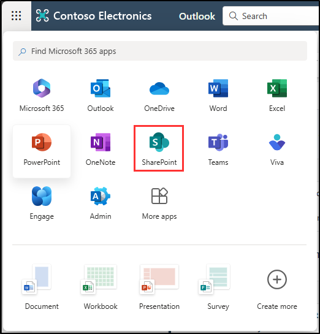
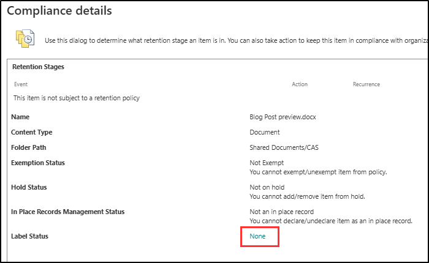

---
lab:
  title: 练习 2 - 实现保留标签
  module: Module 3 - Implement Data Lifecycle and Records Management
---

# 实验室 3 - 练习 2 - 实现保留标签

在本练习中，假设你是英国萨德伯里 Contoso Ltd. 的系统管理员 Joni Sherman。 该公司致力于遵守严格的合规性和数据保留标准，尤其是财务记录。 为了确保这些记录得到系统高效的管理，你需要实施一个文件计划，其中包括为关键文档（如增值税 (VAT) 申报表和信用卡收据）创建和应用保留标签。 这将帮助 Contoso Ltd. 满足法律和内部合规性要求。

**任务**：

1. 使用文件计划创建保留标签
1. 发布保留标签
1. 发布自动应用保留标签
1. 在 Outlook 中应用保留标签
1. 在 SharePoint 中应用保留标签
1. 在 OneDrive 中应用保留标签

## 任务 1 - 使用文件计划创建保留标签

在此任务中，你将为增值税申报表和支持文档以及信用卡收据创建保留标签。 这些标签将是一个全面的文件计划的一部分，意在根据公司的合规性要求管理和保护这些文档。

1. 使用 **SC-400-cl1\admin** 帐户登录到客户端 1 VM (SC-400-CL1)。

1. 在 Microsoft Edge 中，导航到 `https://purview.microsoft.com` 并以 Joni Sherman 的身份 `JoniS@WWLxZZZZZZ.onmicrosoft.com` （其中 ZZZZZZ 是实验室托管提供程序提供的唯一租户 ID）登录到 Microsoft Purview 门户  。 Joni 的密码是在上一练习中设置的。

1. 在 **Microsoft Purview** 门户的左侧边栏中，选择“**解决方案**”，然后选择“**记录管理**”。

1. 在“**记录管理**”页面上，选择左侧边栏中的“**文件计划**”。

1. 在“**文件计划**”页上，选择“**+ 创建标签**”。

1. 在“**命名保留标签**”页上输入：

    - **名称**：`VAT Returns and Supporting Documents`
    - **** 面向用户的说明：`Assign this label to VAT Documents to ensure they are retained for the legal period of seven years.`
    - **** 面向管理员的说明：`VAT returns with seven-year retention.`

1. 选择**下一步**。

1. 在“**定义此标签的文件计划描述符**”页面上输入：

   - **引用 ID**：`VAT-001`
   - **业务功能/部门**：选择此字段旁边的“**选择**”。 在“**业务功能/部门**”浮出面板中，选择“**财务**”，然后选择面板底部的“**选择**”。
   - **类别**：选择此字段旁边的“**选择**”。 在“**类别**”浮出面板中，选择“**+ 新建类别**”。 在“**类别”** 字段中，输入 `Financial records`，然后选择面板底部的“**添加**”。
   - **子类别**：将此字段留空。
   - **管理机构类型**：选择此字段旁边的“**选择**”。 在“**管理机构类型**”浮出面板中，选择“**法规**”，然后选择面板底部的“**选择**”。
   - **预配/引文**：选择此字段旁边的“**选择**”。 在“**预配/引文**”浮出面板中，选择“**《2002 年萨班斯-奥克斯利法案》**”，然后选择面板底部的“**选择**”。

1. 返回“**定义此标签的文件计划描述符**”页上，选择“**下一步**”。

1. 在“定义标签设置”页面上，选择“将项永远保留或保留特定时间段”，然后选择“下一步”  。

1. 在“**定义时间段**”页上，确保为保留期配置输入设置这些值：

    - 保留期有多长?：7 年
    - 此时间段应从何时开始?：创建项时

1. 选择**下一步**。

1. 在“**选择保留期内会发生什么情况**”页面上，选择“**即使用户删除也保留项**”，然后选择“**下一步**”。

1. 在“选择保留期过后发生的情况”页上选择“停用保留设置”，然后选择“下一步”************。

1. 在“查看并完成”页上，选择“创建标签” 。

1. 在“已创建保留标签”页上选择“不执行任何操作”选项，然后选择“完成”  。 标签将在以后的任务中发布。

1. 返回“**文件计划**”页，选择“**+ 创建标签**”以创建另一个保留标签。

1. 在“**命名保留标签**”页上输入：

    - **名称**：`Credit Card Receipts`
    - **** 面向用户的说明：`This label is auto applied to Credit card receipts with a retention period of three years.`
    - **** 面向管理员的说明：`Auto applied retention label for Credit card receipts with three-year retention.`

1. 选择**下一步**。

1. 在“**定义此标签的文件计划描述符**”页面上输入：

   - **引用 ID**：`CC-002`
   - **业务功能/部门**：选择此字段旁边的“**选择**”。 在“**业务功能/部门**”浮出面板中，选择“**销售**”，然后选择面板底部的“**选择**”。
   - **类别**：选择此字段旁边的“**选择**”。 在“**类别**”浮出面板中，选择“**财务记录**”，然后选择面板底部的“**选择**”。
   - **子类别**：选择此字段旁边的“**选择**”。 在“**子类别**”浮出面板中，选择“**+ 新建子类别**”。 在“**子类别**”字段中，输入`Receipts`，然后选择面板底部的“**添加**”。
   - **管理机构类型**：选择此字段旁边的“**选择**”。 在“**管理机构类型**”浮出面板中，选择“**业务**”，然后选择面板底部的“**选择**”。
   - **预配/引文**：选择此字段旁边的“**选择**”。 在“**预配/引文**”浮出面板中，选择“**《信贷真实法案》**”，然后选择面板底部的“**选择**”。

1. 返回“**定义此标签的文件计划描述符**”页上，选择“**下一步**”。

1. 在“定义标签设置”页上，选择“将项永远保留或保留特定期限”，然后选择“下一步”  。

1. 在“**定义时间段**”页上，确保为保留期配置输入设置这些值：

    - 将项保留：选择下拉列表，然后选择“自定义” 。 输入 3 年。
    - 基于以下时间开始保留期：创建项时。

1. 选择**下一步**。

1. 在“**选择保留期内会发生什么情况**”页面上，选择“**即使用户删除也保留项**”，然后选择“**下一步**”。

1. 在“选择保留期过后发生的情况”页上选择“停用保留设置”，然后选择“下一步”************。

1. 在“查看并完成”页上，选择“创建标签” 。

1. 在“已创建保留标签”页上选择“不执行任何操作”，然后选择“完成”************。

你已成功为增值税申报表创建了保留期为 7 年的保留标签，并为信用卡收据创建了保留期为 3 年的保留标签。

## 任务 2 - 发布保留标签

现在，你将发布增值税申报表保留标签，使财务用户能够应用于 Exchange 电子邮件和 SharePoint 网站中的相关文档。

1. 你应仍使用 **SC-400-cl1\admin** 帐户登录到客户端 1 VM (SC-400-CL1)，并且应该会以 **Joni Sherman** 的身份登录到 Microsoft 365。

1. 你应仍位于“**记录管理**”中的“**文件计划**”页上。 如果没有，请导航到 `https://purview.microsoft.com`，然后从左侧边栏中选择“**解决方案**”，然后选择“**记录管理**”。 在“**记录管理**”页面上，选择“**文件计划**”。

1. 选择之前创建的“**增值税申报表和支持性文档**”标签。

1. 选择“**发布标签**”按钮（）以启动用于发布保留标签的配置。

1. 在“**选择要发布的标签**”页上，验证是否已选择“**增值税申报表和支持性文档**”标签，然后选择“**下一步**”。

1. 在“策略范围”页上选择“下一步”********。

1. 在“选择要创建的保留策略的类型”页上选择“静态”，然后选择“下一步”  。

1. 在“**选择标签发布位置**”页上选择“**让我选择特定位置**”，然后选择：

    - Exchange 邮箱
    - SharePoint 经典和通信站点
    - OneDrive 帐户
    - 取消选择所有其他位置

1. 选择**下一步**。

1. 在“**为策略命名**”页上输入：

    - **名称**：`VAT Returns and Supporting Documents Retention Label`
    - **说明**：`VAT Returns and supporting documents Retention label, retention period 3 years, Exchange email and SharePoint site locations.`

1. 选择**下一步**。

1. 在“完成”页上选择“提交” 。  

1. 发布保留标签后，请在“**保留标签已发布**”页上选择“**完成**”。

你已成功发布增值税申报表和支持性文档的保留标签。

## 任务 3 - 发布自动应用保留标签

在此任务中，你要将信用卡收据保留标签配置为自动应用，从而确保在所需时间段内自动标记并保留任何相关文档。

1. 你应仍使用 **SC-400-cl1\admin** 帐户登录到客户端 1 VM (SC-400-CL1)，并且应该会以 **Joni Sherman** 的身份登录到 Microsoft 365。

1. 你应仍位于“**记录管理**”中的“**文件计划**”页上。 如果没有，请导航到 `https://purview.microsoft.com`，然后从左侧边栏中选择“**解决方案**”，然后选择“**记录管理**”。 在“**记录管理**”页面上，选择“**文件计划**”。

1. 选择之前创建的“**信用卡收据**”标签。

1. 选择“**自动应用标签**”按钮（）以启动用于发布此自动应用保留标签的配置。

1. 在“**开始**”页上，输入：

    - **名称**：`Credit Card Receipts auto-applied`
    - **说明**：`Credit Card Receipts auto-applied retention label, with a retention period of three years for all locations.`

1. 选择**下一步**。

1. 在“选择要将此标签应用到的内容类型”页上，选择“将标签应用到包含敏感信息的内容”，然后选择“下一步”  。

1. 在“**包含敏感信息的内容**”页上，选择“**类别**”下的“**财务**”，然后选择“**法规**”下的“**英国财务数据**”

1. 选择**下一步**。

1. 在“定义包含敏感信息的内容”页上选择“下一步” 。

1. 在“策略范围”页上选择“下一步”********。

1. 在“**选择要创建的保留策略的类型**”页上，选择“**静态**”，然后选择“**下一步**”。

1. 在“**选择要应用策略的位置**”页上，选择以下位置：

    - Exchange 邮箱
    - SharePoint 经典和通信站点
    - OneDrive 帐户
    - Microsoft 365 组邮箱和站点

1. 选择**下一步**。

1. 在“**选择要自动应用的标签**”页上，确保选中“**信用卡收据**”标签，然后选择“**下一步**”。

1. 在“决定是测试还是运行策略”中，选择“启用策略”，然后选择“下一步”  。

1. 在“查看并完成”页面上，选择“提交” 。

1. 创建自动标记策略后，请在“**已创建自动标记策略**”上选择“**完成**”。 页面。

1. 在右上角选择 Joni 的头像，然后选择“退出登录”，以退出登录 Joni 的帐户。

你已成功将“**信用卡收据**”保留标签配置为自动应用，为所有识别的文档设置了三年的保留期。

## 任务 4 - 在 Outlook 中应用保留标签

Contoso Ltd.的财务分析师 Megan Bowen 需要确保 Outlook 中的特定电子邮件和文件夹符合公司的数据保留策略。 在此任务中，你要将适当的保留标签应用于她的 Outlook 项。

1. 使用 **SC-400-cl1\admin** 帐户登录到客户端 1 VM (SC-400-CL1)。

1. 在“Microsoft Edge”中，导航到 `https://outlook.office.com`。 并以 **Megan Bowen**`MeganB@WWLxZZZZZZ.onmicrosoft.com`（其中 ZZZZZZ 是实验室托管提供程序提供的唯一租户 ID）的身份登录。 上一练习中已设置 Megan 的密码。

1. 在 Megan 的收件箱中，右键单击任意电子邮件，然后选择“**保留标签**”部分下的“**高级操作**” > “**分配策略**” > “**5 年删除**”。

   此保留标签为所选电子邮件分配 5 年的保留期。 5 年后，该项将被删除。

1. 仍在 Outlook 中，从左侧边栏中展开“**收件箱**”，然后右键单击“**Project Falcon**”文件夹。

1. 在右键单击时出现的菜单中，选择“**保留标签**”部分下的“**高级操作**” > “**分配策略**” > “**5 年删除**”。

   此保留标签为 Project Falcon 文件夹及其所有内容分配了 5 年的保留期。 在 5 年之后，将删除这些项。

你已成功将保留标签应用于 Outlook 中的一封电子邮件和一个文件夹。

## 任务 5 - 在 SharePoint 中应用保留标签

作为财务分析师，Megan Bowen 负责管理 SharePoint 中的敏感文档。 在此任务中，你要将保留标签应用于 SharePoint 库中的一个特定文档，确保文档的保留符合公司政策。

1. 你仍然应该会使用 **SC-400-cl1\admin** 帐户登录到客户端 1 VM (SC-400-CL1)。

1. 你应仍以 Megan Bowen 身份登录 Outlook。 选择左上角的 meatball 菜单，然后选择 **SharePoint** 导航到 SharePoint。

   

1. 在 SharePoint 登陆页上搜索“`Communication site`”，然后从搜索结果中选择“**通信站点**”。

1. 在顶部导航栏中，选择“文档”选项卡。

1. 选择 CAS 文件夹。

1. 在 CAS 文件夹中，将鼠标悬停在“**Blog Post preview.docx**”文档上，然后选择“**显示更多操作**”旁的省略号“**...**”以打开菜单并显示更多选项。

   

1. 从操作菜单中，选择“**更多**” > “**合规性详细信息**”

1. 此时会打开一个新窗口，其中显示了文档的“合规性详细信息”。 对于“标签状态”，请选择“无”打开“应用标签”窗口  。

   

1. 在“**应用标签**”页上，选择“**应用标签**”的下拉列表，并将其从“**无**”更改为“**增值税申报表和支持性文档(保留 7 年)**”。 选择屏幕右侧的“**保存**”。

   >**备注**：保留标签可能需要 1-2 天才能显示在 SharePoint 中。 如果此任务期间“**增值税申报表和支持性文档**标签不可用，可以稍后重新访问并应用该标签。

你已成功将保留标签应用于 SharePoint 中的文档。

## 任务 6 - 在 OneDrive 中应用保留标签

Megan Bowen 在远程工作时将关键财务文档存储在 OneDrive 中。 此任务涉及应用保留标签，以确保根据公司的保留政策管理这些文档。

1. 你仍然应该会使用 **SC-400-cl1\admin** 帐户登录到客户端 1 VM (SC-400-CL1)。

1. 你应仍以 Megan Bowen 身份登录 Outlook。 选择左上角的 meatball 菜单，然后选择 **OneDrive** 导航到 OneDrive。

1. 从左侧边栏中选择“**我的文件**”。 当文件列表出现时，将鼠标悬停在“**年度财务报告**”上，然后选择“**更多选项**”对应的省略号“**...**”以打开菜单并显示更多选项。

1. 从操作菜单中选择“**详细信息**”以打开右侧的详细信息面板。

1. 在“**属性**”下向下滚动以查找“**应用标签**”部分。 选择“**选择标签**”，然后选择“**增值税申报表和支持性文档**”（如果可用）。

   

   >**备注**：保留标签可能需要 1-2 天才能显示在 OneDrive 中。 如果此任务期间“**增值税申报表和支持性文档**标签不可用，可以稍后重新访问并应用该标签。

1. 选择详细信息窗格顶部的“**x**”将其关闭。 此处所做的更改会自动应用。

1. 选择右上角 Megan 的图标并选择“**注销**”，以注销其帐户。

你已成功将保留标签应用于 OneDrive 中的文档。
