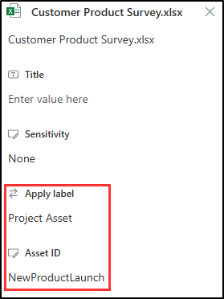
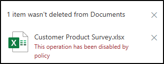

---
lab:
  title: 练习 3 - 配置基于事件的保留
  module: Module 3 - Implement Data Lifecycle and Records Management
---

# 实验室 3 - 练习 3 - 配置基于事件的保留

在本练习中，假设你是 Joni Sherman，Contoso Ltd. 的一名合规性管理员。你的组织位于德克萨斯州，并且想要实现保留策略，从而将属于特定项目的内容在项目关闭后保留 5 年。

1. 创建事件驱动的保留标签和事件类型
1. 发布事件驱动的保留标签
1. 应用标签并添加资产 ID
1. 创建特定事件
1. 观察事件触发器的结果

## 任务 1 - 创建事件驱动的保留标签和事件类型

在此步骤中，你将创建保留标签和事件类型。 事件类型将触发保留期。 为该特定事件类型应用了保留标签的任何内容都将对其强制执行标签的保留操作。

1. 你仍应使用 SC-400-cl1\admin**** 登录到客户端 1 VM (SC-400-CL1)。

1. 在 Microsoft Edge 中，导航到 `https://purview.microsoft.com` 并以 Joni Sherman 的身份 `JoniS@WWLxZZZZZZ.onmicrosoft.com` （其中 ZZZZZZ 是实验室托管提供程序提供的唯一租户 ID）登录到 Microsoft Purview 门户  。 Joni 的密码是在上一练习中设置的。

1. 在 Microsoft Purview 门户**** 的左侧边栏上，选择“解决方案”****，然后选择“记录管理”****。

1. 在“记录管理”**** 页上，从左侧边栏中选择“文件计划”****，然后选择“创建标签”****。

1. 在“为保留标签命名”**** 页上输入：

    - **名称**：`Project Asset`
    - **** 面向用户的说明：`Assign this label to project documents to ensure they are retained for the period of 5 years.`
    - **** 面向管理员的说明：`Project asset for event-based retention.`

1. 选择**下一步**。

1. 在“为此标签定义文件计划描述符”**** 上，将此页留空，然后选择“下一步”****。

1. 在“定义标签设置”页面上，选择“将项永远保留或保留特定时间段”，然后选择“下一步”  。

1. 在“定义保留期”**** 页上，选择“保留项期限”**** 下拉列表，然后选择“5 年”****。

1. 在“保留期开始依据”下拉列表下，选择“+ 创建新事件类型” 。 这将启动基于事件的标签配置。

1. 在右侧的“命名事件类型”**** 浮出控件面板上，输入：

    - **名称**：`Project Closure`
    - **说明**：`This event will be triggered when a project closes.`

1. 选择**下一步**。

1. 查看“摘要”页，然后选择“提交”

1. 在“已创建事件类型”**** 页上，选择“完成”****。

1. 返回“定义保留期”****，选择“保留期开始依据”**** 下拉列表，然后选择新建的“产品终结”**** 事件类型。

1. 选择**下一步**。

1. 在“选择保留期期间会发生什么情况”**** 页上，选择“将项标记为记录”****，然后选择“默认解锁此记录”**** 选项。

1. 选择**下一步**。

1. 在“选择保留期后会发生什么情况”页面上，选择“自动删除项”，然后选择“下一步”  。

1. 在“查看并完成”页上，选择“创建标签” 。  

1. 在“已创建保留标签”页上选择“不执行任何操作”，然后选择“完成”************。

已成功创建基于事件的保留标签。

## 任务 2 - 发布事件驱动的保留标签

在此任务中，你将发布项目资产保留标签，使用户能够将其应用于 SharePoint 和 OneDrive 中的相关文档。

1. 你仍然应该会使用 **SC-400-cl1\admin** 帐户登录到客户端 1 VM (SC-400-CL1)，并且应该会以 **Joni Sherman** 的身份登录到 Microsoft Purview。

1. 你仍应位于 Microsoft Purview 中的“文件计划”**** 页上。 如果不是，请导航到“`https://purview.microsoft.com`”，然后选择“解决方案”**** > “记录管理”**** > “文件计划”****。

1. 选择“项目资产”**** 标签，然后选择“发布标签”**** 按钮（）。

1. 在“选择要发布的标签”**** 页上，确保选中“项目资产”**** 保留标签，然后选择“下一步”****。

1. 在“策略范围”页上，选择“下一步”。

1. 在“选择要创建的保留策略的类型”页上，选择“静态”，然后选择“下一步”  。

1. 在“选择标签发布位置”页上，选择“让我选择特定位置”以显示位置选项 。

1. 在“**选择标签发布位置**”页上选择“**让我选择特定位置**”，然后选择：

    - SharePoint 经典和通信站点
    - OneDrive 帐户
    - 取消选择所有其他位置

1. 选择**下一步**。

1. 在“**为策略命名**”页上输入：

    - **名称**：`Project Asset Retention Label`
    - **说明**：`Project Assets Retention label, retention period 5 years, SharePoint site locations.`

1. 选择**下一步**。

1. 在“完成”**** 页上查看设置，然后选择“提交”****。

1. 发布保留标签后，请在“**保留标签已发布**”页上选择“**完成**”。

已成功发布项目资产的保留标签。

## 任务 3 – 应用标签并添加资产 ID

在此任务中，你将项目资产保留标签应用于文档并分配资产 ID，该 ID 将用于在发生相关项目事件后触发保留期。

1. 你应仍使用 **SC-400-cl1\admin** 帐户登录到客户端 1 VM (SC-400-CL1)，并且应该会以 **Joni Sherman** 的身份登录到 Microsoft 365。

1. 你仍应位于 Microsoft Purview 中的“文件计划”**** 页上。 在左上角选择肉丸菜单，然后从子菜单中选择“SharePoint”****。

   

1. 在顶部搜索栏中搜索“`Brand`”，然后从搜索结果中选择“品牌”**** SharePoint 页。

1. 在顶部导航窗格中，选择“文档”。

1. 在文档文件夹中，将鼠标悬停在“客户产品调查.xlsx”**** 文档上，然后选择表示“显示更多操作”**** 的省略号“...”**** 打开菜单以显示更多选项，然后选择“详细信息”****。

1. 在右侧面板的“属性”**** 下，选择“应用标签”****，然后选择“项目资产”**** 标签。

   >**备注**：保留标签可能需要 1-2 天才能显示在 SharePoint 中。 如果此任务期间“项目资产”**** 标签不可用，可以稍后重新访问并应用标签。

1. 在新出现的“资产 ID”**** 字段中，输入“`NewProductLaunch`”****，然后选择右上角的“X”**** 关闭右侧菜单。

   

已成功应用项目资产标签并向文档分配资产 ID。 项目发生关闭事件时，此设置将启动保留过程。

## 任务 4 - 创建特定事件

在此任务中，将创建特定事件来标记项目的关闭，从而触发所有已标记文档的保留期。

1. 你应仍使用 **SC-400-cl1\admin** 帐户登录到客户端 1 VM (SC-400-CL1)，并且应该会以 **Joni Sherman** 的身份登录到 Microsoft 365。

1. 在 Microsoft Edge**** 中，导航到“`https://purview.microsoft.com`”****，然后从左侧边栏中选择“解决方案”**** > “记录管理”****。

1. 在“记录管理”**** 页上，从左侧边栏中选择“事件”****。

1. 在“事件”**** 页上，选择“+ 创建”****。

1. 在右侧的“命名事件”**** 浮出控件面板上，输入：

    - **名称**：`New Product Launch Closed`
    - **说明**：`Assets with the Project Asset label and AssetID NewProductLaunch will enter their retention period.`

1. 选择**下一步**。

1. 在“事件设置”页上，选择“使用事件类型”，然后选择“选择事件类型”  。

1. 在“选择事件类型”页上，选择“项目关闭”，然后选择“添加”  。

1. 在浮出控件面板上选择“下一步”****。

1. 在“事件设置”**** 页上，将“SharePoint 和 OneDrive 中项的资产 ID”**** 设置为“`NewProductLaunch`”****。

1. 为“此事件何时发生?”选择当天的日期，然后选择“下一步” 。

1. 查看“完成”页，然后选择“提交” 。

1. 在“已创建事件”**** 页上，选择“完成”****。

你已成功触发了事件，并启动了具有项目资产标签和资产 ID NewProductLaunch 的所有文档的保留期。

## 任务 5 - 观察事件触发器的结果

若要验证所指定的保留期是否已启动，需要尝试删除文件。

1. 你应仍使用 **SC-400-cl1\admin** 帐户登录到客户端 1 VM (SC-400-CL1)，并且应该会以 **Joni Sherman** 的身份登录到 Microsoft 365。

1. 在 Microsoft Edge 中，仍应位于 Microsoft Purview 门户中记录管理的“事件”**** 页上。

1. 在左上角选择九点图标，然后在“应用”下选择“SharePoint” 。

1. 在顶部搜索栏中搜索“`Brand`”，然后从搜索结果中选择“品牌”**** SharePoint 页。

1. 在顶部导航窗格中，选择“文档”。

1. 在“文档”**** 页上，选中“客户产品调查.xlsx”**** 复选框，然后选择水平省略号“...”**** 打开操作菜单”

1. 在操作菜单中，选择“删除”**** 并观察结果。 由于策略，应阻止删除此文件。

   

你已成功确认文档的保留期已开始。 如果你仍然可以删除文档，则表示事件的同步期尚未完成，保留策略的触发仍在进行中。 与其他保留标签一样，此过程最多可能需要 1-2 天才能完成。
