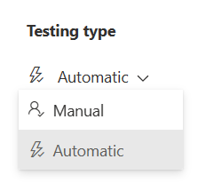

---
lab:
  title: 练习 1 - 探索合规性管理器
  module: Module 4 - Monitor and investigate data and activities by using Microsoft Purview
---

## WWL 租户 - 使用条款

如果在讲师引导式培训过程中向你提供租户，请注意，提供租户旨在支持讲师引导式培训中的动手实验室。

租户不应共享或用于动手实验室以外的用途。 本课程使用的租户为试用租户，课程结束后无法使用或访问，不符合扩展条件。

租户不得转换为付费订阅。 在本课程中获得的租户仍然是 Microsoft Corporation 的财产，我们保留随时获取访问权限和收回的权利。

# 实验室 4 - 练习 1 - 探索合规性管理器

你是 Contoso 有限公司的合规性管理员 Joni Sherman，负责在组织的 Microsoft 365 租户中配置和维护合规性。 Contoso 有限公司设有金融业办事处，并且受到各种监管要求的约束，包括美国的《格雷姆-里奇-比利雷法案》(GLBA)。

作为你职责的一部分，你需要进行一项专门侧重于 Microsoft 365 环境中的 GLBA 要求的合规性评估。 评估将涉及评估当前的合规性状况、识别任何潜在的合规性问题，以及实施适当的措施来解决这些问题。

## 任务 1 - 分配合规性管理器权限

在此任务中，你将授予 Joni 使用合规性管理器创建评估所需的权限。 如果向 Megan 分配了改进操作，则你还将授予她处理改进操作所需的权限。

1. 使用 lon-cl1\admin 帐户登录到客户端 1 VM (LON-CL1)。 密码应由实验室托管提供程序提供。

1. 在 Microsoft Edge **** 中，选择地址栏，导航到 Microsoft Purview 合规性门户**https://compliance.microsoft.com**，并以 MOD 管理员身份****（其中 ZZZZZZ 是实验室托管提供程序提供的唯一租户 ID）登录到 Microsoft Purview 合规性门户admin@WWLxZZZZZZ.onmicrosoft.com。 管理员的密码应由实验室托管提供程序提供。

1. 在左侧导航窗格中，展开“角色和范围”的下拉菜单，然后选择“权限” 。

1. 在“权限”页上，选择“Microsoft Purview 解决方案”下的“角色”  。

1. 在“Microsoft Purview 解决方案的角色组”上，选择“合规性管理器管理员” 。

1. 在右侧的“合规性管理器管理员”弹出页上，选择“编辑” 。

1. 在“合规性管理器管理员”向导的“编辑角色组的成员”页上，选择“+ 选择用户”  。

1. 在“选择用户”页上搜索“Joni”，然后选中“Joni Sherman”旁边的复选框，并选择页面底部的“选择”按钮。

1. 返回“编辑角色组的成员”页，选择“下一步” 。

1. 在“查看角色组并完成”上，选择“保存” 。

1. 现在应会看到一条消息，显示“已成功更新角色组”。 选择“完成”。

1. 返回“Microsoft Purview 解决方案的角色组”，选择“合规性管理器参与者” 。

1. 在右侧的“合规性管理器参与者”弹出页上，选择“编辑” 。

1. 在“合规性管理器参与者”向导的“编辑角色组的成员”页上，选择“+ 选择用户”  。

1. 在“选择用户”页上搜索“Megan”，然后选中“Megan Bowen”旁边的复选框，并选择页面底部的“选择”按钮。

1. 返回“编辑角色组的成员”页，选择“下一步” 。

1. 在“查看角色组并完成”上，选择“保存” 。

1. 现在应会看到一条消息，显示“已成功更新角色组”。 选择“完成”。

1. 退出登录“MOD 管理员”帐户并关闭所有窗口。

在此任务中，你向 Joni 授予了使用合规性管理器创建评估所需的权限，并且还向 Megan 分配了她在被分配了改进操作时处理改进操作的适当权限。

## 任务 2 - 探索合规性管理器

在此任务中，你将探索 Microsoft Purview 合规性门户中合规性管理器的功能。

1. 打开 Microsoft Edge 并导航到 https://compliance.microsoft.com 。 以“Joni Sherman”**** 的身份登录 Microsoft Purview 合规性门户。

1. 从左侧导航窗格中选择“合规性管理器”。

1. 从“合规性管理器”页面顶部，确保已选中“概述”（带下划线）。 向下滚动可查看页面上提供的所有信息。 此页面上的信息包括你的合规性分数、你获得的分数以及获得的 Microsoft 托管分数。 你将看到关键改进操作、影响你的分数的解决方案，以及按类型细分的合规性分数。

1. 在概述页面顶部选择“改进操作”。 这些操作可以提高组织的合规性分数。 请注意，在执行改进操作时，分数最多可能需要 24 小时才会更新。 请注意可用的筛选器。

1. 在 **“改进操作** ”页上，搜索，然后选择“ **启用自助密码重置**”。 查看改进操作的可用信息。 在此页中，可以看到分配所有者__ 或查看已分配的改进操作所有者、实现状态、__测试状态__、服务 _、__ 测试类型和__测试源。_ 还可以选择“详细信息”页以查看有关改进操作的实现信息、上传和查看以前上传的证据的证据，以及相关控件以查看包含该改进操作的控件。

1. 通过从页面左上角的痕迹导航中选择“改进操作”，退出此改进操作。 现在，你已回到改进操作页面。

1. 在页面顶部选择“解决方案”。 在此页面上，你将看到解决方案如何提高分数及其剩余改进机会。

1. 在页面顶部选择“评估”。 在此页面上，你将看到“Microsoft 365 的数据保护基线”。 这是 Microsoft 在合规性管理器中为 Microsoft 365 提供的默认基线评估。 此基线评估具有一组针对关键法规和标准的控制措施，用于数据保护和一般数据管理。 在添加自己的评估以满足组织的特定需求时，合规性管理器将变得更有用。

1. 选择“数据保护基线”评估。 页面左侧是“详细信息”**** 和“关于”信息的概述****。 展开“关于”部分并查看有关 Microsoft 365 数据保护基线的说明。 在页面右侧，请注意进度选项卡上提供的信息，以及关于改进操作的可用信息。 通过页面顶部的选项卡可以选择查看有关控件、改进操作和 Microsoft 操作的更多详细信息。 你可以随意浏览这些内容。

1. 在页面左上角显示 Microsoft 365 的数据保护基线的位置（痕迹导航）上方选择“评估”，返回到合规性管理器中的“评估”选项卡。

1. 在页面顶部选择“法规”。 在此页上，你会看到可用于组织的法规清单。 可以为特定法规创建评估，以跟踪其合规性。

1. 从页面顶部选择“警报”。 在此页上，你会看到“合规性管理器默认警报策略”****。 选择此警报策略，以展开右侧的“合规性管理器默认警报策略”**** 浮出控件页。 在这里，你会看到**合规性管理器默认警报策略**概述。 在浮出控件页上，选择“事件日志”****，以浏览生成此警报的任何事件。

1. 如果要关闭此页面，请选择页面底部的“取消”****，然后从顶部导航栏中选择“警报策略”****。

1. 在“警报策略”**** 页上，你会看到合规性管理器警报的列表。 在此页中，还可以为合规性管理器创建新的警报。

在这项任务中，你浏览了 Microsoft Purview 合规性门户中合规性管理器的功能，包括查看合规性概述、改进操作、解决方案和评估，深入了解关键特性和功能。

## 任务 3 - 创建评估

1. 你仍应使用 Joni 的帐户登录，并登录到 Microsoft Purview 合规门户中的“合规性管理器”。

1. 从顶部导航痕迹导航中选择“评估”。

1. 选择“+ 添加评估”以启动评估创建向导。

1. 在“基于法规进行评估”页上，选择“选择法规” 。

1. 在“选择法规”弹出页上，搜索“格雷姆”。

1. 选中“《格雷姆-里奇-比利雷法案》，标题 V，副标题 A，财务隐私”左侧的复选框，然后选择“保存” 。

1. 返回“基于法规进行评估”页，选择“下一步” 。

1. 在“添加名称和组”页上的“评估名称”下，输入“GLBA 合规性评估” 。 将“使用现有组”下的“默认组”保留为选中状态，然后选择“下一步”。

1. 在“添加名称和组”**** 页上，保留默认评估名称和默认评估组，然后选择“下一步”****。

1. 在“选择服务”页上，选择“选择服务” 。

1. 在“选择服务”浮出控件页上，选中“Microsoft 365”旁边的复选框，然后选择页面底部的“更新”  。

1. 返回“选择服务”页，选择“下一步” 。

1. 在“查看并完成”页上，查看你的选择，然后选择屏幕底部的“创建评估” 。

1. 在“新评估已创建”页上，选择“完成”以查看新评估 。

你已在合规性管理器中成功创建 GLBA 合规性评估，使你能够评估 Contoso 有限公司是否符合 Microsoft 365 中的《格雷姆-里奇-比利雷法案》(GLBA) 要求。

## 任务 4 - 分配改进操作

在此任务中，你将在合规性管理器中创建一项新的评估，以评估 Contoso 有限公司是否符合《格雷姆-里奇-比利雷法案》(GLBA) 要求。

1. 你仍应使用 Joni 的帐户登录，并登录到 Microsoft Purview 合规门户中的“合规性管理器”。 你应进行在上一任务中创建的“GLBA 合规性评估”。

1. 展开左侧的“详细信息”和“关于”窗格，以查看有关刚刚创建的评估的详细信息 。

1. 从顶部痕迹导航的“GLBA 合规性评估”下选择“你的改进操作” 。

1. 探索为遵守《格雷姆-里奇-比利雷法案》法规可采取的“改进操作”。

1. 在改进操作列表右上角的搜索栏中，搜索“DLP”。

1. 选择“为美国《格雷姆-里奇-比利雷法案》使用默认的 DLP 策略”**** 的改进操作。这将打开一个新窗口，其中显示了针对新创建评估的“为美国《格雷姆-里奇-比利雷法案》使用默认的 DLP 策略”**** 改进操作。

1. 在“为美国《格雷姆-里奇-比利雷法案》使用默认的 DLP 策略”**** 页面上，选择“所有者”下的下拉菜单以“分配所有者”****。

1. 在下拉菜单的“建议的用户”__ 下选择“Megan Bowen”****，将此改进操作分配给 Megan，然后选择“为美国《格雷姆-里奇-比利雷法案》使用默认的 DLP 策略”**** 页面右上角的“保存”****。 你应该会看到一条消息，指示操作详细信息已保存。

## 任务 5 - 处理改进操作

在此任务中，你将在合规性管理器中查看并处理分配的改进操作。

1. 你应该会登录到以 lon-cl1\admin 身份打开的客户端 1 VM (LON-CL1)，然后以 Joni Sherman 身份登录到 Microsoft 365。 选择屏幕右上角的图片，然后选择“退出登录”，以退出登录 Joni Sherman 的帐户。

1. 打开 Microsoft Edge 并导航到 https://outlook.office.com/ 。

1. 使用 Megan Bowen 的帐户 MeganB@WWLxZZZZZZ.onmicrosoft.com（其中 ZZZZZZ 是实验室托管提供程序提供的唯一租户 ID）登录。

1. Megan 应该有一封电子邮件，主题 **为“新的改进操作项目”已分配给收件箱** 中。

1. 选择此邮件，然后单击“查看分配给你的操作项”以打开分配的改进操作。 这将启动最近分配给 Megan 的直接改进操作。

1. 在 **改进操作的“详细信息** ”页上，查看有关如何 **实现**的说明。 向下滚动到页面底部，选择“先决条件和许可要求”下的“立即启动” 。 这将直接打开“数据丢失防护”页，如改进操作所建议的那样。

1. 在 **“数据丢失防护** ”页上，选择“ **策略**”，然后选择“ **+ 创建策略**”。

1. 在“从模板开始或创建自定义策略”页上的“类别”下，选择“财务”以打开财务 DLP 策略模板列表  。

1. 在“模板”下，选择“美国《格雷姆-里奇-比利雷法案》(GLBA) 增强版”模板，然后选择“下一步”  。

1. 在“为 DLP 策略命名”页上，在“名称”字段中保留默认名称，然后选择“下一步”  。

1. 在“分配管理单元”**** 页上，选择“下一步”****。

1. 在“选择应用策略的位置”上，选择“Exchange 电子邮件”、“SharePoint 网站”、“OneDrive 帐户”、“Teams 聊天和频道消息”和“设备”，然后选择“下一步”      。

1. 在“定义策略设置”页上，将默认值保留为选中状态，然后选择“下一步” 。

1. 在“要保护的信息”页上查看受保护的信息，然后选择“下一步” 。

1. 在“保护操作”页上，将默认值保留为选中状态，然后选择“下一步” 。

1. 在“自定义访问和替代设置”页上，将默认值保留为选中状态，然后选择“下一步” 。

1. 在 **“策略模式** ”页上，选择 **“立即** 打开策略”，然后选择“ **下一步**”。

1. 在“查看策略并进行创建”页上，选择“提交”以创建并激活新的 DLP 策略 。

1. 在“新策略已创建”页上，选择“完成” 。

1. 返回“数据丢失防护”页，你将看到符合分配的改进操作的“美国《格雷姆-里奇-比利雷法案》(GLBA) 增强版”的新 DLP 策略 。

完成“美国《格雷姆-里奇-比利雷法案》(GLBA) 增强版”的新 DLP 策略的创建和激活后，你将满足分配的改进操作的要求。

## 任务 6 - 手动更新改进操作

1. 你应该会登录到以 lon-cl1\admin 身份打开的客户端 1 VM (LON-CL1)，然后以 Megan Bowen 身份登录到 Microsoft 365。 选择屏幕右上角的图片，然后选择“退出登录”，以退出登录 Megan 的帐户。

1. 打开 Microsoft Edge 并导航到 https://compliance.microsoft.com/ 。

1. 使用 Joni Sherman 的帐户 JoniS@WWLxZZZZZZ.onmicrosoft.com（其中 ZZZZZZ 是实验室托管提供程序提供的唯一租户 ID）登录。

1. 从左侧导航窗格中选择“合规性管理器”，然后从顶部导航栏中选择“改进操作”。

1. 选择在上一任务中创建的 **Gramm-Leach-Bliley Act 评估** 。

1. **从“Gramm-Leach-Bliley Act 评估**”页中，选择“**你的改进操作**”。

1. 在顶部的搜索栏中，搜索 。

1. 选择“ **使用美国 Gramm Leach Bliley Act** 的默认 DLP 策略”，在新窗口中打开此改进操作。

1. 在“使用美国 Gramm Leach Bliley Act 的默认 DLP 策略”下**的状态栏中，将**测试类型**从 **“自动**”更改为 **“手动**”，然后选择页面右上角的“**保存**”。**

      

1. 在页面右上角，选择“编辑笔记 **”** 以打开 **“编辑操作详细信息**”浮出控件页。

1. 在“实现”下 **，选择“实现”状态**的下拉列表**，并将状态更改为 **“已实现**”。**

1. 在“实施日期 **”下**，将日期更改为今天的日期。

1. 选择 **浮出控件页面顶部的“测试和验证** ”选项卡。

1. 在 **“测试状态** ”下拉列表下，选择“ **未评估**”。

1. 选择页面底部的“保存”  。 应在改进操作页上更新实现状态和测试状态。

1. 在“改进操作”页上，将测试类型更改回 **“自动** ”，以便在接下来的 24 小时内自动测试改进操作。

1. 在“使用美国 Gramm Leach Bliley Act** 改进操作”操作页的默认 DLP 策略的右上角**，选择“**保存”** 以保存对此改进操作所做的所有更改。

你已成功更新改进操作。
